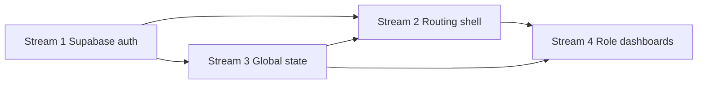

# Frontend Implementation Work Plans

## Context Snapshot
- Angular SSR baseline configured through [`appConfig`](aura360-front/src/app/app.config.ts:7) with empty root routing stub in [`app.routes.ts`](aura360-front/src/app/app.routes.ts:3) and root component [`App`](aura360-front/src/app/app.ts:10).
- Current login architecture decisions and lifecycle notes captured in [`frontend-login-architecture.md`](aura360-front/docs/frontend-login-architecture.md:1) frame guard behaviors and capability derivation expectations.
- Backend exposes authenticated profile and quota endpoints via [`AppUserViewSet`](backend/users/views.py:45) and quota helpers to synchronize Supabase identities with institution data.
- Dependency manifest [`package.json`](aura360-front/package.json:1) currently lacks Supabase SDK, token storage helpers, and notification libraries; tasks below assume extending it accordingly.

## Stream 1: Supabase auth/session infrastructure
### Objectives
- Establish a typed Supabase client wrapper and handshake utilities in [`supabase.client.ts`](aura360-front/src/app/core/auth/supabase.client.ts) to centralize configuration, logging, and JWT event subscriptions.
- Deliver [`AuthService`](aura360-front/src/app/core/auth/auth.service.ts) that orchestrates sign-in, sign-out, refresh, and multi-tab coordination against the Supabase client.
- Persist authenticated state in [`AuthSessionStore`](aura360-front/src/app/core/auth/auth-session.store.ts) with session storage mirroring, timer scheduling, and SSR-friendly hydration adapters.

### Milestones and key tasks
1. **Bootstrap Supabase SDK and runtime config.** Add `@supabase/supabase-js` to [`package.json`](aura360-front/package.json:25), define initialization tokens in [`environment.ts`](aura360-front/src/environments/environment.ts) and [`environment.development.ts`](aura360-front/src/environments/environment.development.ts), and expose typed settings via [`auth.config.ts`](aura360-front/src/app/core/auth/auth.config.ts).
2. **Implement client wrapper.** Build connection factory, event listeners, and helper types inside [`supabase.client.ts`](aura360-front/src/app/core/auth/supabase.client.ts) plus schema contracts in [`auth.types.ts`](aura360-front/src/app/core/auth/auth.types.ts), ensuring SSR-safe lazy imports.
3. **Deliver AuthService orchestration.** Compose sequential sign-in/out flows, Remember Me handling, and profile handshake logic inside [`AuthService`](aura360-front/src/app/core/auth/auth.service.ts) while persisting session metadata through [`auth-session.store.ts`](aura360-front/src/app/core/auth/auth-session.store.ts) and serialization helpers in [`auth-session.storage.ts`](aura360-front/src/app/core/auth/auth-session.storage.ts).
4. **Schedule refresh and multi-tab channeling.** Implement expiry-driven timers within [`session-timer.service.ts`](aura360-front/src/app/core/auth/session-timer.service.ts) and multi-tab events through [`auth-channel.service.ts`](aura360-front/src/app/core/auth/auth-channel.service.ts), keeping Supabase `onAuthStateChange` listeners in sync.
5. **Wire HTTP and resolver integration.** Register bearer token injection and retry logic in [`auth.interceptor.ts`](aura360-front/src/app/core/http/auth.interceptor.ts) with fallback hydration through [`auth-resolver.ts`](aura360-front/src/app/core/resolvers/auth-resolver.ts), then expose providers via [`appConfig`](aura360-front/src/app/app.config.ts:7).

### Integration targets
| Area | Deliverable | Target artifacts |
| --- | --- | --- |
| Supabase configuration | Environment-driven Supabase URL/key management and typed config tokens | [`environment.ts`](aura360-front/src/environments/environment.ts) [`environment.development.ts`](aura360-front/src/environments/environment.development.ts) [`auth.config.ts`](aura360-front/src/app/core/auth/auth.config.ts) |
| Client runtime | Supabase client factory, channel listeners, error mapping | [`supabase.client.ts`](aura360-front/src/app/core/auth/supabase.client.ts) [`auth.types.ts`](aura360-front/src/app/core/auth/auth.types.ts) |
| Session orchestration | Auth service, session store, timer, multi-tab broadcaster | [`auth.service.ts`](aura360-front/src/app/core/auth/auth.service.ts) [`auth-session.store.ts`](aura360-front/src/app/core/auth/auth-session.store.ts) [`session-timer.service.ts`](aura360-front/src/app/core/auth/session-timer.service.ts) [`auth-channel.service.ts`](aura360-front/src/app/core/auth/auth-channel.service.ts) |
| HTTP boundary | Auth interceptor, resolver, provider registration | [`auth.interceptor.ts`](aura360-front/src/app/core/http/auth.interceptor.ts) [`auth-resolver.ts`](aura360-front/src/app/core/resolvers/auth-resolver.ts) [`app.config.ts`](aura360-front/src/app/app.config.ts) |
| Documentation | Update auth runbook and troubleshooting details | [`frontend-login-architecture.md`](aura360-front/docs/frontend-login-architecture.md:1) [`frontend-implementation-plans.md`](aura360-front/docs/frontend-implementation-plans.md:1) |

### Dependencies and prerequisites
- Supabase project must emit synchronized identities with backend, leveraging [`AppUserViewSet`](backend/users/views.py:45) for profile resolution.
- Configuration management relies on build-time environment wiring via Angular CLI environment files and hosting layer secrets.
- Stream 3 will extend [`AuthSessionStore`](aura360-front/src/app/core/auth/auth-session.store.ts) with derived selectors; coordinate state shape before implementation.

### Risks and mitigation
- **Token storage drift:** enforce single source of truth by keeping session serialization inside [`auth-session.storage.ts`](aura360-front/src/app/core/auth/auth-session.storage.ts) and covering upgrade scenarios with migration guards.
- **Refresh race conditions:** use timestamp-based locks in [`session-timer.service.ts`](aura360-front/src/app/core/auth/session-timer.service.ts) and telemetry in [`auth-channel.service.ts`](aura360-front/src/app/core/auth/auth-channel.service.ts).
- **SDK version churn:** pin `@supabase/supabase-js` version in [`package.json`](aura360-front/package.json:25) and document upgrade procedure in [`frontend-login-architecture.md`](aura360-front/docs/frontend-login-architecture.md:1).

### Open questions
- Confirm need for biometric or multi-factor flows beyond password to size future interfaces in [`AuthService`](aura360-front/src/app/core/auth/auth.service.ts).
- Validate whether service-role flows (provisioning, role changes) require dedicated Supabase service clients or remain backend mediated via [`AppUserViewSet`](backend/users/views.py:121).

## Stream 2: Routing shell and guard scaffolding
### Objectives
- Define the application shell layout and navigation in [`app-shell.component.ts`](aura360-front/src/app/core/layout/app-shell.component.ts) with slots for dashboards, notifications, and session indicators.
- Establish route composition within [`app.routes.ts`](aura360-front/src/app/app.routes.ts:3) and server counterpart [`app.routes.server.ts`](aura360-front/src/app/app.routes.server.ts:1), using lazy standalone modules.
- Provide guard scaffolding via [`auth.guard.ts`](aura360-front/src/app/core/guards/auth.guard.ts), [`no-auth.guard.ts`](aura360-front/src/app/core/guards/no-auth.guard.ts), [`role.guard.ts`](aura360-front/src/app/core/guards/role.guard.ts), and [`tier.guard.ts`](aura360-front/src/app/core/guards/tier.guard.ts) plus initialization resolvers housed in [`core/resolvers`](aura360-front/src/app/core/resolvers).

### Milestones and key tasks
1. **Restructure root route tree.** Expand [`routes`](aura360-front/src/app/app.routes.ts:3) with `/auth`, `/dashboard`, `/public`, and fallback branches while adding SSR parity in [`app.routes.server.ts`](aura360-front/src/app/app.routes.server.ts:1).
2. **Scaffold shell layout.** Generate [`app-shell.component.ts`](aura360-front/src/app/core/layout/app-shell.component.ts) and companion template [`app-shell.component.html`](aura360-front/src/app/core/layout/app-shell.component.html) to host header, navigation, progress bar, and outlet composition.
3. **Implement guard skeletons.** Create [`auth.guard.ts`](aura360-front/src/app/core/guards/auth.guard.ts), [`no-auth.guard.ts`](aura360-front/src/app/core/guards/no-auth.guard.ts), [`role.guard.ts`](aura360-front/src/app/core/guards/role.guard.ts), and [`tier.guard.ts`](aura360-front/src/app/core/guards/tier.guard.ts) consuming state from [`AuthSessionStore`](aura360-front/src/app/core/auth/auth-session.store.ts).
4. **Add boot-time resolvers.** Deliver [`app-init.resolver.ts`](aura360-front/src/app/core/resolvers/app-init.resolver.ts) and [`access-context.resolver.ts`](aura360-front/src/app/core/resolvers/access-context.resolver.ts) to preload session and capability data before rendering private routes.
5. **Integrate providers.** Register guards and resolvers within [`appConfig`](aura360-front/src/app/app.config.ts:7) and ensure SSR alignment via [`app.config.server.ts`](aura360-front/src/app/app.config.server.ts:1).

### Integration targets
| Area | Deliverable | Target artifacts |
| --- | --- | --- |
| Route tree | Root routing definition with lazy branches and fallback handling | [`app.routes.ts`](aura360-front/src/app/app.routes.ts) [`app.routes.server.ts`](aura360-front/src/app/app.routes.server.ts) |
| Layout shell | Responsive layout, navigation, outlet wiring | [`app-shell.component.ts`](aura360-front/src/app/core/layout/app-shell.component.ts) [`app-shell.component.html`](aura360-front/src/app/core/layout/app-shell.component.html) [`app-shell.component.scss`](aura360-front/src/app/core/layout/app-shell.component.scss) |
| Guards | Authentication, role, and tier guard logic | [`auth.guard.ts`](aura360-front/src/app/core/guards/auth.guard.ts) [`no-auth.guard.ts`](aura360-front/src/app/core/guards/no-auth.guard.ts) [`role.guard.ts`](aura360-front/src/app/core/guards/role.guard.ts) [`tier.guard.ts`](aura360-front/src/app/core/guards/tier.guard.ts) |
| Resolvers | Session bootstrap and access-context hydration | [`app-init.resolver.ts`](aura360-front/src/app/core/resolvers/app-init.resolver.ts) [`access-context.resolver.ts`](aura360-front/src/app/core/resolvers/access-context.resolver.ts) [`auth-resolver.ts`](aura360-front/src/app/core/resolvers/auth-resolver.ts) |
| Provider registration | Shell providers, navigation events, SSR bridging | [`app.config.ts`](aura360-front/src/app/app.config.ts) [`app.config.server.ts`](aura360-front/src/app/app.config.server.ts) |

### Dependencies and prerequisites
- Relies on Stream 1 session primitives from [`AuthService`](aura360-front/src/app/core/auth/auth.service.ts) and [`AuthSessionStore`](aura360-front/src/app/core/auth/auth-session.store.ts) for guard evaluation.
- Requires Stream 3 capability derivations in [`app-access-context.ts`](aura360-front/src/app/core/auth/app-access-context.ts) to drive role routing.
- Needs UX inputs for navigation layout, icon set, and responsive breakpoints to finalize [`app-shell.component.scss`](aura360-front/src/app/core/layout/app-shell.component.scss).

### Risks and mitigation
- **Guard redirection loops:** implement deterministic navigation outcomes and add diagnostics within [`auth.guard.ts`](aura360-front/src/app/core/guards/auth.guard.ts).
- **Hydration mismatches:** keep resolver logic SSR-compatible and gate browser-only APIs behind platform checks in [`app-init.resolver.ts`](aura360-front/src/app/core/resolvers/app-init.resolver.ts).
- **Navigation flicker:** integrate progress indicators from Stream 3 to cover initial route resolution.

### Open questions
- Determine pattern for marketing/public routes (static vs CMS) to size lazy modules referenced in [`app.routes.ts`](aura360-front/src/app/app.routes.ts).
- Confirm breadcrumb and analytics requirements for dashboards to map into [`app-shell.component.ts`](aura360-front/src/app/core/layout/app-shell.component.ts).

## Stream 3: Global auth state store and notification utilities
### Objectives
- Extend [`AuthSessionStore`](aura360-front/src/app/core/auth/auth-session.store.ts) with selectors for authentication flags, refresh states, and cross-tab awareness.
- Introduce [`AppUserStore`](aura360-front/src/app/core/auth/app-user.store.ts) and [`CapabilitiesService`](aura360-front/src/app/core/auth/capabilities.service.ts) to expose derived permissions for guards and dashboards.
- Provide user-facing notifications, toasts, and progress affordances through [`notification.service.ts`](aura360-front/src/app/shared/services/notification.service.ts) and [`notifications-panel.component.ts`](aura360-front/src/app/shared/ui/notifications-panel.component.ts).

### Milestones and key tasks
1. **Design state schema and selectors.** Document state contracts in [`auth-state.schema.ts`](aura360-front/src/app/core/auth/auth-state.schema.ts), expose Angular signal stores in [`auth-session.store.ts`](aura360-front/src/app/core/auth/auth-session.store.ts), and provide RxJS bridges via [`session-observable.adapter.ts`](aura360-front/src/app/core/auth/session-observable.adapter.ts).
2. **Implement AppUser profile store.** Fetch profiles via [`profile.service.ts`](aura360-front/src/app/core/api/profile.service.ts) and cache results in [`app-user.store.ts`](aura360-front/src/app/core/auth/app-user.store.ts) with derived selectors housed in [`app-access-context.ts`](aura360-front/src/app/core/auth/app-access-context.ts).
3. **Introduce notification utilities.** Build toast/snackbar orchestrators inside [`notification.service.ts`](aura360-front/src/app/shared/services/notification.service.ts), UI bindings in [`notifications-panel.component.ts`](aura360-front/src/app/shared/ui/notifications-panel.component.ts), and configuration in [`notification.config.ts`](aura360-front/src/app/shared/config/notification.config.ts).
4. **Wire global loading and error surfaces.** Connect router events and auth transitions to [`app-progress-bar.component.ts`](aura360-front/src/app/shared/ui/app-progress-bar.component.ts) and reusable status surfaces in [`status-page.component.ts`](aura360-front/src/app/features/status/status-page.component.ts).
5. **Harden state synchronization.** Add persistence guards, version markers, and cleanup hooks in [`auth-session.store.ts`](aura360-front/src/app/core/auth/auth-session.store.ts) and extend test coverage within [`auth-session.store.spec.ts`](aura360-front/src/app/core/auth/auth-session.store.spec.ts).

### Integration targets
| Area | Deliverable | Target artifacts |
| --- | --- | --- |
| State schema | Typed definitions and adapters | [`auth-state.schema.ts`](aura360-front/src/app/core/auth/auth-state.schema.ts) [`session-observable.adapter.ts`](aura360-front/src/app/core/auth/session-observable.adapter.ts) |
| Profile and capabilities | Profile fetchers, store, derived capabilities | [`profile.service.ts`](aura360-front/src/app/core/api/profile.service.ts) [`app-user.store.ts`](aura360-front/src/app/core/auth/app-user.store.ts) [`app-access-context.ts`](aura360-front/src/app/core/auth/app-access-context.ts) [`capabilities.service.ts`](aura360-front/src/app/core/auth/capabilities.service.ts) |
| Notifications | Service, UI components, configuration | [`notification.service.ts`](aura360-front/src/app/shared/services/notification.service.ts) [`notifications-panel.component.ts`](aura360-front/src/app/shared/ui/notifications-panel.component.ts) [`notification.config.ts`](aura360-front/src/app/shared/config/notification.config.ts) |
| Global UX feedback | Loading bar, status views, error mapping | [`app-progress-bar.component.ts`](aura360-front/src/app/shared/ui/app-progress-bar.component.ts) [`status-page.component.ts`](aura360-front/src/app/features/status/status-page.component.ts) [`error.interceptor.ts`](aura360-front/src/app/core/http/error.interceptor.ts) |
| Testing | Store specs and harnesses | [`auth-session.store.spec.ts`](aura360-front/src/app/core/auth/auth-session.store.spec.ts) [`app-user.store.spec.ts`](aura360-front/src/app/core/auth/app-user.store.spec.ts) |

### Dependencies and prerequisites
- Requires Supabase session tokens from Stream 1 to hydrate [`auth-session.store.ts`](aura360-front/src/app/core/auth/auth-session.store.ts) and support refresh logic.
- Depends on backend `/dashboard/users/by_auth_id` endpoint exposed by [`AppUserViewSet`](backend/users/views.py:177) and quota data from [`get_quota_snapshot`](backend/users/services/access.py:132) for capability derivation.
- Needs UX guidance for notification styling and accessibility to finalize [`notifications-panel.component.ts`](aura360-front/src/app/shared/ui/notifications-panel.component.ts).

### Risks and mitigation
- **State divergence across tabs:** rely on broadcast channel events from Stream 1 and add version keys to [`auth-session.store.ts`](aura360-front/src/app/core/auth/auth-session.store.ts).
- **Notification overload:** throttle notifications and deduplicate events within [`notification.service.ts`](aura360-front/src/app/shared/services/notification.service.ts).
- **Profile staleness:** embed revalidation hooks triggered by quota changes or role updates within [`app-user.store.ts`](aura360-front/src/app/core/auth/app-user.store.ts).

### Open questions
- Confirm cadence for quota refresh and whether to integrate push channels beyond REST polling in [`profile.service.ts`](aura360-front/src/app/core/api/profile.service.ts).
- Determine if notifications require persistence history, implying additional storage beyond in-memory state.

## Stream 4: Role-based dashboard module scaffolding
### Objectives
- Scaffold dashboard entry routing via [`dashboard.routes.ts`](aura360-front/src/app/features/dashboard/dashboard.routes.ts) and shared layout [`dashboard-layout.component.ts`](aura360-front/src/app/features/dashboard/dashboard-layout.component.ts).
- Provide role-specific dashboard shells in files such as [`admin-sistema-dashboard.component.ts`](aura360-front/src/app/features/admin-sistema/admin-sistema-dashboard.component.ts) and [`paciente-dashboard.component.ts`](aura360-front/src/app/features/paciente/paciente-dashboard.component.ts) with lazy modules.
- Integrate shared widgets (notifications, quota, billing) respecting capability flags from [`CapabilitiesService`](aura360-front/src/app/core/auth/capabilities.service.ts).

### Milestones and key tasks
1. **Establish dashboard module skeleton.** Generate [`dashboard.routes.ts`](aura360-front/src/app/features/dashboard/dashboard.routes.ts) and [`dashboard-layout.component.ts`](aura360-front/src/app/features/dashboard/dashboard-layout.component.ts) with named outlet slots for widgets and content.
2. **Implement shared dashboard widgets.** Build placeholders for quotas, billing, and activity using [`quota-widget.component.ts`](aura360-front/src/app/shared/ui/quota-widget.component.ts) and integrate notifications via [`notifications-panel.component.ts`](aura360-front/src/app/shared/ui/notifications-panel.component.ts).
3. **Scaffold role-specific dashboards.** Create component stubs such as [`admin-sistema-dashboard.component.ts`](aura360-front/src/app/features/admin-sistema/admin-sistema-dashboard.component.ts), [`admin-institucion-dashboard.component.ts`](aura360-front/src/app/features/admin-institucion/admin-institucion-dashboard.component.ts), [`admin-salud-dashboard.component.ts`](aura360-front/src/app/features/admin-salud/admin-salud-dashboard.component.ts), [`profesional-salud-dashboard.component.ts`](aura360-front/src/app/features/profesional-salud/profesional-salud-dashboard.component.ts), [`paciente-dashboard.component.ts`](aura360-front/src/app/features/paciente/paciente-dashboard.component.ts), [`institucion-dashboard.component.ts`](aura360-front/src/app/features/institucion/institucion-dashboard.component.ts), and [`general-dashboard.component.ts`](aura360-front/src/app/features/general/general-dashboard.component.ts) with matching route definitions.
4. **Wire data services.** Hook profile, quota, and usage data via [`profile.service.ts`](aura360-front/src/app/core/api/profile.service.ts), [`quota.service.ts`](aura360-front/src/app/core/api/quota.service.ts), and planned [`billing.service.ts`](aura360-front/src/app/core/api/billing.service.ts).
5. **Define onboarding and empty states.** Configure contextual CTAs in [`empty-state.config.ts`](aura360-front/src/app/shared/config/empty-state.config.ts) and re-use status surfaces from Stream 3.

### Integration targets
| Area | Deliverable | Target artifacts |
| --- | --- | --- |
| Dashboard entry | Layout and routing for dashboards | [`dashboard.routes.ts`](aura360-front/src/app/features/dashboard/dashboard.routes.ts) [`dashboard-layout.component.ts`](aura360-front/src/app/features/dashboard/dashboard-layout.component.ts) |
| Shared widgets | Notifications, quota, billing widgets | [`notifications-panel.component.ts`](aura360-front/src/app/shared/ui/notifications-panel.component.ts) [`quota-widget.component.ts`](aura360-front/src/app/shared/ui/quota-widget.component.ts) [`billing-widget.component.ts`](aura360-front/src/app/shared/ui/billing-widget.component.ts) |
| Role dashboards | Role-specific components and routing | [`admin-sistema-dashboard.component.ts`](aura360-front/src/app/features/admin-sistema/admin-sistema-dashboard.component.ts) [`admin-sistema.routes.ts`](aura360-front/src/app/features/admin-sistema/admin-sistema.routes.ts) [`paciente-dashboard.component.ts`](aura360-front/src/app/features/paciente/paciente-dashboard.component.ts) [`general-dashboard.component.ts`](aura360-front/src/app/features/general/general-dashboard.component.ts) |
| Data services | Profile, quota, billing fetchers | [`profile.service.ts`](aura360-front/src/app/core/api/profile.service.ts) [`quota.service.ts`](aura360-front/src/app/core/api/quota.service.ts) [`billing.service.ts`](aura360-front/src/app/core/api/billing.service.ts) |
| UX states | Empty, loading, error experiences | [`empty-state.config.ts`](aura360-front/src/app/shared/config/empty-state.config.ts) [`status-page.component.ts`](aura360-front/src/app/features/status/status-page.component.ts) [`app-progress-bar.component.ts`](aura360-front/src/app/shared/ui/app-progress-bar.component.ts) |

### Dependencies and prerequisites
- Requires guard outputs from Stream 2 and capability computations from [`app-access-context.ts`](aura360-front/src/app/core/auth/app-access-context.ts) to determine accessible modules.
- Backend must expose quota summary via [`get_quota_snapshot`](backend/users/services/access.py:132) and billing plan endpoints to populate widgets.
- Needs UX sign-off on dashboard layouts, widget placements, and mobile responsiveness for [`dashboard-layout.component.ts`](aura360-front/src/app/features/dashboard/dashboard-layout.component.ts).

### Risks and mitigation
- **Scope creep across dashboards:** sequence implementation per priority roles and enforce shared component usage documented in [`frontend-login-architecture.md`](aura360-front/docs/frontend-login-architecture.md:79).
- **Data loading complexity:** isolate feature-specific resolvers and loading states to avoid blocking entire dashboard outlet.
- **Accessibility gaps:** integrate semantic regions and keyboard navigation early within [`dashboard-layout.component.ts`](aura360-front/src/app/features/dashboard/dashboard-layout.component.ts).

### Open questions
- Clarify initial MVP widget set per role to avoid overbuilding placeholders.
- Define analytics instrumentation needs per dashboard to plan telemetry hooks.

## Cross-stream dependency map

## Global prerequisites and coordination
- Align environment variable naming and deployment process in [`environment.ts`](aura360-front/src/environments/environment.ts) with DevOps pipeline before Supabase integration rolls out.
- Plan incremental CLI generation sequence and capture commands within [`README.md`](aura360-front/README.md:1) to guide contributors.
- Prioritize shared design assets (icons, typography, notification styles) for [`app-shell.component.scss`](aura360-front/src/app/core/layout/app-shell.component.scss) and widget components ahead of UI development.
- Coordinate backend schema reviews for quotas, billing, and role transitions under [`AppUserViewSet`](backend/users/views.py:393) to de-risk integration blockers.