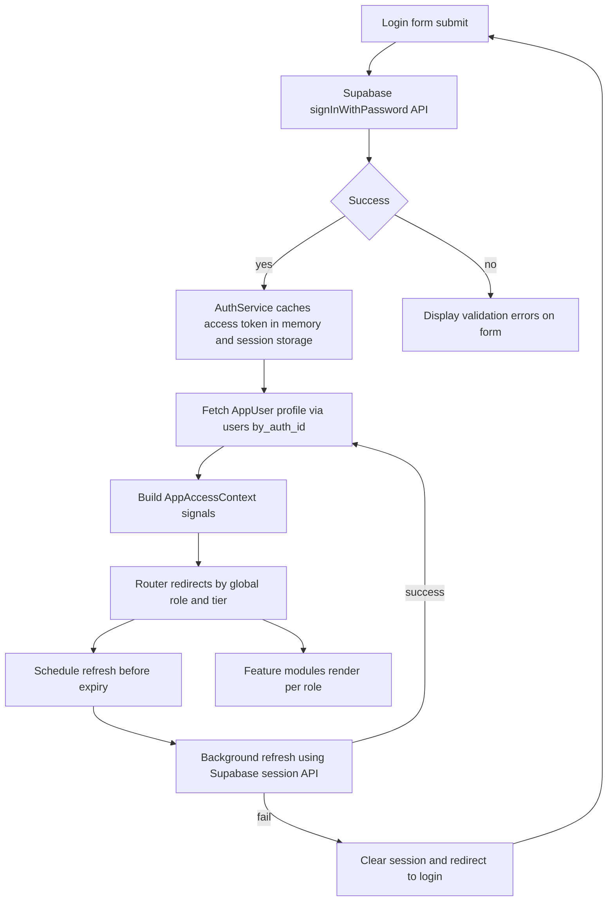

# AURA360 Frontend Login Architecture

## Context
- Target latest Angular release from [angular.dev](https://angular.dev) with zoneless change detection enabled via [`provideZonelessChangeDetection`](aura360-front/src/app/app.config.ts:1) and hydration through [`provideClientHydration`](aura360-front/src/app/app.config.ts:5).
- Maintain standalone component setup anchored by [`app.ts`](aura360-front/src/app/app.ts:4) and route definitions in [`app.routes.ts`](aura360-front/src/app/app.routes.ts).
- Supabase email/password flows backed by project-scoped client wrapper [`supabase.client.ts`](aura360-front/src/app/core/auth/supabase.client.ts) that reads public anon keys from environment configuration and never embeds service-role keys.

## Authentication and Session Lifecycle


- Login UI [`login-page.component.ts`](aura360-front/src/app/features/auth/login/login-page.component.ts) posts credentials to [`AuthService`](aura360-front/src/app/core/auth/auth.service.ts), which delegates to the Supabase client wrapper.
- [`AuthService`](aura360-front/src/app/core/auth/auth.service.ts) caches the access token in signal store [`auth-session.store.ts`](aura360-front/src/app/core/auth/auth-session.store.ts) and mirrors it to session storage when “Remember me” is checked; refresh token persistence relies on Supabase client IndexedDB storage to avoid manual handling.
- Background refresh uses session expiry metadata managed by [`session-timer.service.ts`](aura360-front/src/app/core/auth/session-timer.service.ts), which listens to document visibility changes and proactively refreshes after inactivity.
- Logout invokes the teardown routine in [`AuthService`](aura360-front/src/app/core/auth/auth.service.ts) that wipes caches, purges storage, cancels timers, and broadcasts through [`auth-channel.service.ts`](aura360-front/src/app/core/auth/auth-channel.service.ts) for multi-tab sign-out coherence.
- HTTP calls attach bearer tokens via [`auth.interceptor.ts`](aura360-front/src/app/core/http/auth.interceptor.ts); 401 and 403 responses trigger validation through [`AuthSessionStore`](aura360-front/src/app/core/auth/auth-session.store.ts) before forcing the logout path.

## Session Bootstrap and AppUser Metadata
- On application start, [`app.routes.ts`](aura360-front/src/app/app.routes.ts) resolves the root layout through [`app-init.resolver.ts`](aura360-front/src/app/core/resolvers/app-init.resolver.ts), which inspects cached Supabase sessions before issuing network calls.
- When a session exists, [`profile.service.ts`](aura360-front/src/app/core/api/profile.service.ts) calls GET /dashboard/users/by_auth_id/{uuid} surfaced by [`AppUserViewSet`](backend/users/views.py:177) to load [`AppUser`](backend/users/models.py:42) data including [`role_global`](backend/users/models.py:117), [`tier`](backend/users/models.py:110), and [`billing_plan`](backend/users/models.py:129).
- The response hydrates [`app-access-context.ts`](aura360-front/src/app/core/auth/app-access-context.ts) that derives capability booleans (is admin, institution linked, premium) consumed by guards and layout switches.
- Quota and usage summaries are lazily fetched via [`quota.service.ts`](aura360-front/src/app/core/api/quota.service.ts), mapping to [`get_quota_snapshot`](backend/users/services/access.py:132) for premium dashboards and retaining cached snapshots per user.

## Routing and Layout
```mermaid
flowchart TD
    RootShell[AppShellComponent hosts layout] --> AuthBranch[/auth]
    RootShell --> DashboardBranch[/dashboard]
    DashboardBranch --> AdminSistemaBranch[AdminSistema routes]
    DashboardBranch --> AdminInstitucionBranch[AdminInstitucion routes]
    DashboardBranch --> AdminSaludBranch[AdminInstitucionSalud routes]
    DashboardBranch --> ProfesionalBranch[ProfesionalSalud routes]
    DashboardBranch --> PacienteBranch[Paciente routes]
    DashboardBranch --> InstitucionBranch[Institucion routes]
    DashboardBranch --> GeneralBranch[General experience]
    RootShell --> PublicBranch[/public]
    RootShell --> ErrorBranch[Error and status routes]
```

- Root layout component [`app-shell.component.ts`](aura360-front/src/app/core/layout/app-shell.component.ts) houses responsive header, role-aware navigation, notifications hub, and session indicators.
| Path | Lazy entry | Guards | Key notes |
| --- | --- | --- | --- |
| /auth | [`auth.routes.ts`](aura360-front/src/app/features/auth/auth.routes.ts) | [`no-auth.guard.ts`](aura360-front/src/app/core/guards/no-auth.guard.ts) | Login, password reset placeholder, future magic-link gating hidden behind feature flags |
| /dashboard | [`dashboard.routes.ts`](aura360-front/src/app/features/dashboard/dashboard.routes.ts) | [`auth.guard.ts`](aura360-front/src/app/core/guards/auth.guard.ts), [`access-context.resolver.ts`](aura360-front/src/app/core/resolvers/access-context.resolver.ts) | Authenticated shell with breadcrumb, context switches, and quick actions |
| /dashboard/admin-sistema | [`admin-sistema.routes.ts`](aura360-front/src/app/features/admin-sistema/admin-sistema.routes.ts) | [`role.guard.ts`](aura360-front/src/app/core/guards/role.guard.ts) | Platform-level oversight, provisioning review, tenant management |
| /dashboard/admin-institucion | [`admin-institucion.routes.ts`](aura360-front/src/app/features/admin-institucion/admin-institucion.routes.ts) | [`role.guard.ts`](aura360-front/src/app/core/guards/role.guard.ts) | Institution roster, billing alignment, quota consumption |
| /dashboard/admin-salud | [`admin-salud.routes.ts`](aura360-front/src/app/features/admin-salud/admin-salud.routes.ts) | [`role.guard.ts`](aura360-front/src/app/core/guards/role.guard.ts) | Care network setup, clinical workflow configuration |
| /dashboard/profesional-salud | [`profesional-salud.routes.ts`](aura360-front/src/app/features/profesional-salud/profesional-salud.routes.ts) | [`role.guard.ts`](aura360-front/src/app/core/guards/role.guard.ts), [`tier.guard.ts`](aura360-front/src/app/core/guards/tier.guard.ts) | Patient panels, session scheduling, analytic insights |
| /dashboard/paciente | [`paciente.routes.ts`](aura360-front/src/app/features/paciente/paciente.routes.ts) | [`role.guard.ts`](aura360-front/src/app/core/guards/role.guard.ts) | Personal health timeline, care plan adherence, support access |
| /dashboard/institucion | [`institucion.routes.ts`](aura360-front/src/app/features/institucion/institucion.routes.ts) | [`role.guard.ts`](aura360-front/src/app/core/guards/role.guard.ts) | Institution profile management, contract metrics, invite workflows |
| /dashboard/general | [`general.routes.ts`](aura360-front/src/app/features/general/general.routes.ts) | [`role.guard.ts`](aura360-front/src/app/core/guards/role.guard.ts) | Default experience for users without specific role assignments |
| /public | [`public.routes.ts`](aura360-front/src/app/features/public/public.routes.ts) | none | Marketing pages, legal documents, health blog entries |
| ** | [`not-found.routes.ts`](aura360-front/src/app/features/status/not-found.routes.ts) | none | 404 with contextual CTA to login or dashboard |
- Each role route attaches layout slots via [`dashboard-layout.component.ts`](aura360-front/src/app/features/dashboard/dashboard-layout.component.ts) to unify header, breadcrumbs, and contextual help.

## Guards and HTTP Interceptors
- [`auth.guard.ts`](aura360-front/src/app/core/guards/auth.guard.ts) ensures a valid access token via [`AuthSessionStore`](aura360-front/src/app/core/auth/auth-session.store.ts) and silently refreshes when expiry is within a configurable buffer.
- [`role.guard.ts`](aura360-front/src/app/core/guards/role.guard.ts) compares requested route metadata with [`app-access-context.ts`](aura360-front/src/app/core/auth/app-access-context.ts), redirecting to `/dashboard/general` when mismatched.
- [`tier.guard.ts`](aura360-front/src/app/core/guards/tier.guard.ts) enforces premium-only features and provides upgrade prompts using data from [`AppUser`](backend/users/models.py:42).
- [`auth-resolver.ts`](aura360-front/src/app/core/resolvers/auth-resolver.ts) hydrates Supabase session data before guard execution on SSR and cold starts.
- [`auth.interceptor.ts`](aura360-front/src/app/core/http/auth.interceptor.ts) injects Bearer headers and retries once after forced refresh through [`session-timer.service.ts`](aura360-front/src/app/core/auth/session-timer.service.ts).
- [`error.interceptor.ts`](aura360-front/src/app/core/http/error.interceptor.ts) normalises backend errors, mapping quota exceed responses from [`QuotaExceeded`](backend/users/services/access.py:38) into user-friendly toasts and optional re-auth flows.

## Role-driven Dashboards and UX
| Role | Feature entry | Primary widgets | Key operations |
| --- | --- | --- | --- |
| AdminSistema | [`admin-sistema-dashboard.component.ts`](aura360-front/src/app/features/admin-sistema/admin-sistema-dashboard.component.ts) | Platform KPIs, provisioning queue, tenant health | Trigger provisioning requests (submitted to backend job), inspect quotas, manage global settings |
| AdminInstitucion | [`admin-institucion-dashboard.component.ts`](aura360-front/src/app/features/admin-institucion/admin-institucion-dashboard.component.ts) | Institution roster, billing snapshots, contract alerts | Invite staff, assign tiers, request plan upgrades, export usage |
| AdminInstitucionSalud | [`admin-salud-dashboard.component.ts`](aura360-front/src/app/features/admin-salud/admin-salud-dashboard.component.ts) | Care workflows, facility coverage, compliance status | Configure care protocols, monitor service capacity, coordinate support tickets |
| ProfesionalSalud | [`profesional-salud-dashboard.component.ts`](aura360-front/src/app/features/profesional-salud/profesional-salud-dashboard.component.ts) | Patient list, upcoming sessions, AI insights | Log consultations, request realtime updates, chat with support |
| Paciente | [`paciente-dashboard.component.ts`](aura360-front/src/app/features/paciente/paciente-dashboard.component.ts) | Personalized timeline, recommendations, messaging | Complete check-ins, access chatbot sessions, manage subscriptions |
| Institucion | [`institucion-dashboard.component.ts`](aura360-front/src/app/features/institucion/institucion-dashboard.component.ts) | Contract metrics, seats usage, account status | Adjust billing contacts, download invoices, request assistance |
| General | [`general-dashboard.component.ts`](aura360-front/src/app/features/general/general-dashboard.component.ts) | Welcome checklist, onboarding progress, support links | Complete profile, request role assignment, view product tour |
- Cross-role components such as [`notifications-panel.component.ts`](aura360-front/src/app/shared/ui/notifications-panel.component.ts) and [`quota-widget.component.ts`](aura360-front/src/app/shared/ui/quota-widget.component.ts) consume shared stores and apply capability flags so users only see actions they own.

## State Management and Shared Services
- [`AuthSessionStore`](aura360-front/src/app/core/auth/auth-session.store.ts) exposes signals (isAuthenticated, expiresAt, refreshInProgress) and bridges to RxJS via [`session-observable.adapter.ts`](aura360-front/src/app/core/auth/session-observable.adapter.ts) for guards requiring observable APIs.
- [`AppUserStore`](aura360-front/src/app/core/auth/app-user.store.ts) caches profile data, memoizes feature toggles, and supports optimistic updates after user edits.
- [`CapabilitiesService`](aura360-front/src/app/core/auth/capabilities.service.ts) centralises derived rights (canProvisionUsers, canSeeBilling, canAccessChatbot) using [`AppUser`](backend/users/models.py:42) plus quotas.
- API clients under [`core/api`](aura360-front/src/app/core/api) adopt typed response models aligning with backend serializers such as [`AppUserSerializer`](backend/users/serializers.py:21) and [`QuotaStatusSerializer`](backend/users/serializers.py:26).
- [`notification.service.ts`](aura360-front/src/app/shared/services/notification.service.ts) handles toast, snackbar, and modal orchestration, respecting accessibility-friendly durations.

## Security and Service-role Operations
- Service-role privileged actions like [`AppUserViewSet.provision`](backend/users/views.py:121) and [`AppUserViewSet.set_role`](backend/users/views.py:393) remain backend-only; frontend surfaces request forms that enqueue jobs via protected API endpoints without exposing Supabase keys.
- Use [`auth.interceptor.ts`](aura360-front/src/app/core/http/auth.interceptor.ts) to attach Supabase access tokens while backend validates them through [`SupabaseJWTAuthentication`](backend/users/authentication.py:14).
- Environment secrets load from [`environment.ts`](aura360-front/src/environments/environment.ts) and [`environment.development.ts`](aura360-front/src/environments/environment.development.ts); only the anonymous Supabase key is shipped to clients.
- Apply CSP and secure cookie headers at the hosting layer; ensure logout clears auth data and caches by calling [`AuthService`](aura360-front/src/app/core/auth/auth.service.ts) before redirecting to [`auth.routes.ts`](aura360-front/src/app/features/auth/auth.routes.ts).

## Loading, Error, and Empty States
- Global suspense handled by [`app-progress-bar.component.ts`](aura360-front/src/app/shared/ui/app-progress-bar.component.ts) wired into [`AuthSessionStore`](aura360-front/src/app/core/auth/auth-session.store.ts) and router navigation events.
- Skeleton templates in [`skeleton-card.component.ts`](aura360-front/src/app/shared/ui/skeleton-card.component.ts) cover dashboards, tables, and detail panes; each feature module ships dedicated placeholders.
- Error surfaces use [`status-page.component.ts`](aura360-front/src/app/features/status/status-page.component.ts) with contextual diagnostics, retry actions, and contact support links.
- Empty states provide CTAs tailored to role (e.g., Paciente sees onboarding steps, AdminSistema sees provisioning queue) using config defined in [`empty-state.config.ts`](aura360-front/src/app/shared/config/empty-state.config.ts).

## Angular CLI Usage and Project Conventions
- Generate all components, guards, and services via Angular CLI to maintain consistent providers and schematics.
```bash
ng generate component features/auth/login --standalone --flat --style=scss
ng generate guard core/guards/auth --standalone
ng generate interceptor core/http/auth
ng generate service core/api/profile
```
- Enforce standalone imports using CLI-generated route definitions (e.g., ng generate route features/dashboard --standalone --flat) and update [`app.routes.ts`](aura360-front/src/app/app.routes.ts) with lazy imports.

## Implementation Sequence
1. Scaffold core auth infrastructure (Supabase client, AuthService, AuthSessionStore) via CLI and configure router providers in [`app.config.ts`](aura360-front/src/app/app.config.ts).
2. Implement guards and interceptors (auth, role, tier, error) and register them in [`app.config.ts`](aura360-front/src/app/app.config.ts) alongside HTTP client setup.
3. Build shared layout [`app-shell.component.ts`](aura360-front/src/app/core/layout/app-shell.component.ts) and navigation components, integrating notification and progress services.
4. Deliver Auth feature module routes and login form, including Remember Me toggle and forgot password placeholder in [`auth.routes.ts`](aura360-front/src/app/features/auth/auth.routes.ts).
5. Implement profile bootstrap resolver [`app-init.resolver.ts`](aura360-front/src/app/core/resolvers/app-init.resolver.ts) and application access context pipeline.
6. Create role-specific dashboard routes and widgets, starting with AdminSistema and Paciente to validate both extremes of permissions.
7. Wire quota and billing widgets via [`quota.service.ts`](aura360-front/src/app/core/api/quota.service.ts) and future [`billing.service.ts`](aura360-front/src/app/core/api/billing.service.ts), aligning with backend quota endpoints.
8. Finalize error, empty, and status surfaces in [`status-page.component.ts`](aura360-front/src/app/features/status/status-page.component.ts) and ensure logout flows close open websocket or realtime connections.

## Open Questions / Follow-ups
- Confirm backend endpoints for tier upgrades and billing plan changes align with frontend expectations before implementing upgrade workflows.
- Validate whether Paciente dashboards need realtime subscriptions or polling; adjust [`session-timer.service.ts`](aura360-front/src/app/core/auth/session-timer.service.ts) accordingly.
- Decide on analytics/telemetry tooling (Angular built-in signals instrumentation vs external) for later integration.