# Arquitectura del Componente de Login - AURA360

## 1. Resumen Ejecutivo

Este documento define la arquitectura completa del componente de login para AURA360, integrándose con el [`SupabaseClientService`](../src/app/auth/services/supabase-client.service.ts) existente y siguiendo las convenciones del proyecto (standalone components, Angular signals, SSR-safe, kebab-case).

### Alcance
- Componente de login con formulario reactivo
- Validaciones síncronas y asíncronas
- Integración con Supabase Auth
- Gestión de estados y errores
- Flujo de redirección post-login
- Soporte SSR completo
- Testing unitario y de integración

### Dependencias del Sistema
- Angular 20.3.0+ con signals y zoneless change detection
- @supabase/supabase-js ^2.48.0
- Reactive Forms
- Router con lazy loading
- SupabaseClientService (ya implementado)

---

## 2. Estructura de Archivos

### 2.1 Árbol de Archivos Completo

```
src/app/features/auth/
├── login/
│   ├── login.component.ts           # Componente principal del login
│   ├── login.component.html         # Template del formulario
│   ├── login.component.scss         # Estilos del componente
│   ├── login.component.spec.ts      # Tests unitarios
│   └── models/
│       ├── login-form.model.ts      # Interfaces del formulario
│       └── login-state.model.ts     # Estados del componente
├── services/
│   ├── auth.service.ts              # Servicio de autenticación
│   ├── auth.service.spec.ts         # Tests del servicio
│   └── auth-session.store.ts        # Signal store para sesión
├── auth.routes.ts                   # Definición de rutas
└── models/
    └── auth-error.model.ts          # Tipos de errores de auth
```

### 2.2 Ubicaciones y Responsabilidades

| Archivo | Ruta Completa | Responsabilidad |
|---------|---------------|-----------------|
| **LoginComponent** | `src/app/features/auth/login/login.component.ts` | UI del login, formulario reactivo, validaciones |
| **AuthService** | `src/app/features/auth/services/auth.service.ts` | Lógica de negocio de autenticación, integración Supabase |
| **AuthSessionStore** | `src/app/features/auth/services/auth-session.store.ts` | Estado global de sesión con signals |
| **LoginFormModel** | `src/app/features/auth/login/models/login-form.model.ts` | Interfaces del formulario y tipos |
| **LoginStateModel** | `src/app/features/auth/login/models/login-state.model.ts` | Estados del componente |
| **AuthErrorModel** | `src/app/features/auth/models/auth-error.model.ts` | Tipos de errores y mensajes |

---

## 3. Diagramas de Arquitectura

### 3.1 Diagrama de Flujo del Proceso de Login

```mermaid
flowchart TD
    Start([Usuario accede a /auth/login]) --> CheckSession{Sesión activa?}
    CheckSession -->|Sí| RedirectDash[Redirigir a dashboard según rol]
    CheckSession -->|No| ShowForm[Mostrar formulario de login]
    
    ShowForm --> UserInput[Usuario ingresa credenciales]
    UserInput --> ValidateForm{Validar formulario}
    
    ValidateForm -->|Inválido| ShowErrors[Mostrar errores de validación]
    ShowErrors --> UserInput
    
    ValidateForm -->|Válido| SetLoading[Estado: loading = true]
    SetLoading --> CallSupabase[AuthService.login llamada]
    
    CallSupabase --> SupabaseAuth[Supabase signInWithPassword]
    
    SupabaseAuth --> AuthResult{Resultado}
    
    AuthResult -->|Error| HandleError[Procesar error]
    HandleError --> MapError[Mapear error a mensaje en español]
    MapError --> SetErrorState[Estado: error + mensaje]
    SetErrorState --> ShowAuthError[Mostrar error en UI]
    ShowAuthError --> ResetLoading[Estado: loading = false]
    ResetLoading --> UserInput
    
    AuthResult -->|Éxito| StoreSession[Guardar sesión en AuthSessionStore]
    StoreSession --> SaveRemember{Remember me?}
    
    SaveRemember -->|Sí| PersistSession[Persistir en sessionStorage]
    SaveRemember -->|No| MemoryOnly[Solo en memoria signal]
    
    PersistSession --> FetchProfile[Llamar a backend /api/users/profile]
    MemoryOnly --> FetchProfile
    
    FetchProfile --> ProfileResult{Perfil obtenido?}
    
    ProfileResult -->|Error| ProfileError[Mostrar error de perfil]
    ProfileError --> Logout[Limpiar sesión]
    Logout --> ShowForm
    
    ProfileResult -->|Éxito| BuildContext[Construir AppAccessContext]
    BuildContext --> DetermineRoute[Determinar ruta según role_global]
    
    DetermineRoute --> RouteByRole{role_global}
    
    RouteByRole -->|AdminSistema| NavAdminSis[/dashboard/admin-sistema]
    RouteByRole -->|AdminInstitucion| NavAdminInst[/dashboard/admin-institucion]
    RouteByRole -->|AdminInstitucionSalud| NavAdminSalud[/dashboard/admin-salud]
    RouteByRole -->|ProfesionalSalud| NavProfesional[/dashboard/profesional-salud]
    RouteByRole -->|Paciente| NavPaciente[/dashboard/paciente]
    RouteByRole -->|Institucion| NavInstitucion[/dashboard/institucion]
    RouteByRole -->|General o null| NavGeneral[/dashboard/general]
    
    NavAdminSis --> Success([Login exitoso])
    NavAdminInst --> Success
    NavAdminSalud --> Success
    NavProfesional --> Success
    NavPaciente --> Success
    NavInstitucion --> Success
    NavGeneral --> Success
```

### 3.2 Diagrama de Componentes y Dependencias

```mermaid
graph LR
    subgraph "Feature Auth Module"
        LoginComp[LoginComponent]
        AuthService[AuthService]
        AuthSessionStore[AuthSessionStore]
        AuthRoutes[auth.routes.ts]
    end
    
    subgraph "Core Auth"
        SupabaseClient[SupabaseClientService]
        NoAuthGuard[noAuthGuard]
    end
    
    subgraph "Backend API"
        SupabaseAuth[Supabase Auth API]
        BackendProfile[GET /api/users/profile]
    end
    
    subgraph "Router"
        Router[Angular Router]
        DashboardRoutes[Dashboard Routes]
    end
    
    LoginComp -->|usa| AuthService
    LoginComp -->|lee| AuthSessionStore
    
    AuthService -->|llama| SupabaseClient
    AuthService -->|actualiza| AuthSessionStore
    AuthService -->|llama| BackendProfile
    
    SupabaseClient -->|conecta| SupabaseAuth
    
    AuthRoutes -->|protege con| NoAuthGuard
    NoAuthGuard -->|lee| AuthSessionStore
    
    AuthService -->|navega con| Router
    Router -->|redirecciona| DashboardRoutes
```

### 3.3 Diagrama de Estados del Componente

```mermaid
stateDiagram-v2
    [*] --> Idle: Componente inicializado
    
    Idle --> Loading: submit()
    Idle --> Validating: Usuario escribe
    
    Validating --> ValidationError: Errores de validación
    ValidationError --> Validating: Usuario corrige
    Validating --> Idle: Formulario válido
    
    Loading --> Success: Login exitoso
    Loading --> AuthError: Error de autenticación
    Loading --> NetworkError: Error de red
    
    AuthError --> Idle: Usuario reintenta
    NetworkError --> Idle: Usuario reintenta
    
    Success --> Redirecting: Obteniendo perfil
    Redirecting --> [*]: Navegando a dashboard
    Redirecting --> ProfileError: Error al obtener perfil
    ProfileError --> Idle: Sesión limpiada
```



---

## 4. Interfaces y Modelos TypeScript

### 4.1 Login Form Model (`login-form.model.ts`)

```typescript
/**
 * Valores del formulario de login
 */
export interface LoginFormValue {
  readonly email: string;
  readonly password: string;
  readonly rememberMe: boolean;
}

/**
 * Datos de entrada para el proceso de login
 */
export interface LoginCredentials {
  readonly email: string;
  readonly password: string;
}

/**
 * Configuración de validación del formulario
 */
export interface LoginFormValidation {
  readonly email: {
    required: string;
    email: string;
    maxLength: string;
  };
  readonly password: {
    required: string;
    minLength: string;
    maxLength: string;
  };
}

/**
 * Constantes de validación
 */
export const LOGIN_VALIDATION_RULES = {
  email: {
    maxLength: 255
  },
  password: {
    minLength: 6,
    maxLength: 100
  }
} as const;
```

### 4.2 Login State Model (`login-state.model.ts`)

```typescript
/**
 * Estados posibles del componente de login
 */
export type LoginComponentState = 
  | 'idle'
  | 'validating'
  | 'loading'
  | 'success'
  | 'error'
  | 'redirecting';

/**
 * Estado completo del componente
 */
export interface LoginState {
  readonly status: LoginComponentState;
  readonly error: LoginError | null;
  readonly isSubmitting: boolean;
  readonly rememberMe: boolean;
}

/**
 * Estado inicial del componente
 */
export const INITIAL_LOGIN_STATE: LoginState = {
  status: 'idle',
  error: null,
  isSubmitting: false,
  rememberMe: false
} as const;
```

### 4.3 Auth Error Model (`auth-error.model.ts`)

```typescript
/**
 * Tipos de errores de autenticación
 */
export type AuthErrorType =
  | 'invalid_credentials'
  | 'email_not_confirmed'
  | 'user_disabled'
  | 'rate_limit'
  | 'network_error'
  | 'service_unavailable'
  | 'profile_fetch_failed'
  | 'unknown_error';

/**
 * Estructura de error de autenticación
 */
export interface LoginError {
  readonly type: AuthErrorType;
  readonly message: string;
  readonly technicalDetails?: string;
  readonly canRetry: boolean;
}

/**
 * Mapa de mensajes de error en español
 */
export const AUTH_ERROR_MESSAGES: Record<AuthErrorType, string> = {
  invalid_credentials: 'Email o contraseña incorrectos. Por favor verifica tus credenciales.',
  email_not_confirmed: 'Tu cuenta no ha sido confirmada. Revisa tu email para activarla.',
  user_disabled: 'Tu cuenta ha sido deshabilitada. Contacta con soporte para más información.',
  rate_limit: 'Demasiados intentos de inicio de sesión. Por favor espera unos minutos.',
  network_error: 'Error de conexión. Verifica tu conexión a internet e intenta nuevamente.',
  service_unavailable: 'Servicio temporalmente no disponible. Intenta nuevamente en unos momentos.',
  profile_fetch_failed: 'No se pudo cargar tu perfil. Por favor intenta iniciar sesión nuevamente.',
  unknown_error: 'Ocurrió un error inesperado. Por favor intenta nuevamente.'
} as const;

/**
 * Mapea errores de Supabase a errores de la aplicación
 */
export function mapSupabaseError(error: any): LoginError {
  // Implementación en el código real
}
```

### 4.4 Auth Session Store (`auth-session.store.ts`)

```typescript
import { computed, signal } from '@angular/core';
import type { Session, User } from '@supabase/supabase-js';

/**
 * Estado de la sesión de autenticación
 */
export interface AuthSession {
  readonly user: User | null;
  readonly session: Session | null;
  readonly isAuthenticated: boolean;
  readonly expiresAt: number | null;
  readonly accessToken: string | null;
}

/**
 * Signal store para gestionar el estado de sesión global
 */
export class AuthSessionStore {
  // Signals privados
  private readonly _user = signal<User | null>(null);
  private readonly _session = signal<Session | null>(null);
  
  // Signals computados públicos
  readonly user = this._user.asReadonly();
  readonly session = this._session.asReadonly();
  
  readonly isAuthenticated = computed(() => {
    return this._session() !== null && this._user() !== null;
  });
  
  readonly expiresAt = computed(() => {
    const session = this._session();
    return session?.expires_at ? session.expires_at * 1000 : null;
  });
  
  readonly accessToken = computed(() => {
    return this._session()?.access_token ?? null;
  });
  
  // Métodos para actualizar estado
  setSession(session: Session | null, user: User | null): void;
  clearSession(): void;
  getSessionSnapshot(): AuthSession;
}
```

### 4.5 Auth Service Interface

```typescript
import { Observable } from 'rxjs';
import type { Session, User } from '@supabase/supabase-js';

/**
 * Resultado exitoso de login
 */
export interface LoginSuccess {
  readonly session: Session;
  readonly user: User;
  readonly shouldRemember: boolean;
}

/**
 * Opciones para el método login
 */
export interface LoginOptions {
  readonly rememberMe?: boolean;
}

/**
 * Perfil de usuario desde el backend
 */
export interface UserProfile {
  readonly id: string;
  readonly email: string;
  readonly role_global: string;
  readonly tier: string;
  readonly full_name: string | null;
  // ... otros campos del AppUser
}

/**
 * Interfaz del servicio de autenticación
 */
export interface IAuthService {
  /**
   * Inicia sesión con email y password
   */
  login(credentials: LoginCredentials, options?: LoginOptions): Promise<LoginSuccess>;
  
  /**
   * Cierra sesión y limpia el estado
   */
  logout(): Promise<void>;
  
  /**
   * Obtiene el perfil del usuario autenticado
   */
  getUserProfile(): Promise<UserProfile>;
  
  /**
   * Verifica si hay una sesión activa
   */
  hasActiveSession(): boolean;
  
  /**
   * Observable de cambios en la sesión
   */
  onSessionChange(): Observable<Session | null>;
}
```

---

## 5. Arquitectura del Componente LoginComponent

### 5.1 Estructura del Componente

```typescript
@Component({
  selector: 'app-login',
  standalone: true,
  imports: [
    CommonModule,
    ReactiveFormsModule,
    // ... otros imports
  ],
  templateUrl: './login.component.html',
  styleUrl: './login.component.scss',
  changeDetection: ChangeDetectionStrategy.OnPush
})
export class LoginComponent implements OnInit, OnDestroy {
  // Signals para estado reactivo
  private readonly state = signal<LoginState>(INITIAL_LOGIN_STATE);
  
  // Computados públicos para template
  readonly status = computed(() => this.state().status);
  readonly error = computed(() => this.state().error);
  readonly isSubmitting = computed(() => this.state().isSubmitting);
  readonly canSubmit = computed(() => /* lógica */);
  
  // FormGroup tipado
  readonly loginForm: FormGroup<LoginFormControls>;
  
  // Dependencias inyectadas
  private readonly authService = inject(AuthService);
  private readonly router = inject(Router);
  private readonly destroyRef = inject(DestroyRef);
  
  // Métodos del ciclo de vida
  ngOnInit(): void;
  
  // Métodos públicos para template
  onSubmit(): void;
  clearError(): void;
  
  // Métodos privados
  private buildForm(): FormGroup<LoginFormControls>;
  private handleLoginSuccess(result: LoginSuccess): Promise<void>;
  private handleLoginError(error: any): void;
  private navigateByRole(profile: UserProfile): void;
}
```

### 5.2 Formulario Reactivo

```typescript
/**
 * Tipos para FormGroup tipado
 */
interface LoginFormControls {
  email: FormControl<string>;
  password: FormControl<string>;
  rememberMe: FormControl<boolean>;
}

/**
 * Construcción del formulario
 */
private buildForm(): FormGroup<LoginFormControls> {
  return new FormGroup<LoginFormControls>({
    email: new FormControl('', {
      nonNullable: true,
      validators: [
        Validators.required,
        Validators.email,
        Validators.maxLength(LOGIN_VALIDATION_RULES.email.maxLength)
      ]
    }),
    password: new FormControl('', {
      nonNullable: true,
      validators: [
        Validators.required,
        Validators.minLength(LOGIN_VALIDATION_RULES.password.minLength),
        Validators.maxLength(LOGIN_VALIDATION_RULES.password.maxLength)
      ]
    }),
    rememberMe: new FormControl(false, {
      nonNullable: true
    })
  });
}
```

### 5.3 Validaciones

#### Validaciones Síncronas

| Campo | Validador | Mensaje de Error |
|-------|-----------|------------------|
| email | `required` | "El email es requerido" |
| email | `email` | "Ingresa un email válido" |
| email | `maxLength(255)` | "El email es demasiado largo" |
| password | `required` | "La contraseña es requerida" |
| password | `minLength(6)` | "La contraseña debe tener al menos 6 caracteres" |
| password | `maxLength(100)` | "La contraseña es demasiado larga" |

#### Mensajes de Error Dinámicos

```typescript
/**
 * Helper para obtener mensajes de error del formulario
 */
export class FormErrorMessages {
  static getErrorMessage(control: AbstractControl, fieldName: string): string | null {
    if (!control.errors || !control.touched) {
      return null;
    }
    
    const errors = control.errors;
    
    if (errors['required']) {
      return `${fieldName} es requerido`;
    }
    if (errors['email']) {
      return 'Ingresa un email válido';
    }
    if (errors['minlength']) {
      const minLength = errors['minlength'].requiredLength;
      return `Debe tener al menos ${minLength} caracteres`;
    }
    if (errors['maxlength']) {
      const maxLength = errors['maxlength'].requiredLength;
      return `No puede exceder ${maxLength} caracteres`;
    }
    
    return 'Campo inválido';
  }
}
```

---

## 6. Integración con Supabase

### 6.1 AuthService - Implementación

```typescript
@Injectable({
  providedIn: 'root'
})
export class AuthService implements IAuthService {
  private readonly supabaseClient = inject(SupabaseClientService);
  private readonly authSessionStore = inject(AuthSessionStore);
  private readonly httpClient = inject(HttpClient);
  private readonly router = inject(Router);
  private readonly platformId = inject(PLATFORM_ID);
  
  /**
   * Proceso completo de login
   */
  async login(
    credentials: LoginCredentials, 
    options: LoginOptions = {}
  ): Promise<LoginSuccess> {
    // 1. Validar que estamos en browser
    if (!isPlatformBrowser(this.platformId)) {
      throw new Error('Login solo disponible en navegador');
    }
    
    // 2. Obtener cliente Supabase
    const client = await this.supabaseClient.getClient();
    
    // 3. Llamar a signInWithPassword
    const { data, error } = await client.auth.signInWithPassword({
      email: credentials.email,
      password: credentials.password
    });
    
    // 4. Manejar error
    if (error) {
      throw mapSupabaseError(error);
    }
    
    // 5. Validar respuesta
    if (!data.session || !data.user) {
      throw new LoginError({
        type: 'unknown_error',
        message: AUTH_ERROR_MESSAGES.unknown_error,
        canRetry: true
      });
    }
    
    // 6. Actualizar store
    this.authSessionStore.setSession(data.session, data.user);
    
    // 7. Persistir si remember me
    if (options.rememberMe) {
      this.persistSession(data.session);
    }
    
    return {
      session: data.session,
      user: data.user,
      shouldRemember: options.rememberMe ?? false
    };
  }
  
  /**
   * Obtiene el perfil del usuario desde el backend
   */
  async getUserProfile(): Promise<UserProfile> {
    const token = this.authSessionStore.accessToken();
    
    if (!token) {
      throw new LoginError({
        type: 'profile_fetch_failed',
        message: AUTH_ERROR_MESSAGES.profile_fetch_failed,
        canRetry: false
      });
    }
    
    try {
      // Llamada al backend Django
      const profile = await firstValueFrom(
        this.httpClient.get<UserProfile>('/api/users/profile', {
          headers: {
            Authorization: `Bearer ${token}`
          }
        })
      );
      
      return profile;
    } catch (error) {
      throw new LoginError({
        type: 'profile_fetch_failed',
        message: AUTH_ERROR_MESSAGES.profile_fetch_failed,
        technicalDetails: error.message,
        canRetry: true
      });
    }
  }
  
  /**
   * Cierra sesión
   */
  async logout(): Promise<void> {
    if (!isPlatformBrowser(this.platformId)) {
      return;
    }
    
    try {
      const client = await this.supabaseClient.getClient();
      await client.auth.signOut();
    } catch (error) {
      console.error('Error during logout:', error);
    } finally {
      // Limpiar estado local siempre
      this.authSessionStore.clearSession();
      this.clearPersistedSession();
      await this.router.navigate(['/auth/login']);
    }
  }
  
  /**
   * Persiste sesión en sessionStorage
   */
  private persistSession(session: Session): void {
    if (isPlatformBrowser(this.platformId)) {
      sessionStorage.setItem('aura_session', JSON.stringify({
        access_token: session.access_token,
        expires_at: session.expires_at
      }));
    }
  }
  
  /**
   * Limpia sesión persistida
   */
  private clearPersistedSession(): void {
    if (isPlatformBrowser(this.platformId)) {
      sessionStorage.removeItem('aura_session');
    }
  }
}
```

### 6.2 Flujo de Datos

```mermaid
sequenceDiagram
    participant UI as LoginComponent
    participant AS as AuthService
    participant SC as SupabaseClientService
    participant SB as Supabase Auth API
    participant BE as Backend API
    participant Store as AuthSessionStore
    participant Router as Angular Router
    
    UI->>AS: login(credentials, {rememberMe})
    AS->>SC: getClient()
    SC-->>AS: SupabaseClient
    
    AS->>SB: signInWithPassword()
    
    alt Login exitoso
        SB-->>AS: {session, user}
        AS->>Store: setSession(session, user)
        
        opt Remember Me = true
            AS->>AS: persistSession(session)
            Note over AS: Guarda en sessionStorage
        end
        
        AS-->>UI: LoginSuccess
        
        UI->>AS: getUserProfile()
        AS->>BE: GET /api/users/profile
        BE-->>AS: UserProfile
        AS-->>UI: UserProfile
        
        UI->>UI: navigateByRole(profile)
        UI->>Router: navigate(['/dashboard/...'])
        Router-->>UI: Navegación exitosa
        
    else Login fallido
        SB-->>AS: AuthError
        AS->>AS: mapSupabaseError(error)
        AS-->>UI: throw LoginError
        UI->>UI: Mostrar error en UI
    end
```



---

## 7. UI/UX y Template HTML

### 7.1 Estructura del Template

```html
<!-- login.component.html -->
<div class="login-container" role="main">
  <div class="login-card">
    <!-- Header -->
    <header class="login-header">
      
      <h1 class="login-title">Iniciar Sesión</h1>
      <p class="login-subtitle">Accede a tu cuenta AURA360</p>
    </header>
    
    <!-- Alert de error -->
    @if (error()) {
      <div class="alert alert-error" role="alert" aria-live="assertive">
        <span class="alert-icon" aria-hidden="true">⚠️</span>
        <div class="alert-content">
          <p class="alert-message">{{ error()!.message }}</p>
          @if (error()!.canRetry) {
            <button 
              type="button" 
              class="alert-dismiss"
              (click)="clearError()"
              aria-label="Cerrar alerta">
              ×
            </button>
          }
        </div>
      </div>
    }
    
    <!-- Formulario -->
    <form 
      [formGroup]="loginForm" 
      (ngSubmit)="onSubmit()"
      class="login-form"
      novalidate>
      
      <!-- Email -->
      <div class="form-group">
        <label for="email" class="form-label">
          Email
          <span class="form-required" aria-label="requerido">*</span>
        </label>
        <input
          id="email"
          type="email"
          formControlName="email"
          class="form-control"
          [class.form-control-error]="loginForm.controls.email.invalid && loginForm.controls.email.touched"
          placeholder="tu@email.com"
          autocomplete="email"
          [attr.aria-invalid]="loginForm.controls.email.invalid && loginForm.controls.email.touched"
          [attr.aria-describedby]="loginForm.controls.email.invalid ? 'email-error' : null">
        
        @if (loginForm.controls.email.invalid && loginForm.controls.email.touched) {
          <span id="email-error" class="form-error" role="alert">
            {{ getEmailError() }}
          </span>
        }
      </div>
      
      <!-- Password -->
      <div class="form-group">
        <label for="password" class="form-label">
          Contraseña
          <span class="form-required" aria-label="requerido">*</span>
        </label>
        <div class="form-input-group">
          <input
            id="password"
            [type]="showPassword() ? 'text' : 'password'"
            formControlName="password"
            class="form-control"
            [class.form-control-error]="loginForm.controls.password.invalid && loginForm.controls.password.touched"
            placeholder="Tu contraseña"
            autocomplete="current-password"
            [attr.aria-invalid]="loginForm.controls.password.invalid && loginForm.controls.password.touched"
            [attr.aria-describedby]="loginForm.controls.password.invalid ? 'password-error' : null">
          
          <button
            type="button"
            class="form-toggle-password"
            (click)="togglePasswordVisibility()"
            [attr.aria-label]="showPassword() ? 'Ocultar contraseña' : 'Mostrar contraseña'">
            @if (showPassword()) {
              👁️
            } @else {
              👁️‍🗨️
            }
          </button>
        </div>
        
        @if (loginForm.controls.password.invalid && loginForm.controls.password.touched) {
          <span id="password-error" class="form-error" role="alert">
            {{ getPasswordError() }}
          </span>
        }
      </div>
      
      <!-- Remember Me -->
      <div class="form-group form-checkbox-group">
        <label class="form-checkbox-label">
          <input
            type="checkbox"
            formControlName="rememberMe"
            class="form-checkbox">
          <span>Recordar mi sesión</span>
        </label>
      </div>
      
      <!-- Submit Button -->
      <button
        type="submit"
        class="btn btn-primary btn-block"
        [disabled]="!canSubmit()"
        [attr.aria-busy]="isSubmitting()">
        @if (isSubmitting()) {
          <span class="btn-spinner" aria-hidden="true"></span>
          <span>Iniciando sesión...</span>
        } @else {
          <span>Iniciar Sesión</span>
        }
      </button>
    </form>
    
    <!-- Footer Links -->
    <footer class="login-footer">
      <a href="/auth/forgot-password" class="login-link">
        ¿Olvidaste tu contraseña?
      </a>
      <p class="login-footer-text">
        ¿No tienes cuenta? 
        <a href="/auth/register" class="login-link">Regístrate</a>
      </p>
    </footer>
  </div>
</div>
```

### 7.2 Consideraciones de Accesibilidad

| Aspecto | Implementación |
|---------|----------------|
| **Roles ARIA** | `role="main"`, `role="alert"` en errores |
| **Labels** | Todos los inputs tienen `<label>` asociado con `for` |
| **Estados** | `aria-invalid`, `aria-describedby` para errores |
| **Live Regions** | `aria-live="assertive"` en alertas de error |
| **Focus Management** | Auto-focus en primer error al submit |
| **Navegación Teclado** | Tab order lógico, Enter submits |
| **Contraste** | Mínimo 4.5:1 para texto, 3:1 para controles |
| **Loading States** | `aria-busy` durante submit |

### 7.3 Estilos SCSS

```scss
// login.component.scss
.login-container {
  display: flex;
  align-items: center;
  justify-content: center;
  min-height: 100vh;
  padding: 1rem;
  background: linear-gradient(135deg, #667eea 0%, #764ba2 100%);
}

.login-card {
  width: 100%;
  max-width: 420px;
  padding: 2rem;
  background: white;
  border-radius: 12px;
  box-shadow: 0 10px 40px rgba(0, 0, 0, 0.1);
}

.login-header {
  text-align: center;
  margin-bottom: 2rem;
}

.login-logo {
  height: 60px;
  margin-bottom: 1rem;
}

.login-title {
  font-size: 1.75rem;
  font-weight: 600;
  color: #1a202c;
  margin-bottom: 0.5rem;
}

.login-subtitle {
  color: #718096;
  font-size: 0.875rem;
}

// Alert styles
.alert {
  padding: 1rem;
  border-radius: 8px;
  margin-bottom: 1.5rem;
  display: flex;
  align-items: start;
  gap: 0.75rem;
  
  &-error {
    background-color: #fff5f5;
    border: 1px solid #fc8181;
    color: #c53030;
  }
}

// Form styles
.form-group {
  margin-bottom: 1.5rem;
}

.form-label {
  display: block;
  font-weight: 500;
  margin-bottom: 0.5rem;
  color: #2d3748;
  font-size: 0.875rem;
}

.form-required {
  color: #e53e3e;
}

.form-control {
  width: 100%;
  padding: 0.75rem 1rem;
  border: 1px solid #e2e8f0;
  border-radius: 6px;
  font-size: 1rem;
  transition: all 0.2s;
  
  &:focus {
    outline: none;
    border-color: #667eea;
    box-shadow: 0 0 0 3px rgba(102, 126, 234, 0.1);
  }
  
  &-error {
    border-color: #fc8181;
    
    &:focus {
      border-color: #e53e3e;
      box-shadow: 0 0 0 3px rgba(229, 62, 62, 0.1);
    }
  }
}

.form-error {
  display: block;
  color: #c53030;
  font-size: 0.75rem;
  margin-top: 0.25rem;
}

// Button styles
.btn {
  padding: 0.75rem 1.5rem;
  border: none;
  border-radius: 6px;
  font-weight: 500;
  cursor: pointer;
  transition: all 0.2s;
  display: inline-flex;
  align-items: center;
  justify-content: center;
  gap: 0.5rem;
  
  &-primary {
    background-color: #667eea;
    color: white;
    
    &:hover:not(:disabled) {
      background-color: #5a67d8;
    }
    
    &:disabled {
      opacity: 0.6;
      cursor: not-allowed;
    }
  }
  
  &-block {
    width: 100%;
  }
}

.btn-spinner {
  width: 16px;
  height: 16px;
  border: 2px solid rgba(255, 255, 255, 0.3);
  border-top-color: white;
  border-radius: 50%;
  animation: spin 0.6s linear infinite;
}

@keyframes spin {
  to { transform: rotate(360deg); }
}

// Responsive
@media (max-width: 480px) {
  .login-card {
    padding: 1.5rem;
  }
  
  .login-title {
    font-size: 1.5rem;
  }
}
```

---

## 8. Rutas y Guards

### 8.1 Actualización de auth.routes.ts

```typescript
import { Routes } from '@angular/router';

export const authRoutes: Routes = [
  {
    path: '',
    redirectTo: 'login',
    pathMatch: 'full'
  },
  {
    path: 'login',
    loadComponent: () => 
      import('./login/login.component').then(m => m.LoginComponent),
    title: 'Iniciar Sesión - AURA360'
  },
  {
    path: 'forgot-password',
    loadComponent: () =>
      import('./forgot-password/forgot-password.component').then(m => m.ForgotPasswordComponent),
    title: 'Recuperar Contraseña - AURA360'
  },
  {
    path: 'reset-password',
    loadComponent: () =>
      import('./reset-password/reset-password.component').then(m => m.ResetPasswordComponent),
    title: 'Restablecer Contraseña - AURA360'
  }
];
```

### 8.2 Actualización de noAuthGuard

```typescript
import { inject } from '@angular/core';
import { CanActivateFn, Router } from '@angular/router';
import { AuthSessionStore } from '../../features/auth/services/auth-session.store';

/**
 * Guard que protege rutas de auth (login, register, etc.)
 * Redirige a dashboard si el usuario ya está autenticado
 */
export const noAuthGuard: CanActivateFn = async () => {
  const router = inject(Router);
  const authSessionStore = inject(AuthSessionStore);
  
  // Verificar si hay sesión activa
  const isAuthenticated = authSessionStore.isAuthenticated();
  
  if (isAuthenticated) {
    // Usuario autenticado, redirigir a dashboard
    await router.navigate(['/dashboard']);
    return false;
  }
  
  // Usuario no autenticado, permitir acceso
  return true;
};
```

### 8.3 Actualización de authGuard

```typescript
import { inject } from '@angular/core';
import { CanActivateFn, Router } from '@angular/router';
import { AuthSessionStore } from '../../features/auth/services/auth-session.store';

/**
 * Guard que protege rutas autenticadas
 * Redirige a login si no hay sesión activa
 */
export const authGuard: CanActivateFn = async () => {
  const router = inject(Router);
  const authSessionStore = inject(AuthSessionStore);
  
  // Verificar si hay sesión activa
  const isAuthenticated = authSessionStore.isAuthenticated();
  
  if (!isAuthenticated) {
    // No autenticado, redirigir a login
    await router.navigate(['/auth/login']);
    return false;
  }
  
  // Verificar si la sesión ha expirado
  const expiresAt = authSessionStore.expiresAt();
  const now = Date.now();
  
  if (expiresAt && expiresAt < now) {
    // Sesión expirada, limpiar y redirigir
    authSessionStore.clearSession();
    await router.navigate(['/auth/login'], {
      queryParams: { reason: 'session_expired' }
    });
    return false;
  }
  
  return true;
};
```

### 8.4 Lógica de Redirección por Rol

```typescript
/**
 * Determina la ruta de dashboard según el rol del usuario
 */
private navigateByRole(profile: UserProfile): void {
  const roleRoutes: Record<string, string> = {
    'AdminSistema': '/dashboard/admin-sistema',
    'AdminInstitucion': '/dashboard/admin-institucion',
    'AdminInstitucionSalud': '/dashboard/admin-salud',
    'ProfesionalSalud': '/dashboard/profesional-salud',
    'Paciente': '/dashboard/paciente',
    'Institucion': '/dashboard/institucion'
  };
  
  const targetRoute = roleRoutes[profile.role_global] ?? '/dashboard/general';
  
  this.router.navigate([targetRoute], {
    replaceUrl: true // Reemplazar historial para evitar volver a login
  });
}
```

---

## 9. Consideraciones SSR

### 9.1 Estrategia de Renderizado

```typescript
/**
 * El componente debe manejar SSR correctamente
 */
export class LoginComponent implements OnInit {
  private readonly platformId = inject(PLATFORM_ID);
  
  ngOnInit(): void {
    // Solo en browser
    if (isPlatformBrowser(this.platformId)) {
      this.checkExistingSession();
    }
  }
  
  /**
   * Verificar si hay sesión activa al cargar
   */
  private async checkExistingSession(): Promise<void> {
    const authSessionStore = inject(AuthSessionStore);
    
    if (authSessionStore.isAuthenticated()) {
      // Redirigir a dashboard
      const authService = inject(AuthService);
      try {
        const profile = await authService.getUserProfile();
        this.navigateByRole(profile);
      } catch (error) {
        // Error obteniendo perfil, permitir re-login
        authSessionStore.clearSession();
      }
    }
  }
}
```

### 9.2 Hidratación y Estado Inicial

- El formulario se renderiza completamente en SSR sin estado
- Los signals se inicializan en el browser
- El `SupabaseClientService` solo se activa en browser
- sessionStorage solo se accede con `isPlatformBrowser`

---

## 10. Testing

### 10.1 Estructura de Tests

```typescript
// login.component.spec.ts
describe('LoginComponent', () => {
  let component: LoginComponent;
  let fixture: ComponentFixture<LoginComponent>;
  let authService: jasmine.SpyObj<AuthService>;
  let router: jasmine.SpyObj<Router>;
  
  beforeEach(async () => {
    const authServiceSpy = jasmine.createSpyObj('AuthService', [
      'login',
      'getUserProfile',
      'logout'
    ]);
    
    const routerSpy = jasmine.createSpyObj('Router', ['navigate']);
    
    await TestBed.configureTestingModule({
      imports: [LoginComponent],
      providers: [
        { provide: AuthService, useValue: authServiceSpy },
        { provide: Router, useValue: routerSpy }
      ]
    }).compileComponents();
    
    authService = TestBed.inject(AuthService) as jasmine.SpyObj<AuthService>;
    router = TestBed.inject(Router) as jasmine.SpyObj<Router>;
    
    fixture = TestBed.createComponent(LoginComponent);
    component = fixture.componentInstance;
    fixture.detectChanges();
  });
  
  describe('Form Validation', () => {
    it('should create form with initial values', () => {
      expect(component.loginForm).toBeDefined();
      expect(component.loginForm.get('email')?.value).toBe('');
      expect(component.loginForm.get('password')?.value).toBe('');
      expect(component.loginForm.get('rememberMe')?.value).toBe(false);
    });
    
    it('should mark email as invalid when empty', () => {
      const emailControl = component.loginForm.get('email');
      emailControl?.markAsTouched();
      expect(emailControl?.invalid).toBeTrue();
      expect(emailControl?.hasError('required')).toBeTrue();
    });
    
    it('should mark email as invalid with bad format', () => {
      const emailControl = component.loginForm.get('email');
      emailControl?.setValue('invalid-email');
      emailControl?.markAsTouched();
      expect(emailControl?.invalid).toBeTrue();
      expect(emailControl?.hasError('email')).toBeTrue();
    });
    
    it('should mark password as invalid when too short', () => {
      const passwordControl = component.loginForm.get('password');
      passwordControl?.setValue('12345');
      passwordControl?.markAsTouched();
      expect(passwordControl?.invalid).toBeTrue();
      expect(passwordControl?.hasError('minlength')).toBeTrue();
    });
    
    it('should mark form as valid with correct inputs', () => {
      component.loginForm.patchValue({
        email: 'test@example.com',
        password: 'password123'
      });
      expect(component.loginForm.valid).toBeTrue();
    });
  });
  
  describe('Login Process', () => {
    it('should call authService.login on valid form submit', async () => {
      const mockLoginSuccess: LoginSuccess = {
        session: {} as any,
        user: {} as any,
        shouldRemember: false
      };
      
      const mockProfile: UserProfile = {
        id: '123',
        email: 'test@example.com',
        role_global: 'Paciente',
        tier: 'free',
        full_name: 'Test User'
      };
      
      authService.login.and.returnValue(Promise.resolve(mockLoginSuccess));
      authService.getUserProfile.and.returnValue(Promise.resolve(mockProfile));
      
      component.loginForm.patchValue({
        email: 'test@example.com',
        password: 'password123'
      });
      
      await component.onSubmit();
      
      expect(authService.login).toHaveBeenCalledWith(
        { email: 'test@example.com', password: 'password123' },
        { rememberMe: false }
      );
      expect(authService.getUserProfile).toHaveBeenCalled();
      expect(router.navigate).toHaveBeenCalledWith(['/dashboard/paciente'], {
        replaceUrl: true
      });
    });
    
    it('should show error message on login failure', async () => {
      const mockError: LoginError = {
        type: 'invalid_credentials',
        message: AUTH_ERROR_MESSAGES.invalid_credentials,
        canRetry: true
      };
      
      authService.login.and.returnValue(Promise.reject(mockError));
      
      component.loginForm.patchValue({
        email: 'test@example.com',
        password: 'wrongpassword'
      });
      
      await component.onSubmit();
      
      expect(component.error()).toEqual(mockError);
      expect(component.status()).toBe('error');
    });
    
    it('should disable submit button while loading', async () => {
      authService.login.and.returnValue(new Promise(() => {})); // Never resolves
      
      component.loginForm.patchValue({
        email: 'test@example.com',
        password: 'password123'
      });
      
      const submitPromise = component.onSubmit();
      
      expect(component.isSubmitting()).toBeTrue();
      expect(component.canSubmit()).toBeFalse();
    });
  });
  
  describe('Remember Me', () => {
    it('should pass rememberMe option to authService', async () => {
      const mockLoginSuccess: LoginSuccess = {
        session: {} as any,
        user: {} as any,
        shouldRemember: true
      };
      
      authService.login.and.returnValue(Promise.resolve(mockLoginSuccess));
      authService.getUserProfile.and.returnValue(Promise.resolve({} as any));
      
      component.loginForm.patchValue({
        email: 'test@example.com',
        password: 'password123',
        rememberMe: true
      });
      
      await component.onSubmit();
      
      expect(authService.login).toHaveBeenCalledWith(
        jasmine.any(Object),
        { rememberMe: true }
      );
    });
  });
});
```

### 10.2 Tests del AuthService

```typescript
// auth.service.spec.ts
describe('AuthService', () => {
  let service: AuthService;
  let supabaseClient: jasmine.SpyObj<SupabaseClientService>;
  let httpClient: jasmine.SpyObj<HttpClient>;
  
  beforeEach(() => {
    const supabaseClientSpy = jasmine.createSpyObj('SupabaseClientService', [
      'getClient'
    ]);
    
    const httpClientSpy = jasmine.createSpyObj('HttpClient', ['get']);
    
    TestBed.configureTestingModule({
      providers: [
        AuthService,
        { provide: SupabaseClientService, useValue: supabaseClientSpy },
        { provide: HttpClient, useValue: httpClientSpy }
      ]
    });
    
    service = TestBed.inject(AuthService);
    supabaseClient = TestBed.inject(SupabaseClientService) as jasmine.SpyObj<SupabaseClientService>;
    httpClient = TestBed.inject(HttpClient) as jasmine.SpyObj<HttpClient>;
  });
  
  it('should successfully login with valid credentials', async () => {
    const mockClient = {
      auth: {
        signInWithPassword: jasmine.createSpy().and.returnValue(
          Promise.resolve({
            data: {
              session: { access_token: 'token123', expires_at: 1234567890 },
              user: { id: 'user123', email: 'test@example.com' }
            },
            error: null
          })
        )
      }
    };
    
    supabaseClient.getClient.and.returnValue(Promise.resolve(mockClient as any));
    
    const result = await service.login({
      email: 'test@example.com',
      password: 'password123'
    });
    
    expect(result.session).toBeDefined();
    expect(result.user).toBeDefined();
  });
  
  it('should throw LoginError on invalid credentials', async () => {
    const mockClient = {
      auth: {
        signInWithPassword: jasmine.createSpy().and.returnValue(
          Promise.resolve({
            data: { session: null, user: null },
            error: { message: 'Invalid login credentials' }
          })
        )
      }
    };
    
    supabaseClient.getClient.and.returnValue(Promise.resolve(mockClient as any));
    
    try {
      await service.login({
        email: 'test@example.com',
        password: 'wrongpassword'
      });
      fail('Should have thrown error');
    } catch (error) {
      expect(error).toBeInstanceOf(LoginError);
      expect((error as LoginError).type).toBe('invalid_credentials');
    }
  });
  
  it('should fetch user profile with valid token', async () => {
    const mockProfile: UserProfile = {
      id: '123',
      email: 'test@example.com',
      role_global: 'Paciente',
      tier: 'premium',
      full_name: 'Test User'
    };
    
    httpClient.get.and.returnValue(of(mockProfile));
    
    const profile = await service.getUserProfile();
    
    expect(profile).toEqual(mockProfile);
    expect(httpClient.get).toHaveBeenCalledWith(
      '/api/users/profile',
      jasmine.objectContaining({
        headers: jasmine.objectContaining({
          Authorization: jasmine.stringContaining('Bearer')
        })
      })
    );
  });
});
```

### 10.3 Casos de Prueba Principales

| Categoría | Caso de Prueba | Resultado Esperado |
|-----------|----------------|-------------------|
| **Validación** | Email vacío | Error "El email es requerido" |
| **Validación** | Email inválido | Error "Ingresa un email válido" |
| **Validación** | Password corto | Error "Debe tener al menos 6 caracteres" |
| **Validación** | Formulario válido | Botón de submit habilitado |
| **Login** | Credenciales válidas | Navegación a dashboard según rol |
| **Login** | Credenciales inválidas | Mensaje de error mostrado |
| **Login** | Error de red | Mensaje "Error de conexión" |
| **Login** | Remember me activado | Sesión persistida en storage |
| **Sesión** | Sesión existente al cargar | Redirección automática a dashboard |
| **Perfil** | Error al obtener perfil | Sesión limpiada, volver a login |
| **SSR** | Renderizado servidor | Formulario renderizado sin errores |
| **Accesibilidad** | Navegación con teclado | Todos los campos accesibles |
| **Accesibilidad** | Lectores de pantalla | Labels y errores anunciados |

---

## 11. Consideraciones de Seguridad

### 11.1 Mejores Prácticas

| Aspecto | Implementación |
|---------|----------------|
| **Tokens** | Solo anon key en frontend, service-role en backend |
| **Almacenamiento** | sessionStorage solo con remember me, nunca localStorage |
| **Validación** | Validación client-side Y server-side |
| **Errores** | Mensajes genéricos, sin detalles técnicos al usuario |
| **HTTPS** | Requerido en producción, verificar en environment |
| **CSP** | Configurar Content Security Policy en headers |
| **Timeouts** | Limpiar sesión después de expiración |
| **Rate Limiting** | Manejar errores de rate limit de Supabase |

### 11.2 Gestión de Errores Sensibles

```typescript
/**
 * Mapea errores de Supabase sin exponer detalles técnicos
 */
export function mapSupabaseError(error: any): LoginError {
  // Log técnico para desarrollo
  if (!environment.production) {
    console.error('[Auth Error]', error);
  }
  
  // Mapeo de errores conocidos
  const errorCode = error?.code || error?.error_code || '';
  const errorMessage = error?.message || '';
  
  // Credenciales inválidas
  if (errorMessage.includes('Invalid login credentials') || 
      errorMessage.includes('Email not confirmed')) {
    return {
      type: 'invalid_credentials',
      message: AUTH_ERROR_MESSAGES.invalid_credentials,
      canRetry: true
    };
  }
  
  // Email no confirmado
  if (errorMessage.includes('Email not confirmed')) {
    return {
      type: 'email_not_confirmed',
      message: AUTH_ERROR_MESSAGES.email_not_confirmed,
      canRetry: false
    };
  }
  
  // Rate limiting
  if (errorCode === 'over_rate_limit') {
    return {
      type: 'rate_limit',
      message: AUTH_ERROR_MESSAGES.rate_limit,
      canRetry: true
    };
  }
  
  // Error de red
  if (error?.name === 'NetworkError' || errorMessage.includes('network')) {
    return {
      type: 'network_error',
      message: AUTH_ERROR_MESSAGES.network_error,
      canRetry: true
    };
  }
  
  // Error genérico para cualquier otro caso
  return {
    type: 'unknown_error',
    message: AUTH_ERROR_MESSAGES.unknown_error,
    technicalDetails: environment.production ? undefined : errorMessage,
    canRetry: true
  };
}
```

---

## 12. Roadmap de Implementación

### 12.1 Fase 1: Fundamentos (Prioridad Alta)

```markdown
[ ] 1.1 Crear modelos e interfaces
    - [ ] login-form.model.ts
    - [ ] login-state.model.ts
    - [ ] auth-error.model.ts
    - [ ] Exportar desde index.ts

[ ] 1.2 Implementar AuthSessionStore
    - [ ] Crear signals para user, session
    - [ ] Implementar computed signals
    - [ ] Métodos setSession, clearSession
    - [ ] Tests unitarios

[ ] 1.3 Implementar AuthService
    - [ ] Método login con integración Supabase
    - [ ] Método getUserProfile
    - [ ] Método logout
    - [ ] Persistencia con remember me
    - [ ] Tests unitarios completos
```

### 12.2 Fase 2: Componente UI (Prioridad Alta)

```markdown
[ ] 2.1 Crear LoginComponent
    - [ ] Generar con Angular CLI
    - [ ] Configurar standalone imports
    - [ ] Definir signals para estado

[ ] 2.2 Implementar formulario reactivo
    - [ ] Crear FormGroup tipado
    - [ ] Agregar validaciones síncronas
    - [ ] Helpers para mensajes de error
    - [ ] Tests de validación

[ ] 2.3 Desarrollar template HTML
    - [ ] Estructura del formulario
    - [ ] Alertas de error
    - [ ] Estados de carga
    - [ ] Accesibilidad completa

[ ] 2.4 Estilos SCSS
    - [ ] Diseño responsive
    - [ ] Estados hover/focus
    - [ ] Animaciones de carga
    - [ ] Tema consistente
```

### 12.3 Fase 3: Integración y Flujos (Prioridad Alta)

```markdown
[ ] 3.1 Integrar AuthService en componente
    - [ ] Implementar método onSubmit
    - [ ] Manejo de éxito de login
    - [ ] Manejo de errores
    - [ ] Estados de carga

[ ] 3.2 Implementar navegación por rol
    - [ ] Función navigateByRole
    - [ ] Tabla de rutas por rol
    - [ ] Redirección con replaceUrl
    - [ ] Casos edge (sin rol, rol desconocido)

[ ] 3.3 Actualizar guards
    - [ ] Refactorizar authGuard
    - [ ] Refactorizar noAuthGuard
    - [ ] Integrar con AuthSessionStore
    - [ ] Tests de guards
```

### 12.4 Fase 4: Rutas y Navegación (Prioridad Media)

```markdown
[ ] 4.1 Actualizar auth.routes.ts
    - [ ] Configurar ruta de login
    - [ ] Lazy loading del componente
    - [ ] Meta tags (title)
    - [ ] Placeholder para forgot-password

[ ] 4.2 Integración con app.routes.ts
    - [ ] Verificar guard en /auth
    - [ ] Verificar guard en /dashboard
    - [ ] Tests de integración de rutas
```

### 12.5 Fase 5: Testing Completo (Prioridad Media)

```markdown
[ ] 5.1 Tests unitarios LoginComponent
    - [ ] Tests de validación
    - [ ] Tests de submit
    - [ ] Tests de estados
    - [ ] Tests de navegación

[ ] 5.2 Tests unitarios AuthService
    - [ ] Tests de login exitoso
    - [ ] Tests de errores
    - [ ] Tests de getUserProfile
    - [ ] Tests de logout

[ ] 5.3 Tests de integración
    - [ ] Flujo completo de login
    - [ ] Redirección por rol
    - [ ] Persistencia de sesión
    - [ ] Manejo de errores

[ ] 5.4 Tests E2E (opcional)
    - [ ] Login exitoso
    - [ ] Login con errores
    - [ ] Remember me
    - [ ] Navegación post-login
```

### 12.6 Fase 6: Optimizaciones (Prioridad Baja)

```markdown
[ ] 6.1 Mejoras de UX
    - [ ] Animaciones suaves
    - [ ] Feedback táctil
    - [ ] Auto-focus en errores
    - [ ] Preload de dashboard

[ ] 6.2 Mejoras de performance
    - [ ] Lazy load de Supabase client
    - [ ] Debounce de validaciones
    - [ ] Memoización de computed
    - [ ] Bundle size optimization

[ ] 6.3 Funcionalidades adicionales
    - [ ] Recordar último email
    - [ ] Mostrar/ocultar password
    - [ ] Strength meter de password
    - [ ] Social login (futuro)
```

### 12.7 Estimación de Tiempo

| Fase | Complejidad | Tiempo Estimado | Dependencias |
|------|-------------|-----------------|--------------|
| Fase 1 | Media | 4-6 horas | SupabaseClientService |
| Fase 2 | Alta | 6-8 horas | Fase 1 |
| Fase 3 | Alta | 4-6 horas | Fase 1, Fase 2 |
| Fase 4 | Baja | 2-3 horas | Fase 3 |
| Fase 5 | Media | 6-8 horas | Fase 1-4 |
| Fase 6 | Baja | 3-4 horas | Fase 1-5 |
| **Total** | - | **25-35 horas** | - |

---

## 13. Comandos Angular CLI

### 13.1 Generación de Archivos

```bash
# Componente de login
ng generate component features/auth/login --standalone --style=scss --skip-tests=false

# Servicio de auth
ng generate service features/auth/services/auth --skip-tests=false

# Modelos
ng generate class features/auth/login/models/login-form.model --type=model --skip-tests
ng generate class features/auth/login/models/login-state.model --type=model --skip-tests
ng generate class features/auth/models/auth-error.model --type=model --skip-tests

# Store
ng generate class features/auth/services/auth-session.store --type=store --skip-tests=false

# Guards (si se necesita regenerar)
ng generate guard auth/guards/auth --functional --skip-tests=false
ng generate guard auth/guards/no-auth --functional --skip-tests=false
```

### 13.2 Ejecución y Testing

```bash
# Desarrollo
npm start                          # o ng serve
npm run start -- --open            # Abrir en navegador

# Build
npm run build                      # Build de producción
npm run build -- --configuration development

# Testing
npm test                           # Tests unitarios con Karma
npm test -- --no-watch --code-coverage   # Con cobertura
npm test -- --include='**/login.component.spec.ts'  # Test específico

# Linting
ng lint

# SSR
npm run build:ssr                  # Build con SSR
npm run serve:ssr                  # Servir con SSR
```

---

## 14. Checklist de Validación

### 14.1 Antes de Merge a Main

```markdown
## Funcionalidad
- [ ] Login exitoso con credenciales válidas
- [ ] Error mostrado con credenciales inválidas
- [ ] Remember me funciona correctamente
- [ ] Redirección por rol funciona
- [ ] Logout limpia sesión correctamente
- [ ] Guards funcionan correctamente

## UI/UX
- [ ] Formulario responsive en mobile
- [ ] Estados de carga visibles
- [ ] Errores mostrados claramente
- [ ] Accesibilidad completa (ARIA)
- [ ] Navegación con teclado funciona
- [ ] Focus management correcto

## Testing
- [ ] Cobertura de tests > 80%
- [ ] Todos los tests pasan
- [ ] Tests E2E básicos pasan
- [ ] No hay warnings en consola

## Seguridad
- [ ] Solo anon key en frontend
- [ ] Errores no exponen detalles técnicos
- [ ] HTTPS en producción
- [ ] Rate limiting manejado

## Performance
- [ ] Bundle size aceptable
- [ ] Lazy loading funciona
- [ ] SSR sin errores
- [ ] Lighthouse score > 90

## Documentación
- [ ] README actualizado
- [ ] Comentarios en código complejo
- [ ] Interfaces documentadas
- [ ] CHANGELOG actualizado
```

---

## 15. Dependencias y Versiones

### 15.1 Dependencias del Proyecto

```json
{
  "dependencies": {
    "@angular/common": "^20.3.0",
    "@angular/core": "^20.3.0",
    "@angular/forms": "^20.3.0",
    "@angular/router": "^20.3.0",
    "@supabase/supabase-js": "^2.48.0",
    "rxjs": "~7.8.0"
  }
}
```

### 15.2 Compatibilidad

- Angular 20.3.0+ (con signals y zoneless)
- TypeScript 5.9.2+
- Node.js 20+
- Navegadores modernos (ES2022+)

---

## 16. Recursos Adicionales

### 16.1 Documentación de Referencias

- [Angular Signals](https://angular.dev/guide/signals)
- [Angular Forms](https://angular.dev/guide/forms)
- [Supabase Auth](https://supabase.com/docs/guides/auth)
- [WCAG 2.1 Guidelines](https://www.w3.org/WAI/WCAG21/quickref/)

### 16.2 Archivos Relacionados

- [`SupabaseClientService`](../src/app/auth/services/supabase-client.service.ts)
- [`authGuard`](../src/app/auth/guards/auth.guard.ts)
- [`noAuthGuard`](../src/app/auth/guards/no-auth.guard.ts)
- [`frontend-login-architecture.md`](./frontend-login-architecture.md)
- [`environment.model.ts`](../src/environments/environment.model.ts)

---

## 17. Notas Finales

### 17.1 Decisiones de Diseño

1. **Standalone Components**: Siguiendo la arquitectura moderna de Angular
2. **Signals sobre RxJS**: Para estado reactivo simplificado
3. **Zoneless**: Mejor performance con change detection explícito
4. **SSR-Safe**: Todas las operaciones de Supabase verifican platform
5. **Error Handling**: Errores mapeados a mensajes user-friendly en español
6. **Accessibility First**: ARIA completo desde el inicio

### 17.2 Próximos Pasos

1. Implementar componente de forgot-password
2. Agregar magic link authentication
3. Implementar social login (Google, Apple)
4. Agregar 2FA en el futuro
5. Implementar biometric authentication para móvil

### 17.3 Contacto y Soporte

Para preguntas sobre esta arquitectura, revisar:
- Documentación del proyecto en `/docs`
- Issues en GitHub
- Canal de Slack del equipo

---

**Versión**: 1.0.0  
**Fecha**: 2025-10-22  
**Autor**: Arquitecto AURA360  
**Estado**: ✅ Diseño Completo - Listo para Implementación