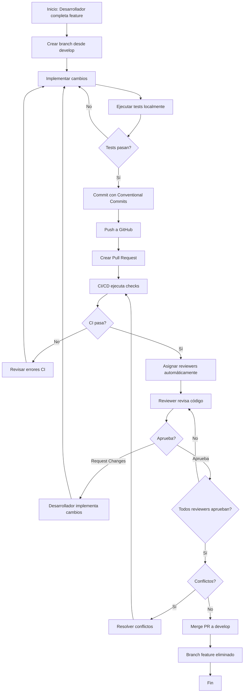
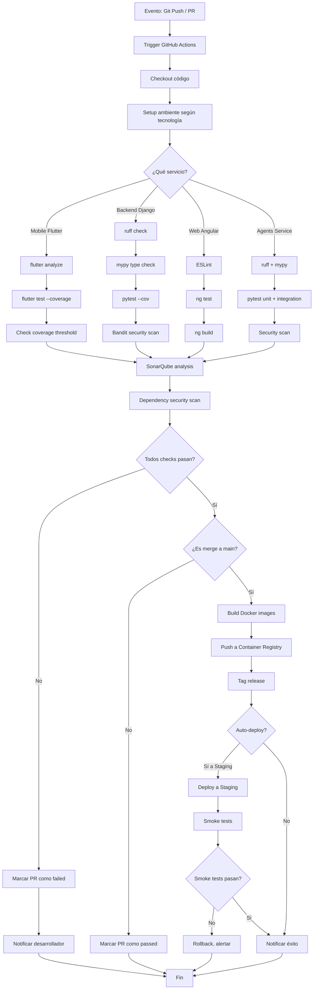
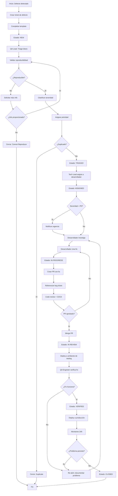
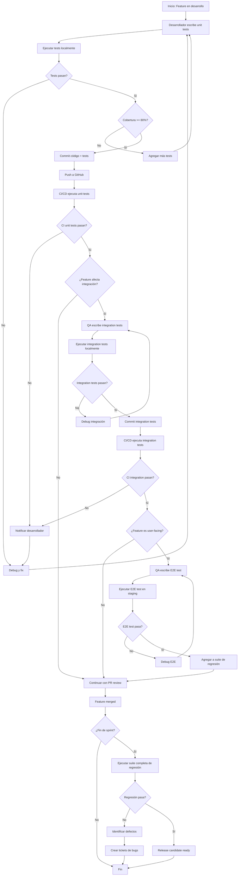
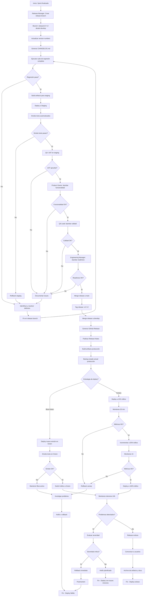
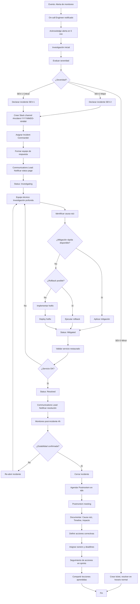
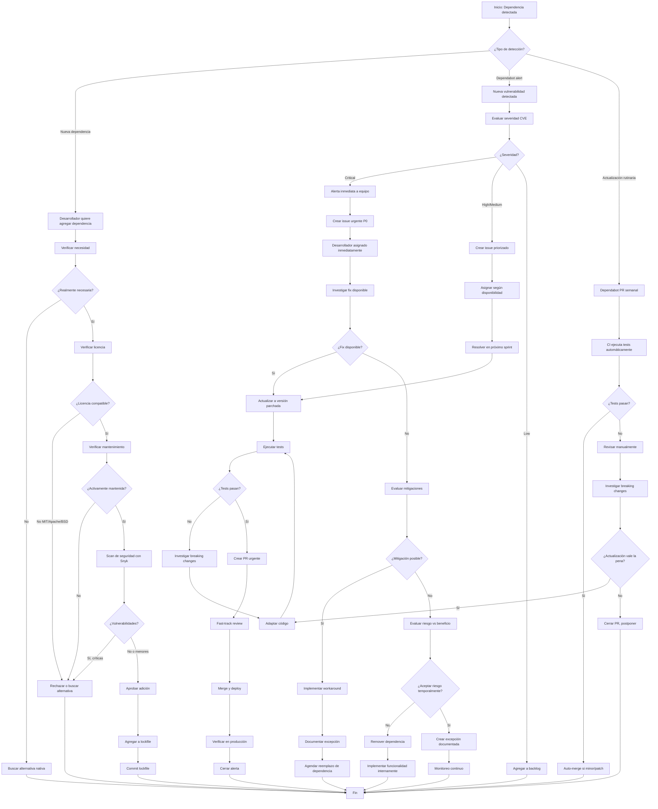
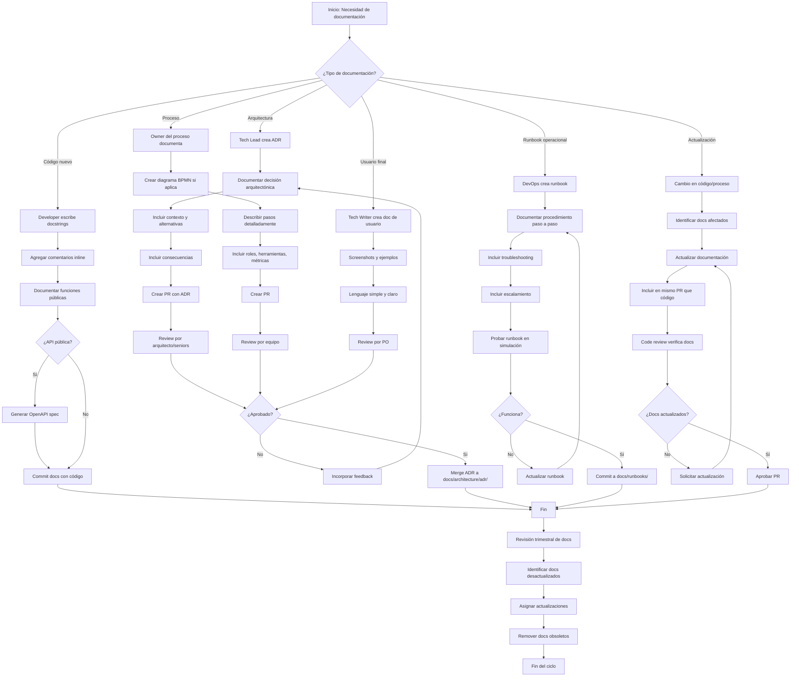

```mermaid
graph TD
    A[Inicio: Nuevo miembro contratado] --> B[HR: Onboarding administrativo]
    B --> C[Preparar equipamiento y cuentas]
    C --> D[Día 1: Bienvenida del equipo]
    D --> E[Engineering Manager: Asignar mentor]
    E --> F[DevOps: Configurar accesos]
    F --> G[GitHub, Jira, Slack, AWS, etc.]
    G --> H[Entrega de laptop y equipamiento]
    H --> I[Semana 1: Setup de ambiente de desarrollo]
    I --> J[Clonar repositorio]
    J --> K[Configurar IDEs]
    K --> L[Ejecutar servicios localmente]
    L --> M{¿Servicios running?}
    M -->|No| N[Mentor ayuda con troubleshooting]
    N --> L
    M -->|Sí| O[Leer documentación core]
    O --> P[README, CONTRIBUTING, AGENTS.md]
    P --> Q[Sesión de arquitectura con Tech Lead]
    Q --> R[Revisión de módulos y tecnologías]
    R --> S[Semana 1: Shadowing]
    S --> T[Observar code reviews]
    T --> U[Participar en daily standups]
    U --> V[Asistir a sesiones de planning]
    V --> W[Hacer preguntas]
    W --> X[Semana 2: Primera contribución guiada]
    X --> Y[Asignar 'good first issue']
    Y --> Z[Nuevo miembro implementa]
    Z --> AA[Mentor revisa frecuentemente]
    AA --> AB[Crear PR]
    AB --> AC[Code review con feedback detallado]
    AC --> AD{PR aprobado?}
    AD -->|No| AE[Implementar feedback]
    AE --> AB
    AD -->|Sí| AF[Merge primera contribución]
    AF --> AG[Celebrar logro]
    AG --> AH[Semana 2-4: Contribuciones incrementales]
    AH --> AI[Asignar tareas de complejidad creciente]
    AI --> AJ[Reducir supervisión gradualmente]
    AJ --> AK[Día 14: Retrospectiva de onboarding]
    AK --> AL[Feedback sobre proceso]
    AL --> AM[Identificar gaps de conocimiento]
    AM --> AN[Ajustar plan de capacitación]
    AN --> AO[Mes 1: Miembro productivo]
    AO --> AP[Contribución independiente]
    AP --> AQ[Fin del onboarding formal]
    AQ --> AR[Seguimiento mensual por 3 meses]
    AR --> AS[Fin]
```

```mermaid
graph TD
    A[Inicio: Nuevo Sprint] --> B[Sprint Planning - Parte 1]
    B --> C[Product Owner presenta backlog priorizado]
    C --> D[Equipo hace preguntas sobre user stories]
    D --> E[Sprint Planning - Parte 2]
    E --> F[Equipo estima user stories]
    F --> G[Planning Poker / Story Points]
    G --> H[Seleccionar stories para sprint]
    H --> I[Definir Sprint Goal]
    I --> J[Sprint Backlog creado]
    J --> K[Sprint Day 1-10: Ejecución]
    K --> L[Daily Standup cada día]
    L --> M[Cada developer reporta]
    M --> N[¿Qué hice ayer?]
    N --> O[¿Qué haré hoy?]
    O --> P[¿Bloqueadores?]
    P --> Q{¿Hay bloqueadores?}
    Q -->|Sí| R[Scrum Master ayuda a resolver]
    R --> S[Actualizar board]
    Q -->|No| S
    S --> T[Developers trabajan en stories]
    T --> U[Mover cards: To Do → In Progress → Review → Done]
    U --> V{¿User story completa?}
    V -->|No| T
    V -->|Sí| W[QA valida acceptance criteria]
    W --> X{¿Criteria cumplidos?}
    X -->|No| Y[Re-abrir story, feedback]
    Y --> T
    X -->|Sí| Z[Marcar como Done]
    Z --> AA{¿Fin de sprint?}
    AA -->|No| L
    AA -->|Sí| AB[Sprint Review / Demo]
    AB --> AC[Equipo presenta stories completadas]
    AC --> AD[Product Owner acepta o rechaza]
    AD --> AE[Stakeholders dan feedback]
    AE --> AF[Sprint Retrospective]
    AF --> AG[¿Qué salió bien?]
    AG --> AH[¿Qué salió mal?]
    AH --> AI[¿Acciones de mejora?]
    AI --> AJ[Priorizar 1-3 acciones]
    AJ --> AK[Asignar owners a acciones]
    AK --> AL[Cerrar sprint]
    AL --> AM[Calcular velocity]
    AM --> AN[Actualizar métricas]
    AN --> AO[Preparar próximo sprint]
    AO --> B
```

# Procesos Core de AURA360 - Especificaciones y BPMN

**Proyecto**: AURA360 - Plataforma Holística de Wellness
**Fecha**: 2025-11-16
**Versión**: 1.0
**Basado en**: IEEE 730-2014 Software Quality Assurance Processes

---

## Tabla de Contenidos

1. [Introducción](#introducción)
2. [Procesos Identificados](#procesos-identificados)
3. [PROC-01: Gestión de Pull Requests y Code Review](#proc-01-gestión-de-pull-requests-y-code-review)
4. [PROC-02: Pipeline de CI/CD](#proc-02-pipeline-de-cicd)
5. [PROC-03: Gestión de Defectos](#proc-03-gestión-de-defectos)
6. [PROC-04: Proceso de Testing (Unit, Integration, E2E)](#proc-04-proceso-de-testing-unit-integration-e2e)
7. [PROC-05: Proceso de Release y Despliegue](#proc-05-proceso-de-release-y-despliegue)
8. [PROC-06: Gestión de Incidentes en Producción](#proc-06-gestión-de-incidentes-en-producción)
9. [PROC-07: Onboarding de Nuevos Desarrolladores](#proc-07-onboarding-de-nuevos-desarrolladores)
10. [PROC-08: Gestión de Dependencias y Seguridad](#proc-08-gestión-de-dependencias-y-seguridad)
11. [PROC-09: Proceso de Sprint (Agile/Scrum)](#proc-09-proceso-de-sprint-agilescrum)
12. [PROC-10: Gestión de Documentación Técnica](#proc-10-gestión-de-documentación-técnica)

---

## Introducción

Este documento define los **10 procesos core más importantes** para el desarrollo, aseguramiento de calidad y operación de la plataforma AURA360. Cada proceso incluye:

- **Diagrama BPMN** en notación textual Mermaid
- **Especificación detallada** con roles, actividades, entradas, salidas, métricas y criterios de éxito
- **Referencias** a herramientas y documentación relacionada

Estos procesos están diseñados para soportar el Plan de Aseguramiento de Calidad (SQAP) definido en `IEEE_730_QUALITY_PLAN.md`.

---

## Procesos Identificados

| ID | Proceso | Criticidad | Frecuencia | Owner |
|----|---------|------------|------------|-------|
| **PROC-01** | Gestión de Pull Requests y Code Review | Alta | Continua | Tech Lead |
| **PROC-02** | Pipeline de CI/CD | Crítica | Por commit | DevOps Engineer |
| **PROC-03** | Gestión de Defectos | Alta | Continua | QA Lead |
| **PROC-04** | Proceso de Testing | Crítica | Continua | QA Engineers |
| **PROC-05** | Proceso de Release y Despliegue | Crítica | Semanal/Mensual | Release Manager |
| **PROC-06** | Gestión de Incidentes en Producción | Crítica | Ad-hoc | On-call Engineer |
| **PROC-07** | Onboarding de Nuevos Desarrolladores | Media | Por nuevo miembro | Engineering Manager |
| **PROC-08** | Gestión de Dependencias y Seguridad | Alta | Continua | DevOps + Security |
| **PROC-09** | Proceso de Sprint (Agile/Scrum) | Alta | Cada 2 semanas | Scrum Master |
| **PROC-10** | Gestión de Documentación Técnica | Media | Continua | Tech Writer + Developers |

---

## PROC-01: Gestión de Pull Requests y Code Review

### Descripción

Proceso para la creación, revisión y merge de Pull Requests (PRs) en el repositorio de código de AURA360, garantizando calidad, seguridad y adherencia a estándares.

### Objetivos

- Asegurar que todo código nuevo cumple con estándares de calidad
- Prevenir introducción de defectos y vulnerabilidades
- Facilitar transferencia de conocimiento entre desarrolladores
- Mantener cobertura de tests adecuada

### Roles y Responsabilidades

| Rol | Responsabilidades |
|-----|-------------------|
| **Desarrollador (Author)** | Crear PR, implementar cambios solicitados, resolver conflictos |
| **Reviewer** | Revisar código, aprobar o solicitar cambios |
| **Tech Lead** | Revisar PRs complejos, resolver desacuerdos |
| **CI/CD System** | Ejecutar checks automatizados |

### Diagrama BPMN



### Especificación Detallada

#### Entradas

| Entrada | Descripción | Fuente |
|---------|-------------|--------|
| Feature Branch | Branch con cambios implementados | Desarrollador |
| User Story / Issue | Requisito o defecto a resolver | Jira / Linear |
| Tests | Unit/Integration tests para cambios | Desarrollador |

#### Actividades

1. **Creación de PR**
   - Desarrollador crea PR usando template
   - Completa descripción, tipo de cambio, checklist
   - Vincula issue relacionado (Closes #XXX)

2. **Ejecución de CI/CD** (automático)
   - Linters (flutter analyze, ESLint, Ruff)
   - Type checking (mypy para Python)
   - Unit tests
   - Integration tests (si aplica)
   - Security scans (Snyk, Bandit)
   - Coverage check

3. **Asignación de Reviewers** (automático vía CODEOWNERS)
   - Mobile changes → Mobile Lead
   - Backend changes → Backend Lead
   - Infra changes → DevOps Engineer

4. **Code Review**
   - Reviewer verifica:
     - ✅ Lógica correcta y eficiente
     - ✅ Cumplimiento de coding standards
     - ✅ Tests adecuados
     - ✅ Documentación (docstrings, comments)
     - ✅ Sin vulnerabilidades de seguridad
     - ✅ Sin deuda técnica innecesaria
   - Comentarios en líneas específicas
   - Solicitud de cambios o aprobación

5. **Iteración** (si request changes)
   - Desarrollador implementa feedback
   - Push de nuevos commits
   - CI/CD re-ejecuta
   - Re-review

6. **Aprobación y Merge**
   - Mínimo 1 aprobación + CI passing
   - Squash merge (preferido) o merge commit
   - Branch automáticamente eliminado

#### Salidas

| Salida | Descripción | Destino |
|--------|-------------|---------|
| Código merged | Código aprobado integrado en develop | Repositorio Git |
| Comentarios de review | Feedback y aprendizajes | GitHub PR |
| Métricas de PR | Tiempo de review, aprobaciones | Dashboard de métricas |

#### Herramientas

- **GitHub**: Repositorio, PRs, comentarios
- **GitHub Actions**: CI/CD automation
- **SonarQube / CodeClimate**: Análisis estático
- **Snyk / Dependabot**: Security scanning

#### Métricas

| Métrica | Objetivo | Medición |
|---------|----------|----------|
| **Tiempo de PR merge** | < 24h promedio | Desde PR creation hasta merge |
| **Tasa de aprobación first-time** | > 70% | PRs aprobados sin cambios / Total PRs |
| **Cobertura de code review** | 100% | PRs revisados / Total PRs |
| **PR size** | < 400 LOC promedio | Lines changed por PR |

#### Criterios de Éxito

- ✅ 100% de PRs pasan CI/CD antes de merge
- ✅ 100% de PRs tienen al menos 1 aprobación
- ✅ Cobertura de código no disminuye
- ✅ 0 errores críticos de análisis estático

#### Riesgos y Mitigaciones

| Riesgo | Mitigación |
|--------|-----------|
| PRs muy grandes difíciles de revisar | Enforcement de PR size limits, split de features |
| Reviews superficiales | Checklist de review, training de reviewers |
| Bottleneck en reviewers | CODEOWNERS distribuido, múltiples reviewers |

---

## PROC-02: Pipeline de CI/CD

### Descripción

Pipeline automatizado de Continuous Integration y Continuous Deployment que ejecuta checks de calidad, tests y despliegues para cada commit en el repositorio.

### Objetivos

- Detectar defectos tempranamente (shift-left)
- Automatizar validaciones de calidad
- Desplegar código de manera rápida y confiable
- Mantener repositorio en estado deployable

### Roles y Responsabilidades

| Rol | Responsabilidades |
|-----|-------------------|
| **DevOps Engineer** | Configurar y mantener pipeline, optimizar performance |
| **Desarrolladores** | Mantener tests passing, resolver fallas de CI |
| **QA Engineers** | Definir tests de integración, validar ambientes |

### Diagrama BPMN



### Especificación Detallada

#### Entradas

| Entrada | Descripción | Fuente |
|---------|-------------|--------|
| Git Push Event | Nuevo commit o PR | GitHub |
| Código fuente | Cambios a validar | Repositorio |
| Configuración de CI | Workflows YAML | `.github/workflows/` |

#### Actividades por Servicio

**Mobile (Flutter)**:
1. flutter analyze (linter)
2. flutter test --coverage
3. Verificar coverage threshold (≥ 70%)
4. Build APK/IPA (solo en release branches)

**Backend (Django)**:
1. ruff check (linting)
2. mypy (type checking)
3. pytest con coverage (≥ 75%)
4. bandit (security linter)
5. Build Docker image (solo main branch)

**Web (Angular)**:
1. ESLint
2. ng test (Karma + Jasmine)
3. ng build
4. Lighthouse CI (solo en deploys)

**Agents Service**:
1. ruff + mypy
2. pytest unit tests
3. pytest integration tests (con servicios mock)
4. Security scan

**VectorDB Service**:
1. ruff + mypy
2. pytest unit tests (fast)
3. pytest integration tests (requiere Qdrant running)

**Cross-cutting**:
1. SonarQube analysis (calidad y deuda técnica)
2. Snyk dependency scan (vulnerabilidades)
3. CHANGELOG verification (en release branches)

#### Salidas

| Salida | Descripción | Destino |
|--------|-------------|---------|
| CI Status (Pass/Fail) | Estado del pipeline | GitHub PR checks |
| Coverage Reports | Reportes de cobertura HTML/XML | Artifacts, SonarQube |
| Build Artifacts | Docker images, APK, IPA | Container Registry, Storage |
| Security Reports | Vulnerabilidades encontradas | GitHub Security tab |
| Deployment | Aplicación desplegada en ambiente | Kubernetes, Cloud |

#### Estrategia de Deployment

**Ambientes**:
- **develop branch** → Auto-deploy a Integration environment
- **main branch** → Auto-deploy a Staging → Manual approval → Production

**Deployment Strategy**:
- **Staging/Prod**: Blue-Green deployment o Canary
- **Smoke tests** post-deploy obligatorios
- **Rollback automático** si smoke tests fallan

#### Herramientas

| Herramienta | Propósito |
|-------------|-----------|
| **GitHub Actions** | Orquestación de CI/CD |
| **Docker** | Containerización |
| **Azure Container Registry** | Registry de imágenes |
| **Kubernetes (AKS)** | Orquestación de contenedores |
| **Helm** | Package manager para Kubernetes |
| **SonarQube** | Análisis de calidad |
| **Snyk** | Security scanning |

#### Métricas

| Métrica | Objetivo | Medición |
|---------|----------|----------|
| **Tiempo de ejecución CI** | < 10 min por pipeline | Duración total de workflow |
| **Pass rate de CI** | > 95% | Builds passing / Total builds |
| **Deployment frequency** | Daily (develop), Weekly (prod) | Deploys por ambiente |
| **MTTR (Mean Time To Recovery)** | < 1h | Tiempo de rollback en incidentes |

#### Criterios de Éxito

- ✅ CI ejecuta en < 10 minutos
- ✅ 100% de código merged pasa CI
- ✅ Despliegues a staging automatizados
- ✅ 0 deploys fallidos sin rollback
- ✅ Smoke tests validan funcionalidad crítica

#### Optimizaciones

- **Caching** de dependencias (npm, uv, pub cache)
- **Paralelización** de tests
- **Test splitting** para tests largos
- **Conditional execution** (solo ejecutar lo necesario)

#### Riesgos y Mitigaciones

| Riesgo | Mitigación |
|--------|-----------|
| CI muy lento (bottleneck) | Optimización de cache, paralelización, hardware más potente |
| Flaky tests (intermittentes) | Identificar y arreglar, retry limitado (max 2) |
| Secrets expuestos en logs | Máscaras de secrets, revisión de logs |
| Deployment fallido en producción | Blue-green deployment, smoke tests, rollback automático |

---

## PROC-03: Gestión de Defectos

### Descripción

Proceso para reportar, clasificar, priorizar, resolver y verificar defectos encontrados en AURA360.

### Objetivos

- Capturar todos los defectos de manera estructurada
- Priorizar resolución según impacto y urgencia
- Mantener trazabilidad de defectos desde detección hasta cierre
- Aprender de defectos recurrentes

### Roles y Responsabilidades

| Rol | Responsabilidades |
|-----|-------------------|
| **Reportador** | Reportar defecto con información completa |
| **QA Lead** | Triage diario, clasificación, priorización |
| **Tech Lead** | Asignación a desarrollador apropiado |
| **Desarrollador** | Investigar, resolver, crear fix |
| **QA Engineer** | Verificar fix en ambiente de pruebas |

### Diagrama BPMN



### Especificación Detallada

#### Entradas

| Entrada | Descripción | Fuente |
|---------|-------------|--------|
| Reporte de defecto | Descripción del problema | QA, Desarrolladores, Usuarios |
| Evidencia | Screenshots, logs, videos | Reportador |
| Pasos de reproducción | Cómo replicar el defecto | Reportador |

#### Clasificación de Severidades

| Severidad | Descripción | SLA Resolución | Ejemplos |
|-----------|-------------|----------------|----------|
| **P0 - Critical** | Sistema no funcional, pérdida de datos, brecha de seguridad | 4 horas | App crashea, pérdida de datos, SQL injection |
| **P1 - High** | Funcionalidad principal rota, workaround difícil | 24 horas | Login no funciona, no se pueden crear mood entries |
| **P2 - Medium** | Funcionalidad secundaria afectada, workaround disponible | 1 semana | Filtros no funcionan, UI incorrecta |
| **P3 - Low** | Problema menor, cosmético | Próximo sprint | Texto mal alineado, mensaje poco claro |

#### Actividades de Triage (Diario, 30 min)

**Responsable**: QA Lead

**Checklist**:
1. Revisar nuevos defectos (Estado: NEW)
2. Validar reproducibilidad
   - Si no reproducible → Solicitar más info o cerrar
3. Verificar si es duplicado → Cerrar como Duplicate
4. Clasificar severidad (P0, P1, P2, P3)
5. Asignar prioridad considerando:
   - Severidad
   - Impacto en usuarios
   - Complejidad de fix
   - Disponibilidad de workaround
6. Cambiar estado a TRIAGED
7. Notificar Tech Lead para asignación
8. Para P0: Escalar inmediatamente a Engineering Manager

#### Flujo de Resolución

1. **Asignación** (Tech Lead):
   - Asignar a desarrollador con expertise en área afectada
   - Establecer deadline según SLA

2. **Investigación** (Desarrollador):
   - Reproducir defecto localmente
   - Identificar causa raíz (código, configuración, dependencia)
   - Estimar esfuerzo de fix

3. **Implementación de Fix**:
   - Crear fix siguiendo coding standards
   - Agregar test de regresión
   - Actualizar documentación si aplica

4. **Code Review y Merge**:
   - Seguir proceso PROC-01
   - PR debe referenciar ticket de defecto

5. **Verificación** (QA Engineer):
   - Validar fix en ambiente de testing
   - Ejecutar test de regresión
   - Verificar que no introdujo nuevos defectos
   - Aprobar o re-abrir

6. **Cierre**:
   - Deploy a producción
   - Monitoreo 24h
   - Cerrar ticket si no hay recurrencia

#### Salidas

| Salida | Descripción | Destino |
|--------|-------------|---------|
| Defecto resuelto | Código con fix integrado | Repositorio |
| Test de regresión | Test que previene recurrencia | Suite de tests |
| Documentación | Lecciones aprendidas | Wiki, Postmortem |
| Métricas de defectos | Data para análisis de tendencias | Dashboard |

#### Herramientas

- **Jira / Linear**: Gestión de defectos
- **GitHub**: Vinculación de PRs a tickets
- **Slack**: Notificaciones (#bugs, #incidents)
- **Sentry**: Error tracking automático

#### Métricas

| Métrica | Objetivo | Medición |
|---------|----------|----------|
| **Defect Density** | < 5 defectos / KLOC | Defectos / Líneas de código |
| **Defect Leakage** | < 10% | Defectos en prod / Total defectos |
| **Mean Time to Fix (MTTF)** | < 48h (P1), < 4h (P0) | Tiempo de resolución promedio |
| **Tasa de Re-apertura** | < 5% | Defectos re-abiertos / Total cerrados |

#### Criterios de Éxito

- ✅ 100% de defectos P0 resueltos en < 4h
- ✅ 100% de defectos P1 resueltos en < 24h
- ✅ Triage diario completado
- ✅ 0 defectos críticos sin asignar > 1h

#### Escalamiento

**Condiciones de escalamiento**:
- P0 no resuelto en 4h → Engineering Manager
- P1 no resuelto en 24h → Engineering Manager
- > 3 P1 abiertos simultáneamente → Engineering Manager
- Defecto recurrente (> 2 veces) → Root Cause Analysis session

#### Riesgos y Mitigaciones

| Riesgo | Mitigación |
|--------|-----------|
| Defectos mal clasificados | Training de triage, revisión de clasificaciones |
| Fixes introducen nuevos bugs | Mandatory regression tests, code review riguroso |
| Backlog de defectos crece | Sprints dedicados a bug fixing, priorización estricta |

---

## PROC-04: Proceso de Testing (Unit, Integration, E2E)

### Descripción

Proceso integral de testing que abarca pruebas unitarias, de integración y end-to-end para garantizar la calidad del software de AURA360.

### Objetivos

- Detectar defectos tempranamente en el ciclo de desarrollo
- Mantener cobertura de código adecuada
- Validar integraciones entre componentes
- Asegurar que flujos críticos de usuario funcionan correctamente

### Roles y Responsabilidades

| Rol | Responsabilidades |
|-----|-------------------|
| **Desarrolladores** | Escribir unit tests, mantener cobertura |
| **QA Engineers** | Escribir integration y E2E tests, ejecutar suite de regresión |
| **QA Lead** | Planificar testing, revisar cobertura, reportar métricas |

### Diagrama BPMN



### Especificación Detallada

#### Niveles de Testing

**1. Unit Tests (70% de cobertura total)**

| Aspecto | Detalle |
|---------|---------|
| **Objetivo** | Verificar comportamiento de unidades individuales (funciones, métodos, clases) |
| **Responsable** | Desarrolladores |
| **Frecuencia** | Por cada función/clase nueva o modificada |
| **Herramientas** | - Flutter Test (Mobile)<br>- pytest (Python)<br>- Jasmine + Karma (Angular) |
| **Ubicación** | - `apps/mobile/test/`<br>- `services/*/tests/unit/`<br>- `apps/web/src/**/*.spec.ts` |
| **Ejecución** | - Local: Antes de commit<br>- CI/CD: Por cada PR |
| **Cobertura Mínima** | ≥ 80% statements + branches |

**Características**:
- ✅ Tests rápidos (< 5 min suite completa)
- ✅ Aislados (sin dependencias externas)
- ✅ Determinísticos (mismo resultado siempre)
- ✅ Mock de dependencias externas

**Ejemplo** (Python/pytest):
```python
def test_calculate_wellness_score():
    """Verificar cálculo correcto de wellness score."""
    score = calculate_wellness_score(
        mind_score=80,
        body_score=75,
        soul_score=85
    )
    assert score == 80.0

def test_calculate_wellness_score_edge_case():
    """Verificar manejo de valores extremos."""
    score = calculate_wellness_score(
        mind_score=0,
        body_score=0,
        soul_score=0
    )
    assert score == 0.0
```

**2. Integration Tests (20% de cobertura total)**

| Aspecto | Detalle |
|---------|---------|
| **Objetivo** | Verificar interacción correcta entre componentes y servicios |
| **Responsable** | QA Engineers + Desarrolladores |
| **Frecuencia** | Por feature que involucra integración |
| **Herramientas** | pytest (con servicios reales o testcontainers) |
| **Ubicación** | `services/*/tests/integration/` |
| **Ejecución** | - Local: Con Docker Compose<br>- CI/CD: Con servicios mock/testcontainers |
| **Duración** | 2-5 min por suite |

**Características**:
- ✅ Servicios dependientes running (Qdrant, Redis, PostgreSQL)
- ✅ Datos de prueba controlados
- ✅ Validación de contratos entre servicios
- ✅ Tests de API REST

**Suites Implementadas** (ver `docs/testing/README_PRUEBAS.md`):
- VectorDB Service Integration (~8 tests)
- Agents Service Integration (~10 tests)
- Backend Django Integration (~9 tests)
- E2E Full Flow (~6 tests)

**Ejecución**:
```bash
# Script orquestado
./scripts/run_integration_tests.sh

# Suite específica
pytest services/vectordb/tests/integration/ -v
```

**3. End-to-End Tests (10% de cobertura total)**

| Aspecto | Detalle |
|---------|---------|
| **Objetivo** | Validar flujos completos de usuario desde UI hasta persistencia |
| **Responsable** | QA Engineers |
| **Frecuencia** | Pre-release, regresión |
| **Herramientas** | - Flutter Integration Tests (Mobile)<br>- Cypress/Playwright (Web) |
| **Ubicación** | `apps/mobile/integration_test/` |
| **Ejecución** | Manual + Automatizada en staging |
| **Duración** | 10-30 min por suite |

**Flujos Críticos** (ver SQAP sección 4.2.3):
- E2E-01: Registro y Onboarding
- E2E-02: Registro de Estado de Ánimo
- E2E-03: Solicitud de Recomendaciones Holísticas
- E2E-04: Creación de Plan Nutricional
- E2E-05: Sincronización Offline

#### Entradas

| Entrada | Descripción | Fuente |
|---------|-------------|--------|
| Código a probar | Implementación de feature/fix | Desarrollador |
| Especificación de requisitos | Acceptance criteria | User Story |
| Datos de prueba | Fixtures, mocks | `tests/fixtures/` |

#### Actividades

**Fase 1: Unit Testing**
1. Desarrollador escribe tests unitarios junto con código
2. Ejecuta localmente: `flutter test`, `pytest`, `ng test`
3. Verifica cobertura: `flutter test --coverage`, `pytest --cov`
4. Commit código + tests
5. CI/CD valida cobertura y ejecución

**Fase 2: Integration Testing**
1. QA identifica puntos de integración a probar
2. Escribe tests de integración
3. Configura datos de prueba
4. Ejecuta con servicios dependientes
5. Valida contratos de API
6. Commit integration tests

**Fase 3: E2E Testing**
1. QA identifica flujos críticos de usuario
2. Escribe tests E2E (Flutter integration_test o Cypress)
3. Ejecuta en ambiente de staging
4. Valida experiencia de usuario completa
5. Agrega a suite de regresión

**Fase 4: Regresión**
1. Ejecutar suite completa antes de release
2. Análisis de resultados
3. Creación de tickets para defectos encontrados

#### Salidas

| Salida | Descripción | Destino |
|--------|-------------|---------|
| Test Reports | Resultados de ejecución (JUnit XML, HTML) | CI/CD artifacts |
| Coverage Reports | Cobertura de código | SonarQube, GitHub |
| Defectos | Bugs encontrados durante testing | Jira / Linear |
| Suite de Regresión | Colección de tests críticos | Repositorio |

#### Estrategia de Datos de Prueba

**Generación**:
- Faker libraries para datos sintéticos realistas
- Scripts de seeding: `scripts/seed_test_data.py`
- Fixtures en `tests/fixtures/`

**Gestión**:
- Versionados con código
- Anonimización de datos productivos
- ❌ NUNCA usar datos reales de usuarios

**Ejemplo**:
```python
# tests/fixtures/mood_entries.py
SAMPLE_MOOD_ENTRIES = [
    {
        "user_id": "test-user-001",
        "mood_level": 7,
        "tags": ["work", "productive"],
        "notes": "Great day at work!"
    },
    # ...
]
```

#### Herramientas

| Categoría | Herramienta | Componentes |
|-----------|-------------|-------------|
| **Unit Testing** | Flutter Test, pytest, Jasmine/Karma | Todos |
| **Integration Testing** | pytest, Postman/Newman | Backend, APIs |
| **E2E Testing** | Flutter integration_test, Cypress | Mobile, Web |
| **Coverage** | coverage.py, lcov | Todos |
| **Test Management** | Jira Test Cases, TestRail (opcional) | QA |
| **Performance Testing** | k6, Locust | Backend |

#### Métricas

| Métrica | Objetivo | Medición |
|---------|----------|----------|
| **Unit Test Coverage - Mobile** | ≥ 80% | lines + branches |
| **Unit Test Coverage - Backend** | ≥ 80% | statements + branches |
| **Integration Test Coverage** | 100% de integraciones críticas | Tests ejecutados |
| **E2E Test Coverage** | 100% de flujos críticos | Flujos validados |
| **Test Execution Time** | < 10 min (unit + integration) | Duración CI/CD |
| **Pass Rate** | > 95% | Tests passing / Total tests |

#### Criterios de Éxito

- ✅ Cobertura de unit tests ≥ 80% para cada componente
- ✅ 100% de integraciones críticas cubiertas
- ✅ 100% de flujos E2E críticos funcionando
- ✅ Suite de regresión ejecutada antes de cada release
- ✅ 0 tests flaky (intermittentes)

#### Riesgos y Mitigaciones

| Riesgo | Mitigación |
|--------|-----------|
| Tests lentos (bottleneck) | Paralelización, optimización, hardware más rápido |
| Tests flaky (intermitentes) | Identificar y arreglar root cause, retry limitado |
| Baja cobertura de código | Enforcement en CI/CD, code review checks |
| Tests desactualizados | Mantenimiento continuo, eliminar tests obsoletos |

---

## PROC-05: Proceso de Release y Despliegue

### Descripción

Proceso para planificar, preparar, ejecutar y validar releases de AURA360 en ambientes de staging y producción.

### Objetivos

- Entregar software de calidad en producción de manera confiable
- Minimizar riesgo de fallas en despliegues
- Mantener trazabilidad de versiones y cambios
- Facilitar rollback rápido si es necesario

### Roles y Responsabilidades

| Rol | Responsabilidades |
|-----|-------------------|
| **Release Manager** | Coordinar release, aprobar despliegue a producción |
| **Product Owner** | Aprobar funcionalidad, release notes |
| **QA Lead** | Aprobar calidad, validar UAT |
| **DevOps Engineer** | Ejecutar despliegue, monitoreo post-deploy |
| **Engineering Manager** | Aprobar readiness técnico |

### Diagrama BPMN



### Especificación Detallada

#### Entradas

| Entrada | Descripción | Fuente |
|---------|-------------|--------|
| develop branch | Código completado del sprint | Repositorio |
| User Stories completadas | Features y fixes incluidos | Jira / Linear |
| Resultados de testing | QA sign-off | QA Lead |

#### Fases del Proceso

**Fase 1: Preparación de Release (T-3 días)**

1. **Crear Release Branch**:
   ```bash
   git checkout develop
   git pull origin develop
   git checkout -b release/v1.2.3
   ```

2. **Actualizar Versiones**:
   - Mobile: `pubspec.yaml` (version: 1.2.3+build)
   - Backend: `pyproject.toml`, `__version__`
   - Web: `package.json`
   - Infraestructura: Helm chart version

3. **Generar CHANGELOG**:
   - Usar Conventional Commits para auto-generar
   - Agrupar por: Features, Fixes, Breaking Changes
   - Ejemplo:
     ```markdown
     ## [1.2.3] - 2025-11-20

     ### Added
     - feat(mobile): mood tagging functionality
     - feat(api): nutrition plans API

     ### Fixed
     - fix(agents): timeout en generación de recomendaciones
     - fix(web): UI responsive en mobile

     ### Changed
     - chore(vectordb): upgrade Qdrant to v1.8.0
     ```

4. **Code Freeze**:
   - Solo bug fixes críticos permitidos en release branch
   - Comunicar a equipo

**Fase 2: Testing Pre-Release (T-2 días)**

1. **Suite de Regresión Completa**:
   - Unit tests: Todos los componentes
   - Integration tests: Full suite
   - E2E tests: Flujos críticos
   - Performance tests: Load testing
   - Security scan: Vulnerabilities

2. **Resolución de Defectos**:
   - Defectos críticos bloqueantes → Fix inmediato
   - Defectos no críticos → Evaluar si bloquean release o pasan a próximo

**Fase 3: Staging Deployment (T-1 día)**

1. **Build Artifacts**:
   - Docker images con tag release
   - APK/IPA signed para staging
   - Web build optimizado

2. **Deploy a Staging**:
   - Helm upgrade en Kubernetes staging
   - Configuración específica de staging

3. **Smoke Tests Automatizados**:
   - Health checks de todos los servicios
   - Tests de conectividad entre servicios
   - Validación de configuración

4. **UAT (User Acceptance Testing)**:
   - QA ejecuta flujos críticos manualmente
   - Product Owner valida funcionalidad
   - Stakeholders revisan features nuevas

**Fase 4: Aprobaciones (T-0)**

**Checkpoints de Aprobación**:

| Checkpoint | Responsable | Criterios |
|------------|-------------|-----------|
| **Funcionalidad** | Product Owner | ✅ Todas las user stories completadas<br>✅ Acceptance criteria cumplidos |
| **Calidad** | QA Lead | ✅ 0 defectos P0/P1 abiertos<br>✅ Suite de regresión passing<br>✅ Cobertura de tests >= objetivos |
| **Readiness Técnico** | Engineering Manager | ✅ Deployment runbook actualizado<br>✅ Rollback plan listo<br>✅ Monitoreo configurado |

**Fase 5: Production Deployment**

**Estrategias de Deployment**:

**Opción A: Blue-Green Deployment**
1. Ambiente Green con nueva versión
2. Smoke tests en Green
3. Switch de tráfico de Blue a Green
4. Mantener Blue por 24h para rollback rápido

**Opción B: Canary Deployment**
1. Deploy a 10% de tráfico
2. Monitoreo 30 min
3. Incrementar a 50% si métricas OK
4. Monitoreo 1h
5. Deploy a 100%

**Actividades Post-Deploy**:
1. **Smoke Tests en Producción**
2. **Monitoreo Intensivo 24h**:
   - Error rates
   - Latencias (p95, p99)
   - Tráfico de usuarios
   - Logs de errores (Sentry)
3. **Comunicación**:
   - Release notes a usuarios
   - Internal announcement
   - Update status page

**Fase 6: Validación Post-Release (24-48h)**

1. Monitoreo continuo de métricas
2. Revisión de feedback de usuarios
3. Identificación de issues post-release
4. Hotfix si es necesario

**Fase 7: Cierre de Release**

1. Archivo de artifacts
2. Actualización de documentación
3. Retrospective de release
4. Lecciones aprendidas

#### Salidas

| Salida | Descripción | Destino |
|--------|-------------|---------|
| Release Tag | vX.Y.Z en Git | GitHub |
| GitHub Release | Release notes + artifacts | GitHub Releases |
| Docker Images | Imágenes tagged con versión | Container Registry |
| Mobile Apps | APK/IPA en tiendas | Google Play, App Store |
| Deployment Logs | Logs de despliegue | Kibana |
| Release Notes | Comunicación a usuarios | Blog, Email, In-app |

#### Versionado (Semantic Versioning)

```
MAJOR.MINOR.PATCH

Ejemplo: 1.2.3

- MAJOR (1): Cambios incompatibles de API (breaking changes)
- MINOR (2): Nueva funcionalidad compatible hacia atrás
- PATCH (3): Bug fixes compatibles
```

**Incremento de Versión**:
- Breaking change → MAJOR
- Nueva feature → MINOR
- Bug fix → PATCH

#### Rollback Strategy

**Triggers de Rollback**:
- Error rate > 5% en producción
- Latencias > 2x baseline
- Crash rate > 1%
- Defecto crítico (P0) descubierto

**Proceso de Rollback**:
1. **Decisión** (< 15 min de detección)
2. **Ejecución**:
   - Blue-Green: Switch de vuelta a Blue
   - Canary: Reducir tráfico a 0%, revertir
   - Standard: Helm rollback a versión anterior
3. **Validación**: Smoke tests en versión anterior
4. **Comunicación**: Notificar stakeholders
5. **Postmortem**: Análisis de causa raíz

**Tiempo de Rollback Objetivo**: < 15 minutos

#### Herramientas

| Herramienta | Propósito |
|-------------|-----------|
| **Git / GitHub** | Versionado, branching, tagging |
| **GitHub Actions** | Build de artifacts, automation |
| **Helm** | Package manager Kubernetes |
| **Kubernetes** | Orquestación de contenedores |
| **Docker** | Containerización |
| **Sentry** | Error tracking |
| **Datadog / New Relic** | APM, monitoreo |
| **PagerDuty** | Alertas de incidentes |

#### Métricas

| Métrica | Objetivo | Medición |
|---------|----------|----------|
| **Deployment Frequency** | Semanal (staging), Mensual (prod) | Deploys por mes |
| **Lead Time for Changes** | < 1 semana | Commit a producción |
| **Change Failure Rate** | < 15% | Deploys con rollback / Total deploys |
| **MTTR (Mean Time To Recover)** | < 1h | Tiempo de rollback |

#### Criterios de Éxito

- ✅ 0 defectos P0/P1 en release
- ✅ Aprobación de todos los checkpoints
- ✅ Smoke tests passing en producción
- ✅ Métricas de producción estables 24h post-deploy
- ✅ Release notes comunicados

#### Riesgos y Mitigaciones

| Riesgo | Mitigación |
|--------|-----------|
| Defecto crítico descubierto en producción | Smoke tests robustos, canary deployment, rollback rápido |
| Downtime durante deploy | Blue-green deployment, zero-downtime strategy |
| Configuración incorrecta | Config as code, validación pre-deploy |
| Comunicación fallida | Automated release notes, status page |

---

## PROC-06: Gestión de Incidentes en Producción

### Descripción

Proceso para detectar, responder, resolver y aprender de incidentes que afectan la disponibilidad o rendimiento del sistema en producción.

### Objetivos

- Minimizar tiempo de downtime y impacto a usuarios
- Restaurar servicio rápidamente
- Comunicar transparentemente estado del sistema
- Prevenir recurrencia mediante análisis de causa raíz

### Roles y Responsabilidades

| Rol | Responsabilidades |
|-----|-------------------|
| **On-call Engineer** | Primera respuesta, triage, mitigación inicial |
| **Incident Commander** | Coordinar respuesta, tomar decisiones críticas |
| **Technical Leads** | Resolver issues técnicos complejos |
| **Communications Lead** | Comunicar a usuarios y stakeholders |
| **Engineering Manager** | Escalamiento, asignación de recursos |

### Diagrama BPMN



### Especificación Detallada

#### Clasificación de Severidades

| Severidad | Descripción | Ejemplos | Tiempo de Respuesta |
|-----------|-------------|----------|---------------------|
| **SEV-1 Critical** | Sistema completamente no disponible, pérdida de datos, brecha de seguridad activa | - Todos los usuarios no pueden usar la app<br>- Base de datos corrupta<br>- Data leak | 5 min |
| **SEV-2 Major** | Funcionalidad crítica degradada, afecta a mayoría de usuarios | - Login intermitente<br>- Latencias muy altas<br>- Error rate > 10% | 15 min |
| **SEV-3 Minor** | Funcionalidad secundaria afectada, workaround disponible | - Feature no crítica rota<br>- UI glitch<br>- Error rate < 5% | 1 hora |

#### Entradas

| Entrada | Descripción | Fuente |
|---------|-------------|--------|
| Alerta de Monitoreo | Alarma automática de métrica crítica | Datadog, PagerDuty |
| Reporte de Usuario | Usuario reporta problema | Soporte, Redes sociales |
| Error Tracking | Spike en errores | Sentry |

#### Actividades de Respuesta

**1. Detección y Notificación**

Triggers de Alerta:
- Error rate > 5% por 5 min → SEV-2
- Latencia p95 > 5s por 5 min → SEV-2
- Health check failing → SEV-1
- Crash rate > 1% → SEV-1
- Security vulnerability explotada → SEV-1

**2. Triage Inicial (5 min)**

On-call Engineer:
- Acknowledge alerta
- Verificar impacto:
  - ¿Cuántos usuarios afectados?
  - ¿Qué funcionalidad está rota?
  - ¿Pérdida de datos?
- Clasificar severidad
- Declarar incidente si SEV-1 o SEV-2

**3. Formación de Equipo de Respuesta**

| Rol | Cuándo | Responsabilidad |
|-----|--------|----------------|
| **Incident Commander** | Siempre (SEV-1/2) | Coordinar, tomar decisiones, comunicación |
| **Technical Leads** | Si issue complejo | Debugging técnico profundo |
| **Communications Lead** | SEV-1 siempre, SEV-2 si afecta usuarios | Actualizar status page, notificaciones |
| **Engineering Manager** | SEV-1, o si > 2h duración | Asignar recursos adicionales |

**4. Investigación y Mitigación**

Estrategias de Mitigación (en orden de preferencia):
1. **Rollback**: Revertir a versión anterior estable
2. **Feature Flag**: Desactivar feature problemática
3. **Hotfix**: Patch rápido y deploy
4. **Escalamiento**: Agregar más recursos si es sobrecarga
5. **Degradación Graciosa**: Deshabilitar funcionalidad no crítica

**5. Comunicación**

**Status Page Updates** (cada 30 min para SEV-1, cada 1h para SEV-2):
- Investigating
- Identified
- Monitoring (mitigación aplicada)
- Resolved

**Audiencias**:
- **Usuarios**: Status page, in-app notification
- **Internal**: Slack #incidents, email
- **Stakeholders**: Email, llamada si SEV-1

**6. Resolución y Cierre**

Criterios de Resolución:
- ✅ Servicio restaurado completamente
- ✅ Métricas normalizadas (error rate, latencias)
- ✅ Monitoreo post-incidente 4h sin problemas
- ✅ Comunicación de resolución enviada

**7. Postmortem**

**Timing**: Dentro de 48h del cierre del incidente

**Participantes**:
- Incident Commander
- On-call Engineer
- Technical Leads involucrados
- Engineering Manager
- Product Owner (si impactó usuarios significativamente)

**Agenda** (1 hora):
1. Timeline del incidente (15 min)
2. Causa raíz identificada (15 min)
3. Qué salió bien / Qué salió mal (15 min)
4. Acciones correctivas (15 min)

**Plantilla de Postmortem**:
```markdown
## Postmortem: [Título del Incidente]

**Fecha del Incidente**: YYYY-MM-DD
**Duración**: Xh Ymin
**Severidad**: SEV-X
**Impacto**: [Descripción del impacto]

### Resumen
[2-3 párrafos describiendo qué pasó]

### Timeline
- HH:MM - Evento desencadenante
- HH:MM - Alerta disparada
- HH:MM - On-call acknowledges
- HH:MM - Incidente declarado
- HH:MM - Mitigación aplicada
- HH:MM - Servicio restaurado
- HH:MM - Incidente cerrado

### Causa Raíz
[Análisis de 5 Whys o Fishbone Diagram]

**Root Cause**: [Causa fundamental]

### Impacto
- **Usuarios afectados**: X usuarios / Y%
- **Funcionalidad afectada**: [Descripción]
- **Duración**: Xh Ymin
- **Pérdida de datos**: Sí/No

### Qué Salió Bien
- ✅ [Cosa 1]
- ✅ [Cosa 2]

### Qué Salió Mal
- ❌ [Cosa 1]
- ❌ [Cosa 2]

### Acciones Correctivas
| Acción | Owner | Deadline | Status |
|--------|-------|----------|--------|
| [Acción 1] | [Nombre] | YYYY-MM-DD | [ ] |
| [Acción 2] | [Nombre] | YYYY-MM-DD | [ ] |

### Lecciones Aprendidas
[Insights para el futuro]
```

#### Salidas

| Salida | Descripción | Destino |
|--------|-------------|---------|
| Servicio Restaurado | Sistema funcionando normalmente | Producción |
| Incident Report | Timeline, causa raíz, impacto | Confluence |
| Postmortem Document | Análisis detallado | Confluence, compartido al equipo |
| Acciones Correctivas | Tareas para prevenir recurrencia | Jira / Linear |
| Actualización de Runbooks | Procedimientos mejorados | docs/runbooks/ |

#### Herramientas

| Herramienta | Propósito |
|-------------|-----------|
| **PagerDuty / OpsGenie** | Alerting, on-call rotation |
| **Slack** | Coordinación (#incidents channel) |
| **Status Page (Statuspage.io)** | Comunicación a usuarios |
| **Datadog / New Relic** | Monitoreo, dashboards |
| **Sentry** | Error tracking |
| **Grafana** | Visualización de métricas |
| **Kibana** | Análisis de logs |
| **Confluence** | Documentación de postmortems |

#### Métricas

| Métrica | Objetivo | Medición |
|---------|----------|----------|
| **MTTA (Mean Time To Acknowledge)** | < 5 min | Tiempo desde alerta hasta acknowledge |
| **MTTI (Mean Time To Identify)** | < 15 min | Tiempo hasta identificar causa |
| **MTTR (Mean Time To Recover)** | < 1h (SEV-1) | Tiempo hasta restaurar servicio |
| **Incident Frequency** | < 2 SEV-1/mes | Número de incidentes críticos |
| **Repeat Incident Rate** | < 10% | Incidentes con misma causa raíz |

#### Criterios de Éxito

- ✅ 100% de alertas acknowledged en < 5 min
- ✅ Postmortem completado para todos los SEV-1/SEV-2
- ✅ Acciones correctivas asignadas y tracked
- ✅ Comunicación oportuna a usuarios
- ✅ Servicio restaurado dentro de SLA

#### On-call Rotation

**Esquema**:
- Rotación semanal
- 2 niveles: Primary (L1) y Escalation (L2)
- Compensación: Tiempo libre o pago adicional

**Responsabilidades del On-call**:
- Responder a alertas 24/7
- Triage inicial
- Escalar si es necesario
- Documentar acciones tomadas

#### Riesgos y Mitigaciones

| Riesgo | Mitigación |
|--------|-----------|
| On-call no responde | Escalamiento automático a backup después de 10 min |
| Comunicación confusa durante incidente | Incident Commander único, canal dedicado |
| Rollback no funciona | Runbooks probados, smoke tests post-rollback |
| Falta de expertise para resolver | Contact list actualizado, escalamiento a expertos |

---

## PROC-07: Onboarding de Nuevos Desarrolladores

### Descripción

Proceso estructurado para integrar nuevos miembros del equipo de desarrollo en AURA360, facilitando su productividad y alineación con prácticas del equipo.

### Objetivos

- Reducir tiempo hasta que nuevo miembro sea productivo
- Transferir conocimiento de arquitectura, procesos y herramientas
- Integrar culturalmente al nuevo miembro
- Asegurar adherencia a estándares desde el inicio

### Roles y Responsabilidades

| Rol | Responsabilidades |
|-----|-------------------|
| **Engineering Manager** | Coordinar onboarding, asignar mentor |
| **Mentor / Buddy** | Guiar al nuevo miembro, responder preguntas |
| **Tech Lead** | Sesión de arquitectura, primeras asignaciones |
| **DevOps** | Setup de accesos y herramientas |
| **HR** | Onboarding administrativo, equipamiento |

### Diagrama BPMN



### Especificación Detallada

#### Entradas

| Entrada | Descripción | Fuente |
|---------|-------------|--------|
| Nuevo miembro contratado | Información del empleado | HR |
| Rol y expertise | Posición (Frontend, Backend, etc.) | Engineering Manager |
| Fecha de inicio | Start date | HR |

#### Pre-Onboarding (1 semana antes de inicio)

| Actividad | Responsable | Output |
|-----------|-------------|--------|
| Crear cuentas | DevOps | GitHub, Jira, Slack, Email corporativo |
| Ordenar equipamiento | HR | Laptop, monitor, accesorios |
| Asignar mentor | Engineering Manager | Buddy asignado |
| Preparar welcome package | Team | Info del equipo, docs útiles |

#### Semana 1: Fundamentos y Setup

**Día 1: Bienvenida**

| Tiempo | Actividad | Responsable |
|--------|-----------|-------------|
| 09:00 - 09:30 | Welcome meeting con Engineering Manager | EM |
| 09:30 - 10:00 | Tour virtual del equipo (Slack intros) | Mentor |
| 10:00 - 11:00 | Setup inicial de laptop | DevOps + Mentor |
| 11:00 - 12:00 | Revisión de docs principales (README, CONTRIBUTING) | Mentor |
| 14:00 - 15:00 | Sesión de Q&A sobre el proyecto | Tech Lead |
| 15:00 - 16:00 | Setup de ambiente de desarrollo | Mentor |

**Día 2-3: Ambiente de Desarrollo**

Objetivos:
- ✅ Clonar repositorio exitosamente
- ✅ Ejecutar todos los servicios localmente
- ✅ Ejecutar suite de tests localmente
- ✅ Entender estructura de monorepo

Checklist de Setup:
```markdown
- [ ] Git configurado con SSH keys
- [ ] Repositorio clonado
- [ ] IDEs instalados (VSCode, Android Studio, etc.)
- [ ] Docker Desktop running
- [ ] Mobile app running en emulador
- [ ] Backend API running localmente
- [ ] VectorDB services running (Docker Compose)
- [ ] Tests unitarios ejecutados exitosamente
- [ ] Acceso a ambientes de staging
```

**Día 4-5: Conocimiento del Dominio**

- Sesión de arquitectura (2h) con Tech Lead:
  - Overview de módulos (Mind, Body, Soul)
  - Integraciones (Supabase, Google ADK, Qdrant)
  - Flujos de datos
  - Decisiones arquitectónicas (ADRs)

- Lectura de documentación:
  - `docs/architecture/` (si existe)
  - `docs/modules/AGENTS.md`
  - `docs/testing/README_PRUEBAS.md`
  - Diagramas de arquitectura

- Shadowing:
  - Observar code reviews (3-5 PRs)
  - Participar en daily standup
  - Asistir a sprint planning si coincide

#### Semana 2: Primera Contribución

**Asignación de "Good First Issue"**:

Características:
- ✅ Scope bien definido
- ✅ Complejidad baja-media
- ✅ Requiere tocar 1-2 archivos
- ✅ No blockeante para otros
- ✅ Permite aprender el flujo de desarrollo

Ejemplos:
- Agregar validación a campo de formulario
- Escribir test unitario faltante
- Refactorizar función pequeña
- Actualizar documentación
- Implementar UI component simple

**Soporte del Mentor**:
- Check-ins diarios (15 min)
- Disponibilidad para preguntas
- Code review detallado con feedback educativo
- Pair programming si es necesario

**Primera PR**:
- Template completado
- Tests incluidos
- Code review exhaustivo (aprendizaje, no solo aprobación)
- Celebración al merge (reconocimiento en Slack)

#### Semana 3-4: Ramping Up

- Asignar tareas de complejidad creciente
- Reducir supervisión gradualmente
- Involucrar en discusiones técnicas
- Asignar área de ownership pequeña

**Retrospectiva de Onboarding (Día 14)**:

Agenda (30 min):
1. ¿Qué fue útil?
2. ¿Qué faltó?
3. ¿Blockers encontrados?
4. ¿Feedback sobre documentación?
5. ¿Ajustes necesarios?

Outputs:
- Feedback documentado
- Mejoras al proceso de onboarding
- Plan de capacitación personalizado

#### Mes 1: Productividad

Objetivos:
- Contribuir independientemente
- Conocer la mayoría de la codebase relevante a su rol
- Adherir a procesos y estándares
- Sentirse parte del equipo

#### Seguimiento Post-Onboarding (Mes 2-3)

- Check-in mensual con Engineering Manager
- Evaluación de progreso
- Identificación de áreas de crecimiento
- Asignación de proyectos más complejos

#### Salidas

| Salida | Descripción | Destino |
|--------|-------------|---------|
| Miembro productivo | Nuevo desarrollador contribuyendo efectivamente | Equipo |
| Feedback de onboarding | Mejoras al proceso | Confluence, retrospective |
| Documentación actualizada | Docs mejoradas basadas en feedback | Repositorio |

#### Herramientas

| Herramienta | Propósito |
|-------------|-----------|
| **Confluence** | Knowledge base, onboarding docs |
| **Slack** | Comunicación, intros, Q&A |
| **Notion / Trello** | Checklist de onboarding |
| **Loom** | Videos de setup y arquitectura |

#### Métricas

| Métrica | Objetivo | Medición |
|---------|----------|----------|
| **Time to First Commit** | < 3 días | Días desde inicio hasta primer commit |
| **Time to Productivity** | < 2 semanas | Días hasta contribución independiente |
| **Onboarding Satisfaction** | > 4/5 | Encuesta post-onboarding |
| **Retention Rate** | > 90% (primeros 6 meses) | % que permanece 6 meses |

#### Criterios de Éxito

- ✅ Ambiente de desarrollo funcional en < 2 días
- ✅ Primera contribución merged en semana 2
- ✅ Miembro contribuyendo independientemente en mes 1
- ✅ Feedback positivo sobre proceso
- ✅ Documentación actualizada con aprendizajes

#### Materiales de Onboarding

**Documentos Clave**:
- `docs/onboarding/WELCOME.md`
- `docs/onboarding/SETUP_GUIDE.md`
- `docs/onboarding/FIRST_WEEK_CHECKLIST.md`
- `docs/architecture/OVERVIEW.md`
- `CONTRIBUTING.md`

**Videos**:
- Arquitectura overview (20 min)
- Setup walkthrough (15 min)
- Code review best practices (10 min)

#### Riesgos y Mitigaciones

| Riesgo | Mitigación |
|--------|-----------|
| Setup complejo y lento | Documentación detallada, scripts de automatización |
| Sobrecarga de información | Información gradual, no todo el día 1 |
| Falta de tiempo del mentor | Asignar tiempo dedicado de mentor, backup mentor |
| Documentación desactualizada | Revisión trimestral de docs, feedback de nuevos miembros |

---

## PROC-08: Gestión de Dependencias y Seguridad

### Descripción

Proceso para gestionar dependencias de terceros, detectar vulnerabilidades y mantener el software actualizado y seguro.

### Objetivos

- Prevenir vulnerabilidades de seguridad en dependencias
- Mantener dependencias actualizadas sin romper funcionalidad
- Reducir deuda técnica por dependencias obsoletas
- Asegurar licencias compatibles

### Roles y Responsabilidades

| Rol | Responsabilidades |
|-----|-------------------|
| **DevOps Engineer** | Configurar herramientas de scanning, automatización |
| **Security Engineer** | Evaluar vulnerabilidades críticas, aprobar excepciones |
| **Desarrolladores** | Actualizar dependencias, resolver vulnerabilidades |
| **Tech Lead** | Priorizar actualizaciones, aprobar upgrades mayores |

### Diagrama BPMN



### Especificación Detallada

#### Categorías de Dependencias

| Categoría | Descripción | Ejemplos | Gestión |
|-----------|-------------|----------|---------|
| **Frameworks Core** | Frameworks principales del stack | Flutter, Django, Angular | Actualizaciones planificadas, major releases evaluadas |
| **Bibliotecas de Negocio** | Lógica de negocio o features críticas | Google ADK, Qdrant client | Actualizaciones cautelosas, tests exhaustivos |
| **Utilidades** | Helpers, formatters, logging | lodash, dart_dev_utils | Actualizaciones frecuentes si no hay breaking changes |
| **Dev Dependencies** | Solo en desarrollo/testing | pytest, flutter_test | Actualizaciones liberales |

#### Políticas de Gestión

**1. Adición de Nueva Dependencia**

**Checklist de Evaluación**:
```markdown
- [ ] ¿Es realmente necesaria? (No se puede implementar nativamente)
- [ ] ¿Licencia compatible? (MIT, Apache 2.0, BSD)
- [ ] ¿Activamente mantenida? (commits en últimos 6 meses)
- [ ] ¿Comunidad activa? (issues respondidos, PRs mergeados)
- [ ] ¿Documentación adecuada?
- [ ] ¿Sin vulnerabilidades críticas conocidas?
- [ ] ¿Tamaño razonable? (no agregar dependencia pesada para feature menor)
- [ ] ¿Alternativas evaluadas?
```

**Aprobación**:
- Utilidades simples: Desarrollador + Code review
- Dependencias significativas: Tech Lead approval
- Frameworks / Cambios arquitectónicos: Engineering Manager approval

**2. Lockfiles y Reproducibilidad**

**Políticas**:
- ✅ **SIEMPRE** commitear lockfiles:
  - Python: `uv.lock`
  - Node.js: `package-lock.json`
  - Dart: `pubspec.lock`
- ✅ Lockfiles garantizan builds reproducibles
- ✅ CI/CD usa lockfiles (no re-resolve)

**3. Actualizaciones de Dependencias**

**Tipos de Actualizaciones (SemVer)**:

| Tipo | Ejemplo | Política | Frecuencia |
|------|---------|----------|------------|
| **Patch** | 1.2.3 → 1.2.4 | Auto-merge si tests pasan | Semanal |
| **Minor** | 1.2.3 → 1.3.0 | Auto-merge si tests pasan | Semanal |
| **Major** | 1.2.3 → 2.0.0 | Manual review, planificado | Según necesidad |

**Dependabot Configuration**:
```yaml
version: 2
updates:
  - package-ecosystem: "npm"
    directory: "/apps/web"
    schedule:
      interval: "weekly"
    open-pull-requests-limit: 5

  - package-ecosystem: "pip"
    directory: "/services/api"
    schedule:
      interval: "weekly"

  - package-ecosystem: "pub"
    directory: "/apps/mobile"
    schedule:
      interval: "weekly"
```

**4. Gestión de Vulnerabilidades**

**Severidades y SLAs**:

| Severidad CVE | SLA Resolución | Acción |
|---------------|----------------|--------|
| **Critical (9.0-10.0)** | 24 horas | Hotfix inmediato, deploy de emergencia |
| **High (7.0-8.9)** | 1 semana | Priorizar en sprint actual |
| **Medium (4.0-6.9)** | 1 mes | Incluir en próximo sprint |
| **Low (0.1-3.9)** | 3 meses | Backlog |

**Proceso de Remediación**:

1. **Detección**: Dependabot / Snyk alerta
2. **Triage**: Security Engineer evalúa severidad real (no solo score)
   - ¿Es explotable en nuestro contexto?
   - ¿Afecta código que usamos?
3. **Priorización**: Asignar según severidad
4. **Resolución**:
   - Opción A: Actualizar a versión parchada
   - Opción B: Mitigación (workaround)
   - Opción C: Reemplazar dependencia
   - Opción D: Aceptar riesgo (documentado)
5. **Validación**: Tests + Security scan
6. **Deploy**: Según proceso de release

**Excepciones de Seguridad**:

Si no hay fix disponible y es necesario aceptar riesgo temporalmente:
- Documentar en `docs/security/EXCEPTIONS.md`
- Incluir:
  - CVE ID
  - Justificación
  - Mitigaciones implementadas
  - Owner
  - Fecha de expiración (max 3 meses)
  - Plan de remediación

**5. Auditorías de Licencias**

**Licencias Permitidas**:
- ✅ MIT
- ✅ Apache 2.0
- ✅ BSD (2-Clause, 3-Clause)
- ⚠️ LGPL (caso por caso, consultar legal)
- ❌ GPL, AGPL (copyleft, evitar)

**Proceso de Verificación**:
- Herramienta: `license-checker` (npm), `licensecheck` (Python)
- Frecuencia: Trimestral + por nueva dependencia significativa

#### Entradas

| Entrada | Descripción | Fuente |
|---------|-------------|--------|
| Dependabot Alert | Vulnerabilidad detectada | GitHub Dependabot |
| Snyk Scan | Análisis de seguridad | Snyk en CI/CD |
| Developer Request | Solicitud de agregar dependencia | Desarrollador |

#### Actividades Automatizadas

**Diario**:
- Scan de seguridad con Snyk en PRs
- Alertas de CVEs críticos

**Semanal**:
- Dependabot PRs de actualizaciones
- Auto-merge de actualizaciones patch/minor si CI passing

**Mensual**:
- Reporte de estado de dependencias
- Revisión de excepciones de seguridad

**Trimestral**:
- Auditoría de licencias
- Limpieza de dependencias no usadas
- Revisión de dependencias obsoletas

#### Salidas

| Salida | Descripción | Destino |
|--------|-------------|---------|
| Dependencias actualizadas | Lockfiles con versiones seguras | Repositorio |
| Reporte de vulnerabilidades | Estado de CVEs | Dashboard, Slack |
| Excepciones documentadas | Riesgos aceptados temporalmente | docs/security/ |

#### Herramientas

| Herramienta | Propósito | Componentes |
|-------------|-----------|-------------|
| **Dependabot** | Alertas de seguridad, PRs de actualizaciones | Todos |
| **Snyk** | Security scanning en CI/CD | Todos |
| **npm audit** | Auditoría de paquetes Node.js | Web |
| **pip-audit / safety** | Auditoría de paquetes Python | Backend, Agents, VectorDB |
| **license-checker** | Verificación de licencias | Todos |

#### Métricas

| Métrica | Objetivo | Medición |
|---------|----------|----------|
| **Vulnerabilidades Críticas Abiertas** | 0 | Count de CVEs críticos sin resolver |
| **Mean Time To Patch (MTTP)** | < 24h (críticas) | Tiempo desde alerta hasta fix |
| **Dependencias Desactualizadas** | < 10% | % de deps con major version detrás |
| **Cobertura de Scanning** | 100% | % de dependencias escaneadas |

#### Criterios de Éxito

- ✅ 0 vulnerabilidades críticas abiertas > 24h
- ✅ Actualizaciones de seguridad aplicadas dentro de SLA
- ✅ Lockfiles siempre actualizados
- ✅ Auditoría de licencias passing
- ✅ Dependabot configurado y funcionando

#### Riesgos y Mitigaciones

| Riesgo | Mitigación |
|--------|-----------|
| Actualización rompe funcionalidad | Tests exhaustivos, canary deployment |
| Dependencia abandonada crítica | Identificar temprano, fork o reemplazar |
| Vulnerabilidad sin fix disponible | Mitigaciones, WAF, workarounds, evaluación de riesgo |
| Demasiadas alertas (fatiga) | Priorización clara, automatización de updates seguros |

---

## PROC-09: Proceso de Sprint (Agile/Scrum)

### Descripción

Proceso iterativo de 2 semanas para planificar, ejecutar y entregar incrementos de software siguiendo metodología Agile/Scrum.

### Objetivos

- Entregar valor incremental cada 2 semanas
- Mantener ritmo sostenible de desarrollo
- Fomentar colaboración y transparencia
- Adaptarse a cambios de prioridades

### Roles y Responsabilidades

| Rol | Responsabilidades |
|-----|-------------------|
| **Product Owner** | Priorizar backlog, definir acceptance criteria, aprobar user stories |
| **Scrum Master** | Facilitar ceremonias, remover impedimentos, coaching de equipo |
| **Developers** | Estimar, implementar, entregar user stories |
| **QA Engineers** | Validar acceptance criteria, testing |

### Diagrama BPMN



### Especificación Detallada

#### Duración de Sprint

**2 semanas** (10 días hábiles)

Justificación:
- Suficientemente corto para adaptabilidad
- Suficientemente largo para entregar valor
- Alineado con cadencia de releases

#### Ceremonias del Sprint

**1. Sprint Planning (Inicio de sprint)**

| Aspecto | Detalle |
|---------|---------|
| **Duración** | 2 horas |
| **Frecuencia** | Cada 2 semanas (lunes AM) |
| **Participantes** | Todo el equipo (PO, Scrum Master, Developers, QA) |
| **Objetivo** | Definir qué se entregará en el sprint |

**Agenda**:

**Parte 1: Qué haremos (1h)**
- Product Owner presenta backlog priorizado
- Discusión de user stories top de backlog
- Aclaración de acceptance criteria
- Identificación de dependencias

**Parte 2: Cómo lo haremos (1h)**
- Equipo descompone user stories en tareas técnicas
- Estimación con Planning Poker (Story Points)
- Selección de stories basada en velocity
- Definición de Sprint Goal

**Outputs**:
- Sprint Backlog (conjunto de user stories comprometidas)
- Sprint Goal (objetivo claro del sprint)
- Estimaciones en story points

**2. Daily Standup**

| Aspecto | Detalle |
|---------|---------|
| **Duración** | 15 minutos |
| **Frecuencia** | Diario (excepto Planning day) |
| **Participantes** | Developers, Scrum Master, (PO opcional) |
| **Objetivo** | Sincronización diaria, identificar bloqueadores |

**Formato** (cada desarrollador):
1. ¿Qué completé ayer?
2. ¿En qué trabajaré hoy?
3. ¿Tengo bloqueadores?

**Reglas**:
- ❌ No es reunión de reporte a manager
- ❌ No es sesión de resolución de problemas (llevar offline)
- ✅ Es para sincronizar entre pares
- ✅ Actualizar board en tiempo real

**Outputs**:
- Board actualizado
- Bloqueadores identificados
- Asignación de tareas del día

**3. Sprint Review / Demo (Fin de sprint)**

| Aspecto | Detalle |
|---------|---------|
| **Duración** | 1 hora |
| **Frecuencia** | Cada 2 semanas (viernes PM) |
| **Participantes** | Equipo + Stakeholders + PO |
| **Objetivo** | Mostrar trabajo completado, obtener feedback |

**Agenda**:
1. **Recap de Sprint Goal** (5 min)
2. **Demo de User Stories completadas** (40 min)
   - Cada desarrollador/feature owner presenta
   - Demostración en vivo (no slides)
   - Ambiente de staging
3. **Feedback de stakeholders** (10 min)
4. **Revisión de backlog** (5 min)
   - Qué no se completó y por qué
   - Ajustes de prioridad basados en feedback

**Criterio de "Done"**:
User story se considera completa solo si:
- ✅ Código implementado y merged
- ✅ Tests escritos y passing
- ✅ Code review aprobado
- ✅ Acceptance criteria validados por QA
- ✅ Documentación actualizada si aplica
- ✅ Desplegado en staging

**Outputs**:
- Funcionalidad demostrada
- Feedback capturado
- Backlog ajustado

**4. Sprint Retrospective (Fin de sprint)**

| Aspecto | Detalle |
|---------|---------|
| **Duración** | 1 hora |
| **Frecuencia** | Cada 2 semanas (viernes PM, después de Review) |
| **Participantes** | Equipo (PO, Scrum Master, Developers, QA) |
| **Objetivo** | Mejora continua de procesos |

**Formato** (varias opciones):

**Opción A: Start / Stop / Continue**
- ¿Qué deberíamos empezar a hacer?
- ¿Qué deberíamos dejar de hacer?
- ¿Qué deberíamos continuar haciendo?

**Opción B: Mad / Sad / Glad**
- ¿Qué nos hizo enojar?
- ¿Qué nos entristeció?
- ¿Qué nos alegró?

**Proceso**:
1. **Generación de ideas** (15 min)
   - Silenciosa, en post-its o herramienta digital
2. **Agrupación** (10 min)
   - Agrupar temas similares
3. **Discusión** (20 min)
   - Votar temas más importantes
   - Discutir en profundidad
4. **Acciones** (15 min)
   - Definir 1-3 acciones concretas
   - Asignar owner
   - Establecer deadline
   - Agregar a backlog si es necesario

**Reglas**:
- ✅ Safe space, sin culpas
- ✅ Enfocarse en procesos, no personas
- ✅ Acciones concretas, no quejas genéricas

**Outputs**:
- 1-3 acciones de mejora con owners
- Issues creados para acciones técnicas
- Documentación de lecciones aprendidas

#### Gestión del Backlog

**Product Backlog**:
- Mantenido y priorizado por Product Owner
- User Stories con formato:
  ```
  Como [rol],
  Quiero [funcionalidad],
  Para que [beneficio/valor].
  ```
- Acceptance Criteria claros
- Estimado en Story Points

**Priorización**:
Criterios de priorización:
1. Valor para usuario
2. Urgencia de negocio
3. Riesgo / Dependencias
4. Esfuerzo (ROI)

**Refinamiento de Backlog** (Grooming):
- Frecuencia: Mid-sprint (1h)
- Objetivo: Preparar backlog para próximo planning
- Actividades:
  - Aclarar user stories
  - Agregar acceptance criteria
  - Descomposición de epics
  - Estimación preliminar

#### Estimación

**Técnica**: Planning Poker

**Escala de Story Points** (Fibonacci):
- 1, 2, 3, 5, 8, 13, 21

**Significado**:
- 1: Muy simple, trivial (< 1h)
- 2: Simple (2-3h)
- 3: Moderado (1 día)
- 5: Medio (2-3 días)
- 8: Complejo (1 semana)
- 13: Muy complejo (casi 1 sprint)
- 21: Demasiado grande, descomponer

**Proceso de Estimación**:
1. PO lee user story
2. Aclaraciones del equipo
3. Votación simultánea (cartas)
4. Si no hay consenso, discutir y re-votar
5. Registrar estimación

#### Velocity y Capacity

**Velocity**:
- Story Points completados por sprint
- Promedio de últimos 3 sprints
- Usado para planificar capacidad de próximo sprint

**Capacity Planning**:
- Considerar:
  - Días festivos
  - Vacaciones
  - Training u otras actividades
  - On-call duties
- Ajustar commitment según capacity real

**Ejemplo**:
```
Sprint anterior: 34 points
2 sprints atrás: 28 points
3 sprints atrás: 32 points

Velocity promedio: (34 + 28 + 32) / 3 = 31 points

Próximo sprint:
- 1 desarrollador en vacaciones 1 semana
- 1 día festivo
Capacity ajustada: ~24 points
```

#### Herramientas

| Herramienta | Propósito |
|-------------|-----------|
| **Jira / Linear** | Gestión de backlog, board, reporting |
| **Miro / Mural** | Retrospectives, brainstorming |
| **Slack** | Comunicación diaria |
| **Zoom / Google Meet** | Ceremonias remotas |

#### Métricas

| Métrica | Objetivo | Medición |
|---------|----------|----------|
| **Velocity** | Estable (±10%) | Story points completados |
| **Sprint Commitment Accuracy** | > 80% | Stories comprometidas vs completadas |
| **Cycle Time** | < 3 días | Tiempo de In Progress a Done |
| **WIP (Work In Progress)** | < 3 por developer | Items en In Progress |

#### Criterios de Éxito del Sprint

- ✅ Sprint Goal alcanzado
- ✅ >= 80% de stories comprometidas completadas
- ✅ Definition of Done cumplido para todas las stories
- ✅ Retrospective con acciones definidas
- ✅ Backlog refinado para próximo sprint

#### Roles Detallados

**Product Owner**:
- Maximizar valor del producto
- Gestionar y priorizar backlog
- Definir acceptance criteria
- Aceptar o rechazar trabajo completado
- Disponible para aclaraciones del equipo

**Scrum Master**:
- Facilitar ceremonias
- Remover impedimentos
- Proteger al equipo de interrupciones
- Coach de procesos Agile
- Fomentar mejora continua

**Developers** (incluye QA):
- Auto-organizarse para cumplir sprint goal
- Estimar y comprometerse
- Entregar incremento potencialmente desplegable
- Colaborar en code reviews
- Participar activamente en ceremonias

#### Riesgos y Mitigaciones

| Riesgo | Mitigación |
|--------|-----------|
| Scope creep (agregar stories mid-sprint) | PO protege sprint, cambios solo si crítico |
| User stories mal definidas | Refinamiento riguroso, acceptance criteria claros |
| Bloqueadores no resueltos | Daily standup efectivo, Scrum Master proactivo |
| Baja asistencia a ceremonias | Hacer ceremonias valiosas, timeboxing estricto |
| Velocity inestable | Retrospectives para identificar causas, estabilizar procesos |

---

## PROC-10: Gestión de Documentación Técnica

### Descripción

Proceso para crear, mantener y actualizar documentación técnica de AURA360, asegurando que esté sincronizada con el código y sea útil para desarrolladores y stakeholders.

### Objetivos

- Facilitar onboarding de nuevos miembros
- Proporcionar referencia técnica confiable
- Reducir preguntas repetitivas
- Mejorar mantenibilidad a largo plazo
- Cumplir requisitos de auditoría y compliance

### Roles y Responsabilidades

| Rol | Responsabilidades |
|-----|-------------------|
| **Developers** | Documentar código, actualizar docs con cambios |
| **Tech Writer** | Crear documentación de usuario, editar y estructurar |
| **Tech Lead** | Revisar y aprobar documentación arquitectónica |
| **QA Lead** | Documentar procesos de testing |
| **DevOps** | Documentar runbooks operacionales |

### Diagrama BPMN



### Especificación Detallada

#### Tipos de Documentación

**1. Documentación de Código (Code-level)**

| Tipo | Descripción | Ubicación | Owner |
|------|-------------|-----------|-------|
| **Docstrings** | Documentación de funciones/clases | En el código fuente | Desarrollador |
| **Comentarios inline** | Explicaciones de lógica compleja | En el código fuente | Desarrollador |
| **README.md** | Overview del módulo, setup | Raíz de cada servicio | Tech Lead |
| **API Docs** | Especificación OpenAPI/Swagger | `docs/api/`, autogenerado | Backend Developers |

**Estándares de Docstrings**:

**Python (Google Style)**:
```python
def calculate_wellness_score(mind: float, body: float, soul: float) -> float:
    """Calculate overall wellness score from component scores.

    Args:
        mind: Mental wellness score (0-100).
        body: Physical wellness score (0-100).
        soul: Spiritual wellness score (0-100).

    Returns:
        Overall wellness score (0-100), calculated as average of components.

    Raises:
        ValueError: If any score is outside 0-100 range.

    Example:
        >>> calculate_wellness_score(80, 75, 85)
        80.0
    """
    if not all(0 <= score <= 100 for score in [mind, body, soul]):
        raise ValueError("Scores must be between 0 and 100")

    return (mind + body + soul) / 3
```

**Dart (dartdoc)**:
```dart
/// Calculates the overall wellness score.
///
/// Takes three component scores ([mind], [body], [soul]) and returns
/// the average as the overall wellness score.
///
/// All scores must be between 0 and 100.
///
/// Example:
/// ```dart
/// final score = calculateWellnessScore(80, 75, 85);
/// print(score); // 80.0
/// ```
double calculateWellnessScore(double mind, double body, double soul) {
  assert(mind >= 0 && mind <= 100, 'Mind score must be 0-100');
  assert(body >= 0 && body <= 100, 'Body score must be 0-100');
  assert(soul >= 0 && soul <= 100, 'Soul score must be 0-100');

  return (mind + body + soul) / 3;
}
```

**2. Documentación Arquitectónica**

| Tipo | Descripción | Ubicación | Owner |
|------|-------------|-----------|-------|
| **ADRs** | Architecture Decision Records | `docs/architecture/adr/` | Tech Lead |
| **Diagramas C4** | Context, Container, Component, Code | `docs/architecture/diagrams/` | Arquitecto |
| **Flujos de datos** | Secuencia, integraciones | `docs/architecture/` | Tech Lead |

**Formato de ADR** (Architecture Decision Record):

```markdown
# ADR-XXX: [Título de la Decisión]

**Estado**: [Propuesto | Aceptado | Deprecado | Superseded by ADR-YYY]
**Fecha**: YYYY-MM-DD
**Autores**: [Nombres]
**Revisores**: [Nombres]

## Contexto

[Descripción del problema o necesidad que motiva la decisión]

## Decisión

[La decisión tomada, claramente descrita]

## Alternativas Consideradas

### Opción A: [Nombre]
**Pros**:
- Pro 1
- Pro 2

**Cons**:
- Con 1
- Con 2

### Opción B: [Nombre]
...

## Consecuencias

**Positivas**:
- Consecuencia positiva 1
- Consecuencia positiva 2

**Negativas**:
- Consecuencia negativa 1 (y mitigación)

**Riesgos**:
- Riesgo 1
- Riesgo 2

## Implementación

[Pasos de implementación si aplica]

## Referencias

- [Link 1]
- [Link 2]
```

**Ejemplo**:
```markdown
# ADR-003: Uso de Qdrant como Vector Database

**Estado**: Aceptado
**Fecha**: 2025-10-15
**Autores**: Backend Lead
**Revisores**: Arquitecto, CTO

## Contexto

El servicio de agentes holísticos requiere búsqueda semántica sobre
documentos biomédicos para proporcionar recomendaciones informadas.
Necesitamos una base de datos vectorial escalable y performante.

## Decisión

Seleccionamos **Qdrant** como nuestra vector database.

## Alternativas Consideradas

### Opción A: Pinecone
**Pros**:
- Managed service, sin gestión de infraestructura
- Escalamiento automático

**Cons**:
- Costo significativo (~$70/mes mínimo)
- Vendor lock-in
- Datos en servidores de terceros

### Opción B: Weaviate
**Pros**:
- Open source
- Búsqueda híbrida (vectorial + keyword)

**Cons**:
- Más complejo de configurar
- Menor performance en benchmarks

### Opción C: Qdrant (Elegida)
**Pros**:
- Open source
- Excelente performance (benchmarks superiores)
- Self-hosted, control de datos
- API simple y bien documentada
- Soporte para filtering

**Cons**:
- Requiere gestión de infraestructura
- Comunidad más pequeña vs Pinecone

## Consecuencias

**Positivas**:
- Control total de datos (compliance)
- Costo reducido (solo infra)
- Performance superior

**Negativas**:
- Requiere expertise en operación de Qdrant
- DevOps debe gestionar backups, scaling

**Riesgos**:
- Si escala excede capacidad self-hosted, migrar a Qdrant Cloud

## Implementación

1. Deploy Qdrant via Docker Compose (desarrollo)
2. Deploy Qdrant en Kubernetes (producción)
3. Configurar backups automáticos
4. Documentar runbooks operacionales

## Referencias

- Qdrant Docs: https://qdrant.tech/documentation/
- Benchmarks: https://qdrant.tech/benchmarks/
```

**3. Documentación de Procesos**

| Tipo | Descripción | Ubicación | Owner |
|------|-------------|-----------|-------|
| **Procesos Core** | 10 procesos principales (este doc) | `docs/CORE_PROCESSES_BPMN.md` | QA Lead |
| **Runbooks** | Procedimientos operacionales | `docs/runbooks/` | DevOps |
| **Testing Guides** | Estrategias de testing | `docs/testing/` | QA Lead |

**4. Documentación de Usuario**

| Tipo | Descripción | Ubicación | Owner |
|------|-------------|-----------|-------|
| **User Guides** | Manuales de usuario final | `docs/user-guides/` | Tech Writer |
| **FAQ** | Preguntas frecuentes | `docs/FAQ.md` | Support + Tech Writer |
| **Release Notes** | Cambios en cada versión | GitHub Releases | Release Manager |

#### Principios de Buena Documentación

**1. Docs as Code**:
- ✅ Documentación en Markdown, versionada con Git
- ✅ Colocada junto al código (en `/docs`)
- ✅ Actualizada en mismo PR que código
- ✅ Revisada en code reviews

**2. DRY (Don't Repeat Yourself)**:
- ❌ No duplicar información
- ✅ Single source of truth
- ✅ Enlaces entre documentos relacionados

**3. Accesibilidad**:
- ✅ Lenguaje claro y simple
- ✅ Ejemplos prácticos
- ✅ Screenshots cuando aplica
- ✅ Estructura clara con ToC

**4. Mantenibilidad**:
- ✅ Fecha de última actualización
- ✅ Owner identificado
- ✅ Revisión periódica (trimestral)
- ✅ Remover docs obsoletos

#### Proceso de Actualización

**Trigger**: Cambio en código, arquitectura o proceso

**Regla de Oro**:
> **Si cambias el código, actualiza la documentación en el mismo PR.**

**Checklist de PR** (para code review):
```markdown
- [ ] Código implementado
- [ ] Tests agregados/actualizados
- [ ] Docstrings actualizados
- [ ] README actualizado si aplica
- [ ] API docs regenerados si aplica
- [ ] Runbooks actualizados si aplica
- [ ] ADR creado si decisión arquitectónica
```

**Enforcement**:
- Code reviewer verifica actualización de docs
- PR template incluye checklist de documentación

#### Herramientas

| Herramienta | Propósito |
|-------------|-----------|
| **Markdown** | Formato de documentación |
| **Mermaid** | Diagramas (BPMN, secuencia, etc.) |
| **PlantUML** | Diagramas UML |
| **Swagger / OpenAPI** | Documentación de APIs REST |
| **Confluence** | Wiki colaborativa (opcional) |
| **GitBook / Docusaurus** | Sitio de documentación (futuro) |

#### Estructura de /docs

```
docs/
├── README.md                          # Índice de documentación
├── IEEE_730_QUALITY_PLAN.md           # Plan SQA (este documento)
├── CORE_PROCESSES_BPMN.md             # Procesos core (este documento)
│
├── architecture/
│   ├── README.md                      # Overview arquitectónico
│   ├── adr/                           # Architecture Decision Records
│   │   ├── ADR-001-monorepo.md
│   │   ├── ADR-002-supabase-auth.md
│   │   └── ADR-003-qdrant-vectordb.md
│   └── diagrams/
│       ├── c4-context.png
│       └── data-flow.png
│
├── api/
│   ├── README.md
│   ├── openapi.yaml                   # API spec
│   └── endpoints/
│       ├── authentication.md
│       └── holistic-advice.md
│
├── runbooks/
│   ├── README.md
│   ├── deployment/
│   │   ├── DEPLOYMENT.md
│   │   └── ROLLBACK.md
│   ├── kafka/
│   │   └── KAFKA_SETUP.md
│   └── setup/
│       └── SUPABASE_SETUP.md
│
├── testing/
│   ├── README_PRUEBAS.md
│   ├── INTEGRATION_TESTING.md
│   └── CHECKLIST_PRUEBAS.md
│
├── modules/
│   ├── AGENTS.md
│   └── BODY_MODULE_IMPLEMENTATION_SUMMARY.md
│
├── user-guides/
│   ├── mobile-app-guide.md
│   └── web-app-guide.md
│
└── onboarding/
    ├── WELCOME.md
    └── SETUP_GUIDE.md
```

#### Métricas

| Métrica | Objetivo | Medición |
|---------|----------|----------|
| **Cobertura de Docs** | 100% de módulos públicos | % de funciones con docstrings |
| **Actualidad de Docs** | 100% < 6 meses antigüedad | Fecha de última actualización |
| **Satisfacción de Docs** | > 4/5 | Encuesta a desarrolladores |
| **Tiempo de Onboarding** | < 2 semanas | Días hasta productividad (indicador de docs efectivos) |

#### Criterios de Éxito

- ✅ Toda función/clase pública documentada
- ✅ README actualizado en cada servicio
- ✅ Documentación actualizada en mismo PR que código
- ✅ 0 docs con > 6 meses sin revisión
- ✅ Onboarding satisfactorio basado en docs

#### Revisión Periódica

**Frecuencia**: Trimestral

**Responsable**: Tech Lead

**Actividades**:
1. Revisar documentos desactualizados (> 6 meses)
2. Identificar docs obsoletos (features removidas)
3. Solicitar actualizaciones a owners
4. Remover docs no relevantes
5. Actualizar índice de documentación

#### Riesgos y Mitigaciones

| Riesgo | Mitigación |
|--------|-----------|
| Docs desactualizados | Enforcement en code review, revisión trimestral |
| Documentación redundante | Principio DRY, single source of truth |
| Baja calidad de docs | Guidelines claras, ejemplos, templates |
| Falta de tiempo para documentar | Docs como parte de Definition of Done |

---

## Conclusión

Estos 10 procesos core constituyen la columna vertebral de las operaciones de desarrollo, calidad y despliegue de AURA360. Su correcta implementación y adherencia garantiza:

✅ **Calidad del Software**: Procesos de testing, code review y gestión de defectos aseguran alta calidad

✅ **Velocidad de Entrega**: CI/CD, sprints ágiles y documentación efectiva aceleran desarrollo

✅ **Seguridad y Confiabilidad**: Gestión de dependencias, incidentes y releases minimizan riesgos

✅ **Escalabilidad del Equipo**: Onboarding estructurado y documentación facilitan crecimiento

✅ **Mejora Continua**: Retrospectives, postmortems y métricas impulsan evolución

---

## Próximos Pasos

1. **Socializar procesos**: Presentar a equipo, obtener feedback
2. **Implementar gradualmente**: No todo a la vez, priorizar procesos críticos
3. **Medir y ajustar**: Capturar métricas, evaluar efectividad
4. **Iterar**: Mejorar procesos basado en experiencia real

---

**Documento preparado por**: Equipo de Calidad AURA360
**Fecha**: 2025-11-16
**Versión**: 1.0
**Próxima revisión**: 2026-02-16

---

**Relacionado con**:
- [IEEE_730_QUALITY_PLAN.md](./IEEE_730_QUALITY_PLAN.md) - Plan de Aseguramiento de Calidad completo
- [CONTRIBUTING.md](../CONTRIBUTING.md) - Guías de contribución
- [docs/testing/README_PRUEBAS.md](./testing/README_PRUEBAS.md) - Sistema de pruebas
