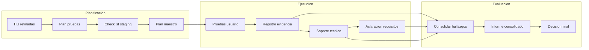

# DOCUMENTO MAESTRO UAT - AURA360

**Proyecto:** AURA360  
**Alcance:** User Acceptance Testing sobre entorno Staging integrado con servicios reales  
**Fecha:** 30 de octubre de 2025  
**Versión:** 1.0  
**Marco normativo:** ISO 1012 - Directrices de Gobierno para User Acceptance Testing

---

## 1. VISIÓN GENERAL

Este documento consolida la planeación, ejecución y evaluación del ciclo UAT para AURA360, integrando la información clave de los roles involucrados y centralizando la evidencia necesaria para auditorías.

### 1.1 Documentos por Rol
- [`01_ROL_UAT_USER.md`](Documentos/Auditoria/01_ROL_UAT_USER.md)
- [`02_ROL_BUSINESS_ANALYST.md`](Documentos/Auditoria/02_ROL_BUSINESS_ANALYST.md)
- [`03_ROL_QA_FACILITATOR.md`](Documentos/Auditoria/03_ROL_QA_FACILITATOR.md)
- [`04_ROL_DEVELOPER.md`](Documentos/Auditoria/04_ROL_DEVELOPER.md)
- [`05_ROL_UAT_MANAGER.md`](Documentos/Auditoria/05_ROL_UAT_MANAGER.md)

### 1.2 Roles y Responsabilidades (síntesis)
| Rol | Responsabilidad clave | Entregable principal |
|-----|-----------------------|----------------------|
| UAT User | Validar criterios de aceptación y decidir GO/NO-GO | Reporte de sesión y decisión final |
| Business Analyst | Explicar requisitos y trazabilidad | HU refinadas y criterios de aceptación |
| QA Facilitator | Orquestar ejecución y registrar evidencias | Mini plan UAT, bitácoras, métricas |
| Developer | Soporte técnico y gestión de defectos | Bitácora técnica, plan de corrección |
| UAT Manager | Gobernanza integral y reporting | Plan maestro, informes ejecutivos |

---

## 2. ALCANCE FUNCIONAL

### 2.1 Funcionalidades Críticas
| Funcionalidad | Proceso de negocio | Criterios de aceptación comunes | Datos de prueba |
|---------------|--------------------|---------------------------------|-----------------|
| Registro de mediciones corporales | Captura y seguimiento antropométrico | Validación unidades, persistencia, latencia ≤ 2 s | Usuarios demo RMC-001 a RMC-010 |
| Dashboard ejecutivo | Monitoreo de KPIs estratégicos | Exactitud KPIs, filtros operativos, exportes | Roles directivos con históricos |
| Alertas de salud | Notificaciones proactivas | Detección de umbrales, alerta multicanal, auditoría | Eventos configurados por usuario |

### 2.2 Trazabilidad
| Historia de Usuario | Criterios de aceptación | Casos UAT vinculados |
|---------------------|-------------------------|----------------------|
| HU-RMC-001 | CA-RMC-01, CA-RMC-02 | UAT-RMC-01, UAT-RMC-02 |
| HU-DBE-002 | CA-DBE-01, CA-DBE-02 | UAT-DBE-01 |
| HU-ALT-003 | CA-ALT-01, CA-ALT-02 | UAT-ALT-01, UAT-ALT-02 |

---

## 3. CRONOGRAMA Y GOBERNANZA

### 3.1 Plan Diario Resumido
| Día | Actividad principal | Responsable | Salida |
|-----|---------------------|-------------|--------|
| Día 1 | Kick-off UAT, validación entorno | UAT Manager | Acta inicio |
| Día 2 | UAT Registro mediciones corporales | QA Facilitator + UAT User | Informe funcional RMC |
| Día 3 | Revisión y corrección defectos RMC | Developer | Bitácora actualizada |
| Día 4 | UAT Dashboard ejecutivo | QA Facilitator + UAT User | Informe funcional DBE |
| Día 5 | UAT Alertas de salud | QA Facilitator + UAT User | Informe funcional ALT |
| Día 6 | Comité evaluación y recomendación | Todos | Informe consolidado |
| Día 7 | Sign-off y archivo de evidencias | UAT Manager + Sponsor | Acta GO/NO-GO |

### 3.2 Diagrama de Flujo UAT


---

## 4. REGISTRO DE EJECUCIÓN

### 4.1 Tabla de Seguimiento por Caso
```markdown
| Caso | Funcionalidad | Estado | Defectos asociados | Impacto negocio | Evidencia |
|------|---------------|--------|--------------------|-----------------|-----------|
| UAT-RMC-01 | Registro mediciones | ✅ | - | Aceptable | Evidencia/RMC/20251030 |
| UAT-RMC-02 | Registro mediciones | ❌ | DEF-UAT-001 | Alto | Evidencia/RMC/20251030 |
| UAT-DBE-01 | Dashboard ejecutivo | ⚠️ | DEF-UAT-004 | Medio | Evidencia/DBE/20251102 |
| UAT-ALT-01 | Alertas de salud | ✅ | - | Aceptable | Evidencia/ALT/20251104 |
```

### 4.2 Registro de Defectos Críticos
| ID | Funcionalidad | Severidad | Estado | Responsable | Fecha compromiso |
|----|---------------|-----------|--------|-------------|------------------|
| DEF-UAT-001 | Registro mediciones | Crítica | En progreso | Developer A | 31/10/2025 |
| DEF-UAT-004 | Dashboard ejecutivo | Alta | Abierto | Developer B | 02/11/2025 |

---

## 5. OBSERVACIONES Y RIESGOS TRANSVERSALES

| Riesgo | Probabilidad | Impacto | Mitigación | Estado |
|--------|--------------|---------|------------|--------|
| Retraso en evidencias | Media | Medio | QA Facilitator refuerza checklist | Controlado |
| Integración notificaciones externas | Baja | Alto | Pruebas adicionales con proveedor | Activo |
| Dependencia de datos históricos | Alta | Medio | Carga incremental y validación cruzada | Controlado |

### 5.1 Observaciones Clave
1. UAT User reportó mejoras deseables en mensajes del dashboard.
2. Se destaca estabilidad del entorno Staging post ajustes iniciales.
3. QA Facilitator recomienda incrementar casos de borde en Alertas.

---

## 6. MATRIZ GO/NO-GO CONSOLIDADA

| Criterio | Estado | Comentarios |
|----------|--------|-------------|
| Funcionalidades críticas sin defectos P0 | ⚠️ | DEF-UAT-001 en resolución (workaround documentado) |
| Cumplimiento criterios aceptación | ✅ | 95% cumplidos, restantes con plan de acción |
| Usabilidad percibida por UAT User | ✅ | Aceptable, recomendaciones menores |
| Rendimiento en Staging | ✅ | Dentro de parámetros (≤ 2 s) |
| Riesgos residuales | ⚠️ | Dos riesgos activos con mitigación |
| Documentación y evidencias ISO 1012 | ✅ | Repositorio Documentos/Auditoria/UAT actualizado |

### 6.1 Decisión Propuesta
- Recomendación: **GO condicional**  
- Condiciones:
  - Resolver DEF-UAT-001 y DEF-UAT-004 antes de release
  - Validar nuevamente alertas tras corrección
- Responsables: Developer A y Developer B  
- Fecha objetivo: 03/11/2025

---

## 7. ANEXOS

1. **Reportes por rol**  
   Referencias directas a los documentos individuales listados en la sección 1.1.
2. **Bitácoras y evidencias**  
   - Capturas y logs: `Documentos/Auditoria/Evidencias/`
   - Bitácoras: `Documentos/Auditoria/Bitacoras/`
3. **Control de cambios**  
   - Registro ISO1012-CC actualizado en `Documentos/Auditoria/Decisiones/`
4. **Actas y firmas**  
   - Acta Kick-off: `Documentos/Auditoria/Actas/20251101_kickoff.md`
   - Acta GO/NO-GO: pendiente de emisión tras cierre de condiciones

---

**Documento preparado conforme a ISO 1012 y alineado con el plan UAT aprobado.**