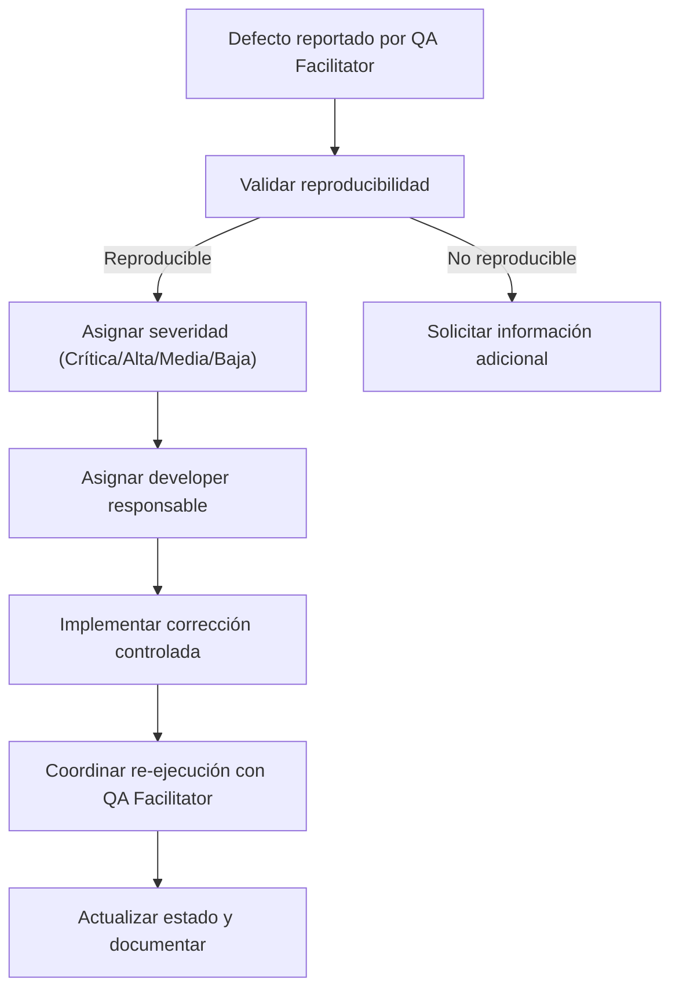

# ROL: Developer (Soporte Técnico UAT)

**Proyecto:** AURA360  
**Fecha:** 30 de octubre de 2025  
**Versión:** 1.0  
**Marco normativo:** ISO 1012 - Directrices de Gobierno para User Acceptance Testing  
**Entorno UAT:** Staging integrado con servicios reales

---

## 1. DESCRIPCIÓN DEL ROL

El Developer actúa como enlace técnico durante el UAT, garantizando que el entorno Staging se mantenga estable, resolviendo dudas funcionales y aplicando correcciones que permitan cumplir los criterios de aceptación sin comprometer la calidad.

### 1.1 Objetivo Principal
Asegurar soporte técnico continuo y documentado al equipo UAT, confirmando que el comportamiento del sistema se alinea a la especificación y que las correcciones se gestionan bajo control ISO 1012.

### 1.2 Perfil Requerido
- Conocimiento profundo de la arquitectura AURA360
- Dominio de pipelines de despliegue y monitoreo en Staging
- Habilidades de depuración y análisis de logs
- Capacidad de comunicación clara con roles no técnicos
- Orientación a documentación y control de cambios

---

## 2. RESPONSABILIDADES ESPECÍFICAS

### 2.1 Fase de Planificación
- ✅ Validar que el entorno Staging replica la configuración de producción (sin datos sensibles)
- ✅ Preparar scripts de inicialización y datos semilla críticos
- ✅ Revisar HU refinadas y criterios de aceptación junto al Business Analyst
- ✅ Establecer ventanas de soporte y canales de atención
- ✅ Generar checklist de salud del entorno (servicios, integraciones, colas)
- ✅ Coordinar con QA Facilitator la carga de evidencias técnicas

### 2.2 Fase de Ejecución
- ✅ Disponibilidad en tiempo real para aclarar comportamientos esperados
- ✅ Monitorear logs, métricas y alertas durante pruebas:  
  - Registro de mediciones corporales  
  - Dashboard ejecutivo  
  - Alertas de salud
- ✅ Analizar defectos reportados, clasificar severidad y reproducibilidad
- ✅ Proporcionar evidencia técnica (trazas, payloads, métricas)
- ✅ Documentar aclaraciones de comportamiento en registro centralizado
- ✅ Aplicar correcciones en ramas controladas, respetando política ISO 1012

### 2.3 Fase de Evaluación
- ✅ Actualizar estado de defectos y registrar compromisos de corrección
- ✅ Documentar cambios aplicados, efectos colaterales y pruebas realizadas
- ✅ Presentar análisis técnico en reuniones de evaluación UAT
- ✅ Responder cuestionamientos de negocio con argumentos técnicos claros
- ✅ Registrar lecciones aprendidas y recomendaciones para producción

---

## 3. PREPARACIÓN DEL ENTORNO STAGING

### 3.1 Checklist Técnico
- [ ] Sincronización de schema base de datos con producción
- [ ] Variables de entorno auditadas y firmadas (archivo ISO 1012-ENV)
- [ ] Servicios externos mockeados o integrados según alcance
- [ ] Pipelines de despliegue probados (rollback incluido)
- [ ] Monitoreo habilitado (APM, logs centralizados, alertas)
- [ ] Datos semilla cargados con anonimización aprobada

### 3.2 Plan de Soporte
| Ventana | Responsable | Canal | Tiempo respuesta objetivo |
|---------|-------------|-------|---------------------------|
| 09:00-12:00 | Developer A | Slack #uat | ≤ 10 min |
| 14:00-17:00 | Developer B | Video soporte | ≤ 15 min |

---

## 4. GESTIÓN DE DEFECTOS

### 4.1 Flujo de Clasificación


### 4.2 Registro de Aclaraciones y Compromisos
```markdown
| ID | Fecha | Tema | Descripción | Responsable | Fecha compromiso | Estado |
|----|-------|------|-------------|-------------|------------------|--------|
| CLR-DEV-001 | 30/10/2025 | Dashboard | Diferencia en KPI mensual vs. reporte | Dev A | 31/10/2025 | Abierto |
```

### 4.3 Evidencia Técnica
- Logs (HTTP, aplicación, base de datos) con hash SHA-256
- Payloads de solicitudes/respuestas relevantes
- Screenshots de dashboards técnicos
- Métricas de rendimiento (latencias, throughput)

---

## 5. GUÍA DE RESPUESTAS Y JUSTIFICACIONES

| Escenario | Respuesta esperada | Evidencia requerida |
|-----------|--------------------|---------------------|
| Funcionalidad funciona como diseñado | Explicar regla de negocio/proceso técnico | HU, criterios de aceptación, diseño técnico |
| Comportamiento anómalo reproducible | Asumir defecto y detallar siguiente paso | Ticket con logs y plan de corrección |
| Incidente fuera del alcance | Documentar exclusión y ruta de escalamiento | Documento de alcance firmado |
| Criterio de aceptación ambiguo | Solicitar clarificación al BA y registrar | Minuta de reunión, actualización de HU |

> Todas las respuestas deben registrarse en el repositorio Documentos/Auditoria/Decisiones/ con código UAT-DEC-####.

---

## 6. MÉTRICAS Y KPIs (ISO 1012)

| Métrica | Definición | Objetivo | Responsable |
|---------|------------|----------|-------------|
| Tiempo medio de respuesta | Tiempo desde consulta hasta primera respuesta | ≤ 15 minutos | Developer |
| Tiempo medio de resolución | Tiempo desde reporte hasta cierre | ≤ 48 horas (críticos) | Developer |
| Ratio de reincidencia | Defectos reabiertos / total defectos corregidos | ≤ 5% | Developer |
| Cobertura de evidencias | % defectos con evidencia técnica adjunta | 100% | Developer |
| Disponibilidad de entorno | Tiempo operativo de Staging durante UAT | ≥ 99% | Equipo DevOps |

---

## 7. CHECKLIST DEL ROL

### Antes del UAT
- [ ] Entorno Staging validado y firmado por QA Facilitator
- [ ] Scripts de datos y fixtures actualizados
- [ ] Documentación técnica compartida con equipo UAT
- [ ] Plan de soporte comunicado

### Durante el UAT
- [ ] Monitoreo activo de métricas críticas
- [ ] Registro de consultas y respuestas en bitácora
- [ ] Actualización diaria de estado de defectos
- [ ] Coordinación con UAT Manager para cambios urgentes

### Después del UAT
- [ ] Informe técnico consolidado (defectos, causas, soluciones)
- [ ] Documentación de cambios subida a repositorio ISO 1012
- [ ] Revisión post-mortem con BA y QA Facilitator
- [ ] Recomendaciones para producción entregadas

---

## 8. BUENAS PRÁCTICAS

### 8.1 Técnicas
1. Automatizar recolección de logs y métricas para cada sesión UAT.
2. Utilizar feature flags para activar/desactivar correcciones sin redeploy completo.
3. Mantener bitácoras de configuración y cambios en formato auditable.
4. Validar siempre en datos cercanos a producción (anonimizados).

### 8.2 Comunicación
- Responder en lenguaje comprensible para negocio.
- Confirmar recepción de cada consulta con timestamp.
- Informar progreso de correcciones (inicio, en curso, completado).
- Elevar riesgos técnicos al UAT Manager de manera preventiva.

### 8.3 Control de Cambios
- Toda corrección debe pasar por pipeline CI con pruebas automatizadas.
- Requiere aprobación dual (Developer + QA Facilitator) antes de despliegue.
- Registrar cambios en documento ISO 1012-CC (control de cambios).
- Mantener plan de rollback documentado para cada release.

---

## 9. GLOSARIO

- **Rollback controlado:** Procedimiento documentado para revertir cambios.
- **SLA de UAT:** Compromisos de tiempo acordados con negocio durante UAT.
- **Bitácora técnica:** Registro detallado de acciones y eventos técnicos.
- **Feature flag:** Mecanismo para habilitar/deshabilitar funcionalidades sin despliegue.
- **P0/P1/P2:** Niveles de prioridad definidos en matriz de criticidad UAT.

---

## 10. ANEXOS

### Anexo A: Lista de Servicios Críticos a Monitorear
| Servicio | Métrica clave | Umbral | Herramienta |
|----------|---------------|--------|-------------|
| API Backend | Latencia p95 | ≤ 1.5 s | APM interno |
| Vectorial DB | Tiempo de respuesta consultas | ≤ 800 ms | Grafana |
| Notificaciones | Ratio de entrega | ≥ 99% | Logs + métricas push |

### Anexo B: Informe Técnico Post-Sesión (Plantilla)
```markdown
# Informe Técnico UAT

**Sesión:** [ID]  
**Fecha:** [DD/MM/AAAA]  
**Funcionalidad:** [Nombre]  
**Consultas recibidas:** [Cantidad]  
**Defectos reportados:** [IDs]  
**Acciones técnicas ejecutadas:**  
1. [Acción + evidencia]  
2. [Acción + evidencia]

**Impacto potencial en producción:**  
- [Descripción]

**Recomendaciones:**  
- [Punto 1]  
- [Punto 2]

**Preparado por:** [Nombre Developer]
```

---

**Documento preparado conforme a:**
- ISO 1012 - Directrices de Gobierno para User Acceptance Testing
- AURA360 Playbook de soportabilidad
- Políticas de Auditoría AURA360 2025

**Fin del documento**