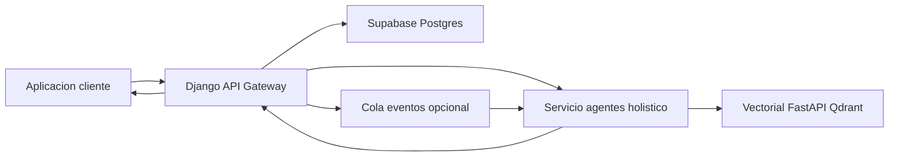

# Arquitectura Backend Holística AURA360

## 1. Resumen del objetivo
El objetivo es orquestar un flujo backend que combine perfilamiento relacional, agentes inteligentes y consulta vectorial para entregar recomendaciones personalizadas alineadas con las dimensiones mente, cuerpo y alma. La arquitectura propuesta garantiza trazabilidad extremo a extremo, separación de responsabilidades y capacidad de evolución sin bloquear nuevas fuentes de datos o modelos de lenguaje.

## 2. Arquitectura lógica
- **Aplicación cliente**: móvil o web invocando el backend con identificador de usuario y categoría solicitada.
- **API REST (Django REST Framework)**: puerta de entrada que valida solicitudes, obtiene contexto del modelo relacional y coordina la orquestación con agentes y almacenamiento.
- **Base relacional (Supabase PostgreSQL gestionado)**: fuente de verdad para usuarios, historiales de solicitudes, métricas y auditoría; se aprovechan RLS y funciones existentes.
- **Servicio de agentes (Python + Google ADK o LangGraph)**: ejecuta agentes especializados por categoría, gestiona estado conversacional y decide cuándo consultar la base vectorial.
- **Base vectorial (FastAPI + Qdrant)**: colecciones para embeddings multilingües, métricas de similitud y mantenimiento de contexto semántico persistente.
- **Cola de mensajería opcional (Celery o Redis Streams)**: desacopla trabajos pesados como enriquecimiento asincrónico, reintentos prolongados o ingesta masiva.
- **Observabilidad centralizada (OpenTelemetry + Grafana Tempo/Prometheus + Loki)**: captura métricas, trazas y logs para todos los servicios.

**Decisiones clave y alternativas**  
- Se mantiene Django por madurez y reuse, pero podría migrarse a FastAPI o Starlite para workloads altamente concurrentes.  
- Qdrant administrado en contenedor provee control total; como alternativa gestionada (Pinecone, Weaviate Cloud) simplificaría operaciones a costa de lock-in.  
- Google ADK facilita agentes multimodales; frameworks alternos (CrewAI, LangChain) pueden evaluarse si se busca portabilidad fuera del ecosistema Gemini.

## 3. Flujo de orquestación
1. El cliente envía `user_id`, `category` y metadatos opcionales (idioma, dispositivo, flags de depuración).  
2. El backend valida esquema, autentica token Supabase y verifica cuotas o límites de frecuencia.  
3. Se consulta el perfil ampliado en `app_users` y tablas auxiliares (historias clínicas, hábitos, métricas biométricas).  
4. El backend construye un contexto estructurado: datos personales filtrados, historial de respuestas previas y preferencias explícitas.  
5. La solicitud se registra en `holistic_requests` (estado `PENDING`) y se envía al servicio de agentes mediante RPC HTTP/JSON o cola Celery según criticidad.  
6. El servicio de agentes selecciona plantillas y modelos según categoría; compone prompts, realiza enriquecimiento y decide si necesita embeddings adicionales.  
7. Cuando el agente requiere memoria semántica:  
   - Genera embeddings con FastEmbed o Gemini (fallback) y llama al servicio vectorial;  
   - El servicio vectorial verifica coherencia dimensional, ejecuta búsqueda con filtros por categoría e idioma y retorna documentos clasificados.  
8. El agente compone la respuesta final (texto estructurado, sugerencias, seguimiento) con referencias a documentos vectoriales.  
9. El backend recibe la respuesta, actualiza `holistic_requests` a `COMPLETED`, persiste payload completo en `holistic_responses` y devuelve la respuesta al cliente.  
10. Si el agente o vectorial fallan, se aplica política de reintentos limitada, se marca estado `FAILED` con causa analítica y se devuelve mensaje controlado al cliente.

**Errores y escenarios alternos**  
- Vectorial no disponible: fallback a cache por categoría, marcar `holistic_requests.error_type = VECTOR_SERVICE_UNAVAILABLE` y retornar respuesta empobrecida.  
- Embeddings rechazados por dimensión: el servicio de agentes solicita regeneración con modelo alineado o bloquea ejecución hasta ajustar colección.  
- Usuario sin perfil completo: se activa flujo de enriquecimiento asincrónico para recolectar datos faltantes antes de ejecutar agentes premium.  
- Exceso de latencia: se permite degradación entregando resumen previo y completando detalle vía notificación push una vez listo.

## 4. Modelado de datos
**Tablas nuevas propuestas**

| Tabla | Propósito | Campos clave |
| --- | --- | --- |
| `holistic_requests` | Registrar cada solicitud entrante | `id` (UUID), `user_id` (UUID FK → `app_users.auth_user_id`), `category` (ENUM mente/cuerpo/alma), `status` (ENUM), `requested_at`, `request_metadata` (JSONB), `schema_version` |
| `holistic_agent_runs` | Trazar ejecuciones y agentes invocados | `id`, `request_id` FK, `agent_name`, `model_version`, `input_context` (JSONB), `elapsed_ms`, `status`, `retry_count`, `created_at` |
| `holistic_vector_queries` | Auditoría de consultas a Qdrant | `id`, `agent_run_id` FK, `collection_name`, `embedding_model`, `top_k`, `filters` (JSONB), `results` (JSONB), `created_at` |
| `holistic_responses` | Persistir respuesta final entregada al cliente | `id`, `request_id` FK, `payload` (JSONB), `delivered_at`, `trace_id`, `human_review_required` (boolean), `version_major`, `version_minor` |

**Estructura JSON recomendada (clave: tipo)**
- `version`: string SemVer de la respuesta (ej. `"1.0.0"`).  
- `user`: object `{ id: uuid, tier: string, locale: string }`.  
- `category`: string `"mind" | "body" | "soul"`.  
- `summary`: object `{ title: string, message: string }`.  
- `recommendations`: array de objetos `{ type: string, description: string, confidence: float, evidence_ids: array }`.  
- `follow_up`: array de objetos `{ action: string, due_date: iso8601?, channel: string }`.  
- `sources`: array `{ source_id: string, url: string?, chunk: string, score: float }`.  
- `agent_diagnostics`: object `{ model: string, prompt_checksum: string, safety_flags: array }`.

**Versionado y auditoría**  
- Columna `schema_version` en `holistic_requests` y `version_major`/`version_minor` en respuestas para controlar cambios retrocompatibles.  
- Campos `created_at`, `updated_at`, `updated_by` con triggers que capturan usuario de servicio.  
- Estrategia de auditoría: triggers que insertan en `holistic_request_history` o uso de `pgaudit` para cambios sensibles.  
- Considerar particionamiento por `requested_at` mensual si la carga supera 5M registros/año para optimizar consultas de analítica.  
- Compatibilidad con Supabase: definir migraciones SQL gestionadas y pruebas de regresión en entornos clonados.

## 5. Interacción con el servicio de agentes
- **Selección dinámica**: tabla de configuración `holistic_agent_profiles` que mapea `category` y atributos del usuario (tier, idioma, estado de salud) a un pipeline de agentes; permite activar agentes adicionales (nutricional, mindfulness) sin despliegue.  
- **Empaquetado de contexto**: el backend entrega payload con secciones diferenciadas: perfil demográfico, historial relevante, banderas médicas y últimas tres respuestas para mantener coherencia conversacional.  
- **Política de reintentos**: intentos rápidos (2) con backoff exponencial cuando el fallo es recuperable (timeout, 5xx); fallos lógicos (validación) se marcan como definitivos. Registro de reintentos en `holistic_agent_runs.retry_count`.  
- **Timeouts**: llamada síncrona limitada a 12 segundos; si se excede, se responde al cliente con estado `PROCESSING` y se continúa asincrónicamente mediante webhook o notificación.  
- **Mantenimiento de estado**: el servicio de agentes almacena historial corto en `holistic_agent_runs.input_context`; para sesiones prolongadas se serializa vector conversacional en Redis con TTL configurable.  
- **Gestión de seguridad**: tokens firmados con Supabase JWT; se emite clave de servicio específica para que agentes consulten datos adicionales vía endpoints protegidos.  
- **Alternativas**: LangGraph provee transiciones declarativas para flujos complejos; CrewAI puede explorarse si se requiere coordinación humana.

## 6. Integración con la base vectorial
- **Generación de embeddings**: agentes usan backend FastEmbed por defecto (384 dims) y caen a Gemini (`models/text-embedding-004`, 3072 dims) cuando se requiere mayor precisión multilingüe. Se valida dimensión con la colección Qdrant antes de cada consulta.  
- **Configuración de colecciones**: colección `holistic_memory` en Qdrant con `vector_size` homogéneo, métrica cosine, payload schema con `category`, `locale`, `confidence`, `source_type`.  
- **Actualizaciones**: ingesta incremental via pipeline `vectosvc.core.pipeline` invocado por workers Celery; se registran versiones de documentos y se despublican automáticamente entradas caducadas usando `deleted_at`.  
- **Consistencia semántica**:  
  - Sincronizar pipelines de ingestión para que usen el mismo modelo de embeddings que las consultas.  
  - Ejecutar smoke test dimensional (`scripts/smoke_retrieval.py`) en cada despliegue.  
  - Mantener job nocturno que recalcula embeddings cuando se actualice el modelo (bandera `embedding_model_version`).  
- **Alternativas**: si se requiere SLA gestionado, evaluar Qdrant Cloud con réplicas automáticas o Pinecone; ambos implican costos mayores pero reducen la carga operativa.

## 7. Aspectos transversales
- **Seguridad**:  
  - Autenticación primaria con Supabase JWT y scopes; rotación automática de claves.  
  - Comunicación interna sobre HTTPS con certificados emitidos por plataforma (LetsEncrypt, ACM).  
  - mTLS entre backend y servicios internos cuando se despliega en Kubernetes o Service Mesh (Istio).  
  - Cifrado en reposo: Postgres con TDE, Qdrant montado sobre discos cifrados, secretos gestionados vía Vault o AWS Secrets Manager.  
- **Observabilidad**: OpenTelemetry SDK instrumentando Django, agentes y vectorial; exportación a Grafana Tempo (trazas), Prometheus (métricas), Loki (logs estructurados). Dashboards específicos para latencia por categoría y tasa de reintentos.  
- **Escalabilidad**: backend y agentes en contenedores orquestados por Kubernetes con HPA basado en CPU y latencia; vectorial con réplicas lectoras y shard horizontal si se supera 10M embeddings. Uso de Redis o Memcached para cachear perfiles.  
- **Pruebas**:  
  - Unitarias para serializers y servicios (pytest + factory boy).  
  - Integración completo orquestado (pytest con docker-compose levantando agentes y vectorial).  
  - Contratos API con Schemathesis o Dredd.  
  - Evaluaciones de calidad de respuesta con datasets sintéticos y métricas humanas (Likert).  
  - Chaos y resiliencia: inyectar fallos de Qdrant y latencia de agentes para validar circuit breakers.

## 8. Pseudocódigo y fragmentos ejemplificativos
**Controlador REST orientado a pasos**
1. Validar esquema y autorización.  
2. Obtener perfil del usuario y consolidar contexto.  
3. Registrar solicitud pendiente y generar `trace_id`.  
4. Llamar al servicio de agentes con payload contextualizado.  
5. Si la respuesta llega en plazo, persistir resultado y retornar.  
6. Si ocurre timeout recuperable, continuar asincrónicamente y notificar al cliente mediante canal diferido.

**Estrategia del servicio de agentes**
1. Seleccionar pipeline a partir de categoría, idioma y tier.  
2. Construir prompt con secciones: contexto, objetivos, restricciones.  
3. Consultar memoria vectorial cuando el prompt requiera antecedentes.  
4. Ejecutar modelo, evaluar guardrails de seguridad, aplicar formato de salida.  
5. Devolver contenido estructurado con evidencias y metadatos.

**Consulta vectorial paso a paso**
1. Normalizar embeddings y verificar dimensión contra la colección destino.  
2. Ejecutar búsqueda `top_k` con filtros `category`, `locale`, `confidence >= threshold`.  
3. Recalcular puntuaciones si se combinan múltiples colecciones o se aplica reranking.  
4. Preparar evidencia compacta (texto, enlaces) para enviarla de vuelta al agente.

**Persistencia y auditoría**
1. Guardar respuesta completa en `holistic_responses.payload`.  
2. Registrar resumen ligero en `holistic_requests` para listados rápidos.  
3. Emitir evento `holistic.response.created` en la cola para tareas posteriores (notificaciones, analytics).  
4. Almacenar trazas OpenTelemetry con atributos `user_id`, `category`, `agent_name` para facilitar depuración.
