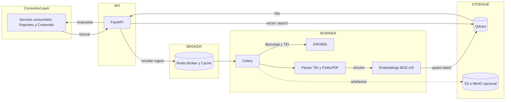
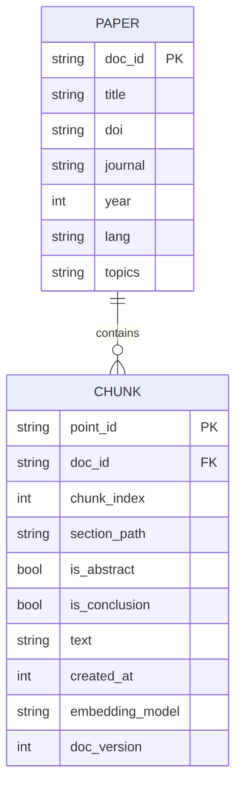
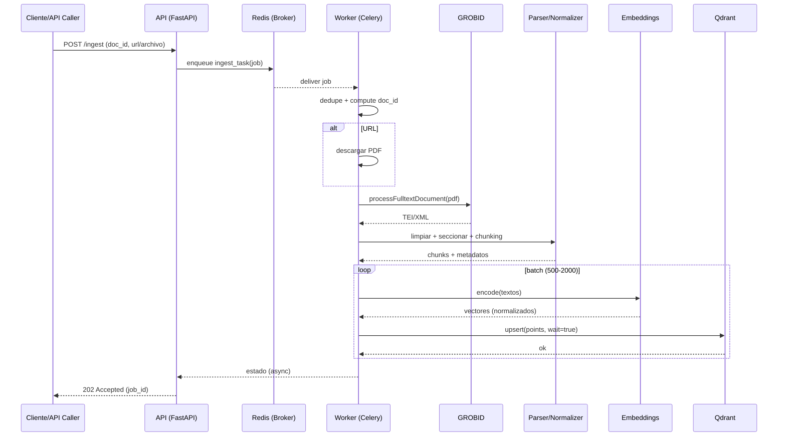
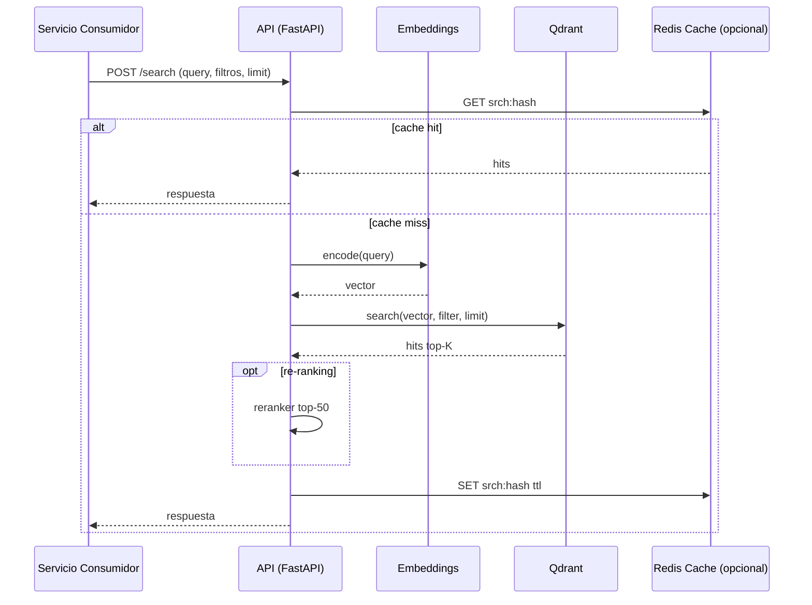
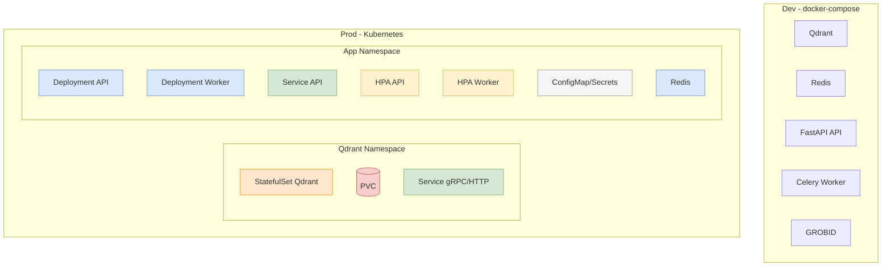

# Plan de Implementación — Servicio de Base de Datos Vectorial (Qdrant)

Este documento define el plan integral para diseñar, construir y operar el servicio de búsqueda semántica sobre PDFs biomédicos (papers de sueño, alimentación, estrés, neurodivergencias, etc.). Este servicio será el “cerebro” que indexa, enriquece y responde; otro servicio consumidor lo usará para generar reportes y contenido con datos agregados de otra BD contextual al usuario.

---

## 1) Objetivo y Alcance
- Ingerir PDFs biomédicos, extraer estructura y metadatos, generar embeddings de alta calidad y almacenarlos en Qdrant con filtros útiles (tema, año, journal, idioma, etc.).
- Exponer una API HTTP para ingesta, búsqueda y monitorización.
- Operar con un worker asíncrono para ingestas pesadas, caché de embeddings y resultados.
- Diseñar para escalar de miles a millones de chunks sin rehacer arquitectura.

Fuera de alcance inicial: UI final, generación de reportes; se ofrece contrato y mejores prácticas para el servicio consumidor.

---

## 2) Requisitos y Supuestos
- Corpus: PDFs académicos (mayoría texto, algunos escaneados). Orígenes: URLs, S3/directorio.
- Metadatos clave: título, autores, DOI/PMID (si existe), journal, año, secciones, idioma, topics.
- Privacidad: no almacenar PII/PHI del usuario. Para PDFs con PHI, activar políticas de anonimización si aplica.
- Latencia objetivo de búsqueda (p95): ≤ 300 ms con filtros moderados y top-10.
- Ingesta: ≥ 30–100 PDFs/min con batching y concurrencia moderada (dependiente de CPU/GPU para embeddings).

---

## 3) Arquitectura
- Core “pure Python”: lógica, esquemas Pydantic, embeddings, adaptadores Qdrant, pipeline.
- API delgada (FastAPI): encola ingestas, expone búsqueda y endpoints de salud/métricas.
- Worker (Celery + Redis): orquesta descarga → parsing → limpieza → chunking → embeddings → upsert.
- Almacenamiento:
  - Qdrant: vectores + payload indexado.
  - Objeto (S3/minio opcional): PDFs y TEI (salida de GROBID) para auditoría y reprocesos.
- Caché: Redis para embeddings y resultados frecuentes.
- Observabilidad: métricas, logs estructurados, trazas (OpenTelemetry opcional).

Flujo alto nivel:
1) API recibe ingesta → encola tarea. 2) Worker descarga/parsea PDF (GROBID) → normaliza → chunking. 3) Embeddings por lote → upsert a Qdrant con índices. 4) API de búsqueda codifica query, aplica filtros y devuelve hits con trazabilidad.

### Diagrama de Arquitectura


---

## 4) Modelo de Datos en Qdrant
- Colección: `papers` (por defecto; configurable). Distancia: `cosine`.
- Vectores: `dense` (dim=1024 si BGE-m3). Futuro: `sparse` adicional para híbrido.
- Payload por chunk (campos principales):
  - `doc_id` (keyword), `chunk_index` (int), `text` (string recortado), `section_path` (keyword, p.ej. Introduction>Sleep),
  - `is_abstract` (bool), `is_conclusion` (bool),
  - `title` (keyword), `doi` (keyword), `journal` (keyword), `year` (int), `lang` (keyword),
  - `topics` (keyword[]), `mesh_terms` (keyword[] opcional),
  - `created_at` (epoch int), `embedding_model` (keyword), `doc_version` (int), `hash` (keyword).
- Índices de payload recomendados:
  - `doc_id`, `journal`, `lang`, `topics` → keyword
  - `year`, `created_at` → integer
- Idempotencia: `point_id = sha1(doc_id, chunk_idx, preview)`.
- Versionado: `doc_version` para re-embedding sin downtime (convivir versiones y filtrar por la activa).

Parámetros HNSW iniciales: `m=16`, `ef_construct=256` (ajustables). `on_disk=true` si volumen alto.

### Diagrama Entidad-Relación (conceptual)


---

## 5) Pipeline de Ingesta de PDFs
Fases y decisiones:
1) Descarga/Entrada
   - Soportar: lista de URLs, archivos subidos (multipart), carpeta local, S3.
   - Calcular `doc_id` por DOI/PMID si existe; fallback: hash del archivo.
2) Parsing
   - GROBID (TEI/XML) para texto + metadatos (título, autores, journal, año, DOI, secciones).
   - Fallback: PyMuPDF; OCR opcional para escaneados (Tesseract/uOCR en fase posterior).
3) Limpieza/Normalización
   - Eliminar cabeceras/pies, números de línea; conservar tablas/figuras como chunks aparte cuando aporten evidencia.
   - Detectar idioma (langid o fasttext-lite). Guardar `lang`.
4) Enriquecimiento
   - Etiquetado `topics` inicial: reglas+sinónimos y/o zero-shot sobre abstract. `mesh_terms` opcional (fase 2).
5) Chunking “aware”
   - 600–1,000 chars o 256–512 tokens; `overlap` 15–20%; cerrar en límites de párrafo o heading cuando sea posible.
   - Señales: `is_abstract`, `is_conclusion`, `section_path`.
6) Embeddings
   - Modelo default: BGE-m3 (1024d). Normalizar para `cosine`.
   - Batching 500–2,000 chunks; caché por `sha1(text)`.
7) Upsert
   - `ensure_collection()` con índices; `upsert` por lotes, `wait=true`.
8) Idempotencia y DLQ
   - Reintentos exponenciales; DLQ con causa y artefactos (PDF/TEI) para auditoría.

KPIs de pipeline: ratio de éxito, tiempo por fase, tamaño medio de chunk, throughput de embeddings y upsert.

### Diagrama de Secuencia — Ingesta


---

## 6) API HTTP (contrato base)
- `POST /ingest` → encola ingesta (URL o archivo referenciado). 202 Accepted.
- `POST /ingest/batch` → lista de PDFs/URLs. Devuelve `job_ids`.
- `GET /jobs/{job_id}` → estado de ingesta, conteos, errores.
- `POST /api/v1/holistic/search` → endpoint enriquecido para servicio de agentes (ver sección de contrato).
- `POST /search` → semántica (dense) + filtros legacy; `limit`, `offset|cursor`.
- `POST /search/hybrid` (fase 2) → dense + sparse con mixing.
- `GET /readyz`, `GET /livez`, `GET /metrics`.

Seguridad
- API Key para cliente interno; mTLS o JWT para service-to-service en prod.
- CORS restringido. Rate limiting (si se expone fuera de la VPC).

Ejemplos (resumen)
```http
POST /ingest
{
  "doc_id": "doi:10.1234/xyz",
  "url": "https://.../paper.pdf",
  "metadata": {"topics": ["sueno"], "source": "manual"}
}
```
```http
POST /search
{
  "query": "melatonin sleep latency adults",
  "limit": 10,
  "filter": {"must": {"topics": ["sueno"], "year": 2020}}
}
```

---

## 7) Worker de Ingesta
- Celery + Redis. Tareas: `ingest_pdf(url|file_ref)`, `extract_tei`, `chunk_and_embed`, `upsert_qdrant`.
- Concurrencia configurable; warm-up del modelo de embeddings al iniciar.
- Reintentos con backoff y DLQ (lista Redis o cola separada) con detalle del error.

---

## 8) Búsqueda, Ranking y Re-ranking
- Búsqueda vectorial (dense) con `ef_search` ajustable por request o a nivel cliente.
- Boosts (fase 1.5): +peso si `is_abstract`/`is_conclusion`; +peso por coincidencia de `topics`.
- Re-ranking (fase 2): reranker cross-encoder sobre top-50; cachear resultados re-rankeados.
- Híbrido (fase 2/3): agregar `sparse` y combinar (alpha blending o ll-score fusion) según recall medido.

### Diagrama de Secuencia — Búsqueda


---

## 9) Estrategia de Caché
- Embeddings: Redis (key=`emb:{sha1(text)}`) con TTL largo (días). Evita recodificar.
- Resultados: Redis (key=`srch:{sha1(query+filtros+ver)}`) TTL 30–120s.
- Re-ranking: TTL 15–60s. Invalida por `doc_version`.

---

## 10) Observabilidad y Calidad
- Logs JSON con correlación `job_id` y `doc_id`.
- Métricas: tiempos por fase, tamaño de chunk, upserts/seg, latencias p50/p95/p99, tasa de errores, tamaño colección.
- Tracing: FastAPI + Celery (OTel) opcional.
- Dashboards y alertas: colas atascadas, fallos de upsert, aumento de latencia, cambios bruscos en tamaño/recall.

---

## 11) Seguridad, Privacidad y Cumplimiento
- Datos biomédicos: restringir PII/PHI; si aplica, pipeline de desidentificación antes de almacenamiento.
- Tránsito: TLS 1.2+; mTLS interno en prod.
- En reposo: cifrado de volúmenes (Qdrant/Disco) y del bucket de objetos.
- Accesos: API keys rotables, RBAC mínimo, secretos vía variables + gestor de secretos.
- Retención y borrado: políticas por `doc_id`/tenant.
- Auditoría: log de operaciones de ingesta y borrado.

---

## 12) Despliegue y Operaciones
- Dev: `docker-compose` con `qdrant`, `redis`, `api`, `worker` y `grobid`.
- Prod: Kubernetes
  - Qdrant (StatefulSet) con PVC; readiness/liveness; gRPC para bajo overhead.
  - API/worker con HPA por CPU/latencia; afinidad para locality con Qdrant.
- Backups y DR
  - Snapshots programados de Qdrant + backups del bucket de objetos.
  - Restauración probada en ambiente de staging.
- Escalado
  - Primero vertical (RAM/CPU); luego cluster Qdrant y/o cuantización (scalar/PQ) si latencia/huella crecen.

### Topología de Despliegue


---

## 13) Pruebas y Validación
- Unit tests: chunking, hashing/idempotencia, construcción de filtros, normalización.
- Integración: contra Qdrant local (crear colección, upsert, buscar con filtros).
- Performance: ingesta de N PDFs sintéticos, medir throughput; búsqueda con QPS objetivo; tuning de `ef_search`.
- Calidad de búsqueda: small set con queries y juicios (relevante/no). Métricas: Recall@K, MRR@K.

---

## 14) Roadmap y Hitos (DoD)
- Fase 0 — Esqueleto (listo)
  - Core + API + Worker + Compose + Qdrant/Redis. DoD: `ingest(text)` y `search` funcionan end-to-end.
- Fase 1 — Ingesta de PDFs con GROBID
  - Servicio GROBID en compose, parser TEI, extracción de metadatos, campos/índices `year/journal/topics/lang`.
  - DoD: ingesta por URL/archivo crea chunks con metadatos; filtros funcionan; métricas básicas.
- Fase 1.5 — Boosts y monitoreo
  - Señales `is_abstract/is_conclusion`; métricas de pipeline; dashboards.
- Fase 2 — Cachés y Re-ranking
  - Caché de embeddings/resultados; reranker top-50; endpoint `/search/hybrid`.
- Fase 3 — Híbrido denso+léxico y escalado
  - Vectores `sparse`, mezcla de scores; on-disk + cuantización; gRPC.
- Fase 4 — Hardening y cumplimiento
  - Auditoría, rotación de llaves, backups automáticos, pruebas de restauración.

---

## 15) Riesgos y Mitigaciones
- PDFs escaneados/sucios → OCR y heurísticas de limpieza; marcar calidad de extracción.
- Cardinalidad alta de filtros sin índice → crear índice previo, normalizar valores.
- Crecimiento de colección → activar `on_disk`/cuantización, cluster y gRPC.
- Drift de calidad de embeddings → versionado `doc_version`, re-embedding controlado.
- Coste de cómputo de embeddings → batching, cache, posible offloading a GPU.

---

## 16) Contrato con el Servicio Consumidor
- SLA de búsqueda: p95 ≤ 300 ms (top-10, filtros moderados). Paginación por cursor.
- Campos garantizados en respuesta: `doc_id`, `score`, `confidence_score`, `text`, `section_path`, `year`, `journal`, `topics`, `doi`, `chunk_index`, `category`, `source_type`, `embedding_model`, `version`.
- Filtros garantizados: `topics`, `year`, `journal`, `lang`, `doc_id`.
- Versionado: `doc_version` y `version` (embedding version) expuestos para permitir invalidaciones y cachés en el consumidor.
- Tolerancia a fallos: si Qdrant no responde, responder 503 + `retry-after`.

---

## 17) Checklist de Implementación
- [ ] Añadir `grobid` al `docker-compose` y variable `GROBID_URL`.
- [ ] Crear módulo `vectosvc/core/parsers/grobid.py` (TEI → texto, secciones, metadatos).
- [ ] Fallback `vectosvc/core/parsers/pdf.py` (PyMuPDF) y OCR opcional (fase 2/3).
- [ ] Extender `schemas.py` con `IngestJob`, `IngestStatus`, `PaperMeta` (título, autores, doi, year, journal, lang, topics, mesh_terms).
- [ ] Extender `qdrant_store.ensure_collection()` con índices `journal`, `year`, `topics`.
- [ ] Agregar endpoint `/api/v1/holistic/search` con validación de payload y trazabilidad (`trace_id`).
- [ ] Versionar embeddings explícitamente en payload (`version`, `embedding_model`, `valid_from`, `confidence_score`).
- [ ] Actualizar `pipeline.py` para flujo `pdf->tei->chunks->embed->upsert`, idempotente, caché embeddings.
- [ ] API: endpoints `POST /ingest/batch`, `GET /jobs/{id}`; validación y auth.
- [ ] Métricas: tiempos de fase, recuento de chunks/errores, latencias de búsqueda.
- [ ] Caché Redis: capa de embeddings y resultados.
- [ ] Re-ranking (fase 2) y `/search/hybrid`.
- [ ] Backups de Qdrant y pruebas de restauración.

---

## 18) Anexos — Parámetros por Defecto
- Chunking: 900 chars, overlap 150.
- Embeddings: BGE-m3 (1024d, cosine, normalizado).
- Qdrant: HNSW m=16, ef_construct=256; `indexing_threshold=20k`, `memmap_threshold=20k`; `on_disk=true` si >5M puntos.
- Búsqueda: `limit=10`, `ef_search=128` (tunable), filtros indexados.

---

## 19) Próximos Pasos Inmediatos
1) Aprobación de este plan.
2) Implementar Fase 1 (GROBID + metadatos + filtros) sobre el esqueleto existente.
3) Correr ingestión de 50–100 PDFs muestra; medir métricas base y ajustar chunking/ef.
4) Entregar contrato final a servicio consumidor y ejemplos de consultas típicas.

*** Fin del documento ***
